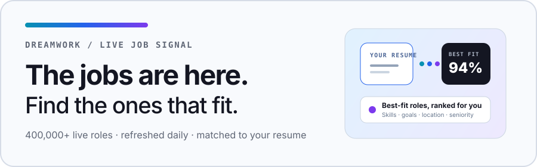

<a href="https://www.dreamworkhq.com/?utm_source=github&utm_medium=readme_cta&utm_campaign=gh-devops-sre-cloud-jobs">
  <picture>
    <source media="(prefers-color-scheme: dark)" srcset="./static/img/banner-dark.svg">
    <source media="(prefers-color-scheme: light)" srcset="./static/img/banner-light.svg">
    
  </picture>
</a>

<h1 align="center">DevOps, SRE, and Cloud Jobs</h1>

DevOps, site reliability, platform, infrastructure, and cloud engineering roles in the US and worldwide. Listings come straight from company career pages, so every link is a real, open posting.

  
  

  <a href="https://www.dreamworkhq.com/?utm_source=github&utm_medium=readme_cta&utm_campaign=gh-devops-sre-cloud-jobs">
    <picture>
      <source media="(prefers-color-scheme: dark)" srcset="./static/img/btn-matches-dark.svg">
      <source media="(prefers-color-scheme: light)" srcset="./static/img/btn-matches-light.svg">
      
    </picture>
  </a>

  <a href="https://www.dreamworkhq.com/?utm_source=github&utm_medium=link_row&utm_campaign=gh-devops-sre-cloud-jobs">dreamworkhq.com</a>
  ·
  <a href="https://www.dreamworkhq.com/blog?utm_source=github&utm_medium=link_row&utm_campaign=gh-devops-sre-cloud-jobs">Blog</a>
  ·
  <a href="https://www.dreamworkhq.com/research?utm_source=github&utm_medium=link_row&utm_campaign=gh-devops-sre-cloud-jobs">Hiring research</a>
  ·
  <a href="../../issues">Report a listing</a>

Star this repo and new roles land in your GitHub feed every day. Listings come from [Dreamwork](https://www.dreamworkhq.com/?utm_source=github&utm_medium=readme_cta&utm_campaign=gh-devops-sre-cloud-jobs), which crawls 1.5M+ live jobs directly from company career pages.

Last updated: **2026-10-07**. Showing the **600** most recently indexed roles, curated from **4,443+** open listings on Dreamwork. Salary shows when the posting discloses it. Click a role to see details and apply.

<!-- TABLE_START (auto-generated: do not edit by hand; edits are overwritten daily) -->

| Company | Role | Location | Pay | Added |
| --- | --- | --- | --- | --- |
| **[TOPdesk](https://www.dreamworkhq.com/c/topdesk.com?utm_source=github&utm_campaign=gh-devops-sre-cloud-jobs)** | [Principal Cloud Engineer (Azure)](https://www.dreamworkhq.com/job/356c3fcb-c489-4133-a45a-d85f501e790e?utm_source=github&utm_campaign=gh-devops-sre-cloud-jobs) | Budapest, , Hungary (Hybrid) | $76K–$91K | 0d |
| **[Diana Duggan UK Limited](https://www.dreamworkhq.com/c/dianaduggan.co.uk?utm_source=github&utm_campaign=gh-devops-sre-cloud-jobs)** | [DevOps Engineer with SFTPGo experience](https://www.dreamworkhq.com/job/f3586b92-5d20-42ca-ab66-7693044e89ec?utm_source=github&utm_campaign=gh-devops-sre-cloud-jobs) | London (Hybrid) | $172K | 0d |
| **[Prolific](https://www.dreamworkhq.com/c/prolific.com?utm_source=github&utm_campaign=gh-devops-sre-cloud-jobs)** | [Cloud Platform Engineer](https://www.dreamworkhq.com/job/ff1d75c9-2504-4a60-ac49-2ddc03145bec?utm_source=github&utm_campaign=gh-devops-sre-cloud-jobs) | Remote (Remote, UK) |  | 0d |
| **[GitLab](https://www.dreamworkhq.com/c/gitlab.com?utm_source=github&utm_campaign=gh-devops-sre-cloud-jobs)** | [Senior Backend Engineer, Core DevOps](https://www.dreamworkhq.com/job/3159adc0-ea4e-4d36-8534-f8e9fe96a554?utm_source=github&utm_campaign=gh-devops-sre-cloud-jobs) | Remote (Remote, United Kingdom) |  | 0d |
| **[GitLab](https://www.dreamworkhq.com/c/gitlab.com?utm_source=github&utm_campaign=gh-devops-sre-cloud-jobs)** | [Senior CX Platform Engineer](https://www.dreamworkhq.com/job/8a00ab48-e996-48a2-889a-4bc37b4c6192?utm_source=github&utm_campaign=gh-devops-sre-cloud-jobs) | Remote | $139K–$235K | 0d |
| **[Beyondtrust](https://www.dreamworkhq.com/c/beyondtrust.com?utm_source=github&utm_campaign=gh-devops-sre-cloud-jobs)** | [Cloud Engineer](https://www.dreamworkhq.com/job/08038064-370f-426b-a970-75540f02d506?utm_source=github&utm_campaign=gh-devops-sre-cloud-jobs) | — (Hybrid) |  | 0d |
| **[NICE](https://www.dreamworkhq.com/c/nice.com?utm_source=github&utm_campaign=gh-devops-sre-cloud-jobs)** | [Senior Cloud Operations Engineer - Night shift 10PM to 6AM](https://www.dreamworkhq.com/job/a155d60e-33ac-4e5b-9b5f-a5cc6438ced3?utm_source=github&utm_campaign=gh-devops-sre-cloud-jobs) | Remote (United Kingdom - Remote) |  | 0d |
| **[NICE](https://www.dreamworkhq.com/c/nice.com?utm_source=github&utm_campaign=gh-devops-sre-cloud-jobs)** | [Senior Cloud Operations Engineer](https://www.dreamworkhq.com/job/68104e6f-2221-4f7b-9e4d-55c036fbb1c9?utm_source=github&utm_campaign=gh-devops-sre-cloud-jobs) | Remote (United Kingdom - Remote) |  | 0d |
| **[Usbank](https://www.dreamworkhq.com/c/usbank.com?utm_source=github&utm_campaign=gh-devops-sre-cloud-jobs)** | [Senior Infrastructure Engineer - Configuration Management (Ansible Auto…](https://www.dreamworkhq.com/job/83202686-f37e-4d50-ad0c-77280942b549?utm_source=github&utm_campaign=gh-devops-sre-cloud-jobs) | Hopkins, MN (Hybrid) | $120K–$141K | 0d |
| **[Booz Allen Hamilton](https://www.dreamworkhq.com/c/boozallen.com?utm_source=github&utm_campaign=gh-devops-sre-cloud-jobs)** | [AWS Cloud Operations Engineer](https://www.dreamworkhq.com/job/99cb836f-e2c2-4159-881f-90ef96bbfaf2?utm_source=github&utm_campaign=gh-devops-sre-cloud-jobs) | McLean, VA (Hybrid) | $69K–$158K | 0d |
| **[Inetum2](https://www.dreamworkhq.com/c/inetum.com?utm_source=github&utm_campaign=gh-devops-sre-cloud-jobs)** | [Azure Cloud Engineer](https://www.dreamworkhq.com/job/c3736347-0ae1-4eee-9625-3c4a77f6ba68?utm_source=github&utm_campaign=gh-devops-sre-cloud-jobs) | Mechelen, , Belgium (Hybrid) |  | 0d |
| **[Vanguard](https://www.dreamworkhq.com/c/vanguard.com?utm_source=github&utm_campaign=gh-devops-sre-cloud-jobs)** | [Platform Engineer, Specialist](https://www.dreamworkhq.com/job/54ee815d-c877-4217-b005-2dc031bcb411?utm_source=github&utm_campaign=gh-devops-sre-cloud-jobs) | Malvern, PA (Hybrid) |  | 0d |
| **[EVERIENCE](https://www.dreamworkhq.com/c/everience.com?utm_source=github&utm_campaign=gh-devops-sre-cloud-jobs)** | [DevOps - F/H - Marseille](https://www.dreamworkhq.com/job/86a2670a-0f28-4923-8190-c93ba36de873?utm_source=github&utm_campaign=gh-devops-sre-cloud-jobs) | Marseille, Provence-Alpes-Côte d'Azur, Fran… (Hybrid) | $45K–$59K | 0d |
| **[Danaher](https://www.dreamworkhq.com/c/danaher.com?utm_source=github&utm_campaign=gh-devops-sre-cloud-jobs)** | [Senior Software Engineer (DevOps)](https://www.dreamworkhq.com/job/f80a8ea6-5cee-4fbc-b3b9-07d2c079cbec?utm_source=github&utm_campaign=gh-devops-sre-cloud-jobs) | Bangalore, Karnataka, India |  | 0d |
| **[Weekday 1](https://www.dreamworkhq.com/c/weekday.com?utm_source=github&utm_campaign=gh-devops-sre-cloud-jobs)** | [Senior Backend Cloud Infrastructure Engineer](https://www.dreamworkhq.com/job/7fa4de4e-4431-42e3-bc33-3e1b3f04b76b?utm_source=github&utm_campaign=gh-devops-sre-cloud-jobs) | Bengaluru, Karnataka, India |  | 0d |
| **[MYO Talent](https://www.dreamworkhq.com/c/myotalent.com?utm_source=github&utm_campaign=gh-devops-sre-cloud-jobs)** | [Site Reliability Engineer / Platform Lead – Datadog / Azure](https://www.dreamworkhq.com/job/f88c742c-6816-4dd3-ab43-7f08435e20b7?utm_source=github&utm_campaign=gh-devops-sre-cloud-jobs) | West Midlands (Region) (Hybrid) | $154K–$206K | 0d |
| **[Amazon Talent Acquisition](https://www.dreamworkhq.com/c/veeqo.com?utm_source=github&utm_campaign=gh-devops-sre-cloud-jobs)** | [DevOps Engineer, Veeqo](https://www.dreamworkhq.com/job/a6e23206-894f-462c-891b-d42d60eed800?utm_source=github&utm_campaign=gh-devops-sre-cloud-jobs) | SA15AE |  | 0d |
| **[Inetum2](https://www.dreamworkhq.com/c/inetum.com?utm_source=github&utm_campaign=gh-devops-sre-cloud-jobs)** | [Azure Cloud Engineer](https://www.dreamworkhq.com/job/6c2d1722-84f7-4409-a6df-d35966dc068a?utm_source=github&utm_campaign=gh-devops-sre-cloud-jobs) | Remote (Belgium, mechelen, Belgium) |  | 0d |
| **[Clara](https://www.dreamworkhq.com/c/clara.com?utm_source=github&utm_campaign=gh-devops-sre-cloud-jobs)** | [Staff DevOps Engineer (Ingeniero DevOps Staff) - Hybrid](https://www.dreamworkhq.com/job/c1a6eba3-8835-4120-9767-e3acbb1a5f0b?utm_source=github&utm_campaign=gh-devops-sre-cloud-jobs) | Bogota D.C. / DC / Colombia; Mexico City / … (Hybrid) |  | 0d |
| **[Cambiahealth](https://www.dreamworkhq.com/c/cambiahealth.com?utm_source=github&utm_campaign=gh-devops-sre-cloud-jobs)** | [Data & Analytics Platform Engineer IV](https://www.dreamworkhq.com/job/aea42e8a-b97d-4ee7-b351-9d28ca94c7e2?utm_source=github&utm_campaign=gh-devops-sre-cloud-jobs) | Portland, OR (Hybrid) | $101K–$143K | 0d |
| **[Flextrade](https://www.dreamworkhq.com/c/flextrade.com?utm_source=github&utm_campaign=gh-devops-sre-cloud-jobs)** | [Associate AWS Cloud Engineer](https://www.dreamworkhq.com/job/af56f76d-5bd3-41aa-ba99-4ad9e3d961f9?utm_source=github&utm_campaign=gh-devops-sre-cloud-jobs) | Pune, Mahārāshtra, India |  | 0d |
| **[Pwc](https://www.dreamworkhq.com/c/pwc.com?utm_source=github&utm_campaign=gh-devops-sre-cloud-jobs)** | [IN_Associate_ Site Reliability Engineering_GCC_Advisory_Bangalore](https://www.dreamworkhq.com/job/a186b4ec-6e17-4f78-bf62-be0230ee09d8?utm_source=github&utm_campaign=gh-devops-sre-cloud-jobs) | Bengaluru Millenia |  | 0d |
| **[LSEG](https://www.dreamworkhq.com/c/lseg.com?utm_source=github&utm_campaign=gh-devops-sre-cloud-jobs)** | [Software & Platform Engineering](https://www.dreamworkhq.com/job/b73aa160-17a5-4da9-ae56-eb93cbd7624d?utm_source=github&utm_campaign=gh-devops-sre-cloud-jobs) | IND-Hyderabad-CapitaLand |  | 0d |
| **[Astreya](https://www.dreamworkhq.com/c/astreya.com?utm_source=github&utm_campaign=gh-devops-sre-cloud-jobs)** | [Multicloud / DevOps Engineer](https://www.dreamworkhq.com/job/719c359c-903e-4b1a-81db-153be2dd294c?utm_source=github&utm_campaign=gh-devops-sre-cloud-jobs) | Santa Clara, CA | $132K–$209K | 0d |
| **[Riskified](https://www.dreamworkhq.com/c/riskified.com?utm_source=github&utm_campaign=gh-devops-sre-cloud-jobs)** | [Senior AI Platform Engineer](https://www.dreamworkhq.com/job/311152f2-fea5-4685-9e21-7a90488b70aa?utm_source=github&utm_campaign=gh-devops-sre-cloud-jobs) | Lisbon (Hybrid) | $73K–$85K | 0d |
| **[Synechron](https://www.dreamworkhq.com/c/synechron.com?utm_source=github&utm_campaign=gh-devops-sre-cloud-jobs)** | [DevOps Platform Engineer – Jenkins, Git, Artifactory, Kubernetes & CI/C…](https://www.dreamworkhq.com/job/0b30885c-518b-4dbe-8e38-66f592a7b3fd?utm_source=github&utm_campaign=gh-devops-sre-cloud-jobs) | Pune - Kharadi (EON-II) |  | 0d |
| **[Synechron](https://www.dreamworkhq.com/c/synechron.com?utm_source=github&utm_campaign=gh-devops-sre-cloud-jobs)** | [DevOps PaaS - Sr. Technology Engineer](https://www.dreamworkhq.com/job/682383a2-481c-404b-92b7-c9019d9f2c63?utm_source=github&utm_campaign=gh-devops-sre-cloud-jobs) | Bengaluru - Bellandur (GTP) |  | 0d |
| **[Accenture](https://www.dreamworkhq.com/c/accenture.com?utm_source=github&utm_campaign=gh-devops-sre-cloud-jobs)** | [Data Platform Engineer](https://www.dreamworkhq.com/job/e75b0383-5987-4c05-b169-1f47b1b50ba9?utm_source=github&utm_campaign=gh-devops-sre-cloud-jobs) | — |  | 0d |
| **[Booz Allen Hamilton](https://www.dreamworkhq.com/c/boozallen.com?utm_source=github&utm_campaign=gh-devops-sre-cloud-jobs)** | [Site Reliability Engineer](https://www.dreamworkhq.com/job/6936260d-270a-4714-805e-4854582dae33?utm_source=github&utm_campaign=gh-devops-sre-cloud-jobs) | Chantilly, VA (Hybrid) | $62K–$141K | 0d |
| **[SopraSteria1](https://www.dreamworkhq.com/c/soprasteria.com?utm_source=github&utm_campaign=gh-devops-sre-cloud-jobs)** | [DevOps Engineer](https://www.dreamworkhq.com/job/a2fd3f49-d979-416d-8373-5f0527fb01ca?utm_source=github&utm_campaign=gh-devops-sre-cloud-jobs) | Nieuwegein, UT, Netherlands (Hybrid) | $96K | 0d |
| **[Obrio](https://www.dreamworkhq.com/c/obrio.tech?utm_source=github&utm_campaign=gh-devops-sre-cloud-jobs)** | [TechOps Engineer/DevOps](https://www.dreamworkhq.com/job/e65f1dfe-6db7-49a2-9e0b-68962949590a?utm_source=github&utm_campaign=gh-devops-sre-cloud-jobs) | Remote (Ukraine) |  | 0d |
| **[Quantum Systems Ukraine](https://www.dreamworkhq.com/c/quantum-systems.com?utm_source=github&utm_campaign=gh-devops-sre-cloud-jobs)** | [Platform Engineer](https://www.dreamworkhq.com/job/fa2304e9-1af2-40b3-95ce-82feaac980d3?utm_source=github&utm_campaign=gh-devops-sre-cloud-jobs) | Kyiv, Ukraine (Hybrid) |  | 0d |
| **CyberCraft** | [Senior AI Platform Engineer](https://www.dreamworkhq.com/job/4e296f07-df35-44b5-8503-7a16c2d8f04c?utm_source=github&utm_campaign=gh-devops-sre-cloud-jobs) | Remote (Ukraine) |  | 0d |
| **[BetterMe](https://www.dreamworkhq.com/c/bettermepain.com?utm_source=github&utm_campaign=gh-devops-sre-cloud-jobs)** | [AI Platform Engineer](https://www.dreamworkhq.com/job/94c5e8a2-4303-4b20-b929-dacbb53e373d?utm_source=github&utm_campaign=gh-devops-sre-cloud-jobs) | Remote (Europe) |  | 0d |
| **[Bosch](https://www.dreamworkhq.com/c/bosch.com?utm_source=github&utm_campaign=gh-devops-sre-cloud-jobs)** | [\[EPM\] Software Integration & DevOps Engineer - Azure Cloud Engineer](https://www.dreamworkhq.com/job/32073e1f-1201-4528-9e35-33d125f4b419?utm_source=github&utm_campaign=gh-devops-sre-cloud-jobs) | Thành phố Hồ Chí Minh, Hồ Chí Minh, Vietnam (Hybrid) |  | 0d |
| **[Bosch](https://www.dreamworkhq.com/c/bosch.com?utm_source=github&utm_campaign=gh-devops-sre-cloud-jobs)** | [Azure Migration and DevOps Consultant](https://www.dreamworkhq.com/job/f6e90319-5d09-49b7-885c-9c40166e550f?utm_source=github&utm_campaign=gh-devops-sre-cloud-jobs) | bangalore, , India |  | 0d |
| **[Bond Williams](https://www.dreamworkhq.com/c/bondwilliams.com?utm_source=github&utm_campaign=gh-devops-sre-cloud-jobs)** | [Azure DevOps / Platform Engineer - £450/day Inside IR35](https://www.dreamworkhq.com/job/15143b68-18fb-49ba-af4c-6597b1bbefd5?utm_source=github&utm_campaign=gh-devops-sre-cloud-jobs) | Southampton (Hybrid) | $137K–$154K | 0d |
| **[Hays Specialist Recruitment Lim…](https://www.dreamworkhq.com/c/hays.co.uk?utm_source=github&utm_campaign=gh-devops-sre-cloud-jobs)** | [DevOps Engineer](https://www.dreamworkhq.com/job/85884dc5-d5ba-443f-9f1b-43c845b7084e?utm_source=github&utm_campaign=gh-devops-sre-cloud-jobs) | Remote (London) | $147K | 0d |
| **[Bti36021](https://www.dreamworkhq.com/c/bti360.com?utm_source=github&utm_campaign=gh-devops-sre-cloud-jobs)** | [Platform Engineer - Polygraph Required](https://www.dreamworkhq.com/job/a26e531a-c8da-4534-a88c-3d582017b58e?utm_source=github&utm_campaign=gh-devops-sre-cloud-jobs) | Chantilly, VA | $97K–$248K | 0d |
| **[Airbus](https://www.dreamworkhq.com/c/airbus.com?utm_source=github&utm_campaign=gh-devops-sre-cloud-jobs)** | [Evergreen Military Derivatives Software Platform Engineer](https://www.dreamworkhq.com/job/9102ab82-da84-49c8-a1a7-f3adc95701ae?utm_source=github&utm_campaign=gh-devops-sre-cloud-jobs) | Getafe Area (Hybrid) |  | 0d |
| **[Playtech](https://www.dreamworkhq.com/c/playtech.com?utm_source=github&utm_campaign=gh-devops-sre-cloud-jobs)** | [DevOps Team Leader](https://www.dreamworkhq.com/job/f9e956c7-7f9a-43b3-acc4-232720e4142c?utm_source=github&utm_campaign=gh-devops-sre-cloud-jobs) | Remote (Kyiv, , Ukraine) |  | 0d |
| **[Gresearch](https://www.dreamworkhq.com/c/gresearch.com?utm_source=github&utm_campaign=gh-devops-sre-cloud-jobs)** | [Linux Platform Engineer](https://www.dreamworkhq.com/job/a925dbb3-28bb-4fb2-b719-f2028918ec88?utm_source=github&utm_campaign=gh-devops-sre-cloud-jobs) | London, UK |  | 0d |
| **SKYFALL IT** | [Azure Cloud Engineer](https://www.dreamworkhq.com/job/2f06bd80-f996-48be-842e-f376a8dc99ca?utm_source=github&utm_campaign=gh-devops-sre-cloud-jobs) | Belgium |  | 0d |
| **[Spektrum](https://www.dreamworkhq.com/c/spektrum.eu?utm_source=github&utm_campaign=gh-devops-sre-cloud-jobs)** | [DevOps Engineer](https://www.dreamworkhq.com/job/0a04d8de-514a-4ecb-b48a-cd390b109066?utm_source=github&utm_campaign=gh-devops-sre-cloud-jobs) | Braine l'Alleud, Belgium (Hybrid) |  | 0d |
| **[Nttlimited](https://www.dreamworkhq.com/c/nttlimitedinternal.service-now.com?utm_source=github&utm_campaign=gh-devops-sre-cloud-jobs)** | [Site Reliability Engineer - Level 2](https://www.dreamworkhq.com/job/a2f2c2fc-e231-459e-a1f8-538faf43dce4?utm_source=github&utm_campaign=gh-devops-sre-cloud-jobs) | EGP, Cairo Z&O |  | 0d |
| **[EXL](https://www.dreamworkhq.com/c/exlservice.com?utm_source=github&utm_campaign=gh-devops-sre-cloud-jobs)** | [AWS Platform Engineer](https://www.dreamworkhq.com/job/4fa7d5d9-8cf2-4e3c-83f7-513c0f51b36a?utm_source=github&utm_campaign=gh-devops-sre-cloud-jobs) | Pune, Maharashtra, India (Hybrid) |  | 0d |
| **[EXL Talent Acquisition Team](https://www.dreamworkhq.com/c/exl.com?utm_source=github&utm_campaign=gh-devops-sre-cloud-jobs)** | [AWS Platform Engineer](https://www.dreamworkhq.com/job/cadb6418-7536-43a8-9f7c-189d296fa64f?utm_source=github&utm_campaign=gh-devops-sre-cloud-jobs) | Pune, Maharashtra, India (Hybrid) |  | 0d |
| **[EURES Netherlands (Professional)](https://www.dreamworkhq.com/c/zorgmatch.nl?utm_source=github&utm_campaign=gh-devops-sre-cloud-jobs)** | [Sr. Azure & Microsoft 365 Beheerder (DevOps)](https://www.dreamworkhq.com/job/2da407cf-bce8-476d-9008-aaffa82bf003?utm_source=github&utm_campaign=gh-devops-sre-cloud-jobs) | Netherlands (Hybrid) |  | 0d |
| **[EURES Netherlands (Professional)](https://www.dreamworkhq.com/c/zorgmatch.nl?utm_source=github&utm_campaign=gh-devops-sre-cloud-jobs)** | [Senior Devops Engineer](https://www.dreamworkhq.com/job/2003025f-1ba3-415b-970b-7fbb75bf06e8?utm_source=github&utm_campaign=gh-devops-sre-cloud-jobs) | Netherlands |  | 0d |
| **[EURES Netherlands (Professional)](https://www.dreamworkhq.com/c/zorgmatch.nl?utm_source=github&utm_campaign=gh-devops-sre-cloud-jobs)** | [Medior Network DevOps Engineer](https://www.dreamworkhq.com/job/3b7d56fc-e929-443c-a211-59768f0ca2cb?utm_source=github&utm_campaign=gh-devops-sre-cloud-jobs) | Netherlands |  | 0d |
| **[EURES Netherlands (Professional)](https://www.dreamworkhq.com/c/delftcircuits.com?utm_source=github&utm_campaign=gh-devops-sre-cloud-jobs)** | [Senior Platform Engineer](https://www.dreamworkhq.com/job/cc9e18af-5247-4761-b472-e716686f4db5?utm_source=github&utm_campaign=gh-devops-sre-cloud-jobs) | Noord-Holland, Netherlands (Hybrid) |  | 0d |
| **[EURES Netherlands (Professional)](https://www.dreamworkhq.com/c/delftcircuits.com?utm_source=github&utm_campaign=gh-devops-sre-cloud-jobs)** | [Junior Platform Engineer](https://www.dreamworkhq.com/job/ca3512c2-2c89-4bd7-9aba-1e4918e5f3ab?utm_source=github&utm_campaign=gh-devops-sre-cloud-jobs) | Noord-Holland, Netherlands |  | 0d |
| **[EURES Netherlands (Professional)](https://www.dreamworkhq.com/c/alserda.nl?utm_source=github&utm_campaign=gh-devops-sre-cloud-jobs)** | [(Senior) Cloud Devops Engineer](https://www.dreamworkhq.com/job/ad492455-a523-482c-b64d-d64fbd4bbb4f?utm_source=github&utm_campaign=gh-devops-sre-cloud-jobs) | Netherlands |  | 0d |
| **[EURES Netherlands (Professional)](https://www.dreamworkhq.com/c/koop.overheid.nl?utm_source=github&utm_campaign=gh-devops-sre-cloud-jobs)** | [DevOps Engineer Team Generiek](https://www.dreamworkhq.com/job/d0cb462c-3b98-4837-9f29-1ee3b102f79d?utm_source=github&utm_campaign=gh-devops-sre-cloud-jobs) | Netherlands |  | 0d |
| **[EURES Netherlands (Professional)](https://www.dreamworkhq.com/c/koop.overheid.nl?utm_source=github&utm_campaign=gh-devops-sre-cloud-jobs)** | [Devops Engineer](https://www.dreamworkhq.com/job/b03476e1-44f5-4c7c-8911-b246226baec0?utm_source=github&utm_campaign=gh-devops-sre-cloud-jobs) | Gelderland, Netherlands |  | 0d |
| **[EURES Netherlands (Professional)](https://www.dreamworkhq.com/c/koop.overheid.nl?utm_source=github&utm_campaign=gh-devops-sre-cloud-jobs)** | [Java DevOps Engineer Search](https://www.dreamworkhq.com/job/149e23f1-2f7f-468e-bd69-5c3bc7fc356a?utm_source=github&utm_campaign=gh-devops-sre-cloud-jobs) | Netherlands |  | 0d |
| **[EURES Netherlands (Professional)](https://www.dreamworkhq.com/c/koop.overheid.nl?utm_source=github&utm_campaign=gh-devops-sre-cloud-jobs)** | [Devops Engineer (Linux)](https://www.dreamworkhq.com/job/da485573-8e6f-4fd3-b9e6-45ff00067008?utm_source=github&utm_campaign=gh-devops-sre-cloud-jobs) | Netherlands |  | 0d |
| **[EURES Netherlands (Professional)](https://www.dreamworkhq.com/c/koop.overheid.nl?utm_source=github&utm_campaign=gh-devops-sre-cloud-jobs)** | [Devops Engineer](https://www.dreamworkhq.com/job/af8b1387-48c7-4d3a-b9b9-c522f5ee2c3b?utm_source=github&utm_campaign=gh-devops-sre-cloud-jobs) | Flevoland, Netherlands | $73K–$84K | 0d |
| **[EURES Netherlands (Professional)](https://www.dreamworkhq.com/c/koop.overheid.nl?utm_source=github&utm_campaign=gh-devops-sre-cloud-jobs)** | [Senior Devops Engineer](https://www.dreamworkhq.com/job/b6d1a143-26e7-45f6-a1d6-ea31deebfe15?utm_source=github&utm_campaign=gh-devops-sre-cloud-jobs) | Noord-Holland, Netherlands |  | 0d |
| **[EURES Netherlands (Professional)](https://www.dreamworkhq.com/c/koop.overheid.nl?utm_source=github&utm_campaign=gh-devops-sre-cloud-jobs)** | [Devops Engineer](https://www.dreamworkhq.com/job/17216ae9-9a67-4555-a5bd-635d5884a141?utm_source=github&utm_campaign=gh-devops-sre-cloud-jobs) | Noord-Holland, Netherlands |  | 0d |
| **[EURES Netherlands (Professional)](https://www.dreamworkhq.com/c/koop.overheid.nl?utm_source=github&utm_campaign=gh-devops-sre-cloud-jobs)** | [AI Platform Engineer](https://www.dreamworkhq.com/job/4cce942f-8078-4f98-8c8d-3c5994155030?utm_source=github&utm_campaign=gh-devops-sre-cloud-jobs) | Noord-Brabant, Netherlands |  | 0d |
| **[Sanderson](https://www.dreamworkhq.com/c/sanderson.com?utm_source=github&utm_campaign=gh-devops-sre-cloud-jobs)** | [Platform Engineer, AWS](https://www.dreamworkhq.com/job/f3287d1d-6475-4093-9bb1-7ff430758e87?utm_source=github&utm_campaign=gh-devops-sre-cloud-jobs) | South West England | $189K | 0d |
| **[Pauwels Consulting](https://www.dreamworkhq.com/c/pauwels.consulting?utm_source=github&utm_campaign=gh-devops-sre-cloud-jobs)** | [DevOps Engineer – Linux & Kubernetes](https://www.dreamworkhq.com/job/2ff938e2-5d12-45b1-bbf5-0a9d700740ef?utm_source=github&utm_campaign=gh-devops-sre-cloud-jobs) | Brussels, Belgium |  | 0d |
| **Vlaamse overheid** | [Systeembeheerder met DevOps skills](https://www.dreamworkhq.com/job/b456cff6-9cec-4038-90af-dfebbd1057ee?utm_source=github&utm_campaign=gh-devops-sre-cloud-jobs) | Brussels, Belgium |  | 0d |
| **[Cathcart Technology](https://www.dreamworkhq.com/c/cathcarttechnology.com?utm_source=github&utm_campaign=gh-devops-sre-cloud-jobs)** | [Platform Engineer](https://www.dreamworkhq.com/job/b7b69e95-f821-49f8-a3fb-0676929d7b2d?utm_source=github&utm_campaign=gh-devops-sre-cloud-jobs) | Stockport (Hybrid) | $92K | 0d |
| **[Qualify Nation Recruitment](https://www.dreamworkhq.com/c/qualifynation.co.uk?utm_source=github&utm_campaign=gh-devops-sre-cloud-jobs)** | [Trainee DevOps Engineer \| No experience needed (Ref: 7501)](https://www.dreamworkhq.com/job/c1b67c5a-4466-4131-ac12-ab34c60d097d?utm_source=github&utm_campaign=gh-devops-sre-cloud-jobs) | Remote (Coventry) | $37K–$50K | 0d |
| **[Qualify Nation Recruitment](https://www.dreamworkhq.com/c/qualifynation.co.uk?utm_source=github&utm_campaign=gh-devops-sre-cloud-jobs)** | [Trainee DevOps Engineer \| No experience needed (Ref: 7501)](https://www.dreamworkhq.com/job/d6317d32-2cda-4141-a558-835bb2c1be82?utm_source=github&utm_campaign=gh-devops-sre-cloud-jobs) | Remote (Nottingham) | $37K–$50K | 0d |
| **[Qualify Nation Recruitment](https://www.dreamworkhq.com/c/qualifynation.co.uk?utm_source=github&utm_campaign=gh-devops-sre-cloud-jobs)** | [Trainee DevOps Engineer \| No experience needed (Ref: 7501)](https://www.dreamworkhq.com/job/762a550c-d279-4107-94e8-904a70ced88c?utm_source=github&utm_campaign=gh-devops-sre-cloud-jobs) | Remote (Plymouth) | $37K–$50K | 0d |
| **[Qualify Nation Recruitment](https://www.dreamworkhq.com/c/qualifynation.co.uk?utm_source=github&utm_campaign=gh-devops-sre-cloud-jobs)** | [Trainee DevOps Engineer \| No experience needed (Ref: 7501)](https://www.dreamworkhq.com/job/eb5d3308-93bc-4a83-a4ef-d85fa8419a49?utm_source=github&utm_campaign=gh-devops-sre-cloud-jobs) | Remote (Leeds) | $37K–$50K | 0d |
| **[Qualify Nation Recruitment](https://www.dreamworkhq.com/c/qualifynation.co.uk?utm_source=github&utm_campaign=gh-devops-sre-cloud-jobs)** | [Trainee DevOps Engineer \| No experience needed (Ref: 7501)](https://www.dreamworkhq.com/job/e5da8edc-b23e-437a-9d18-96f1fdb16801?utm_source=github&utm_campaign=gh-devops-sre-cloud-jobs) | Remote (Glasgow) | $37K–$50K | 0d |
| **[Qualify Nation Recruitment](https://www.dreamworkhq.com/c/qualifynation.co.uk?utm_source=github&utm_campaign=gh-devops-sre-cloud-jobs)** | [Trainee DevOps Engineer \| No experience needed (Ref: 7501)](https://www.dreamworkhq.com/job/74d9a6f2-c06e-4db1-9e5f-2341d2acc9e0?utm_source=github&utm_campaign=gh-devops-sre-cloud-jobs) | Remote (Bristol) | $37K–$50K | 0d |
| **[Qualify Nation Recruitment](https://www.dreamworkhq.com/c/qualifynation.co.uk?utm_source=github&utm_campaign=gh-devops-sre-cloud-jobs)** | [Trainee DevOps Engineer \| No experience needed (Ref: 7501)](https://www.dreamworkhq.com/job/c4d0a005-1f3a-464d-93ce-074ecc4d2066?utm_source=github&utm_campaign=gh-devops-sre-cloud-jobs) | Remote (Edinburgh) | $37K–$50K | 0d |
| **[Qualify Nation Recruitment](https://www.dreamworkhq.com/c/qualifynation.co.uk?utm_source=github&utm_campaign=gh-devops-sre-cloud-jobs)** | [Trainee DevOps Engineer \| No experience needed (Ref: 7501)](https://www.dreamworkhq.com/job/cc259b5b-fe7e-46ca-8ab6-d7306a2b0b59?utm_source=github&utm_campaign=gh-devops-sre-cloud-jobs) | Remote (Liverpool) | $37K–$50K | 0d |
| **[Qualify Nation Recruitment](https://www.dreamworkhq.com/c/qualifynation.co.uk?utm_source=github&utm_campaign=gh-devops-sre-cloud-jobs)** | [Trainee DevOps Engineer \| No experience needed (Ref: 7501)](https://www.dreamworkhq.com/job/c041b384-e27a-419d-8064-1516491588ec?utm_source=github&utm_campaign=gh-devops-sre-cloud-jobs) | Cardiff | $37K–$50K | 0d |
| **[Qualify Nation Recruitment](https://www.dreamworkhq.com/c/qualifynation.co.uk?utm_source=github&utm_campaign=gh-devops-sre-cloud-jobs)** | [Trainee DevOps Engineer \| No experience needed (Ref: 7501)](https://www.dreamworkhq.com/job/346ee931-0aa5-455e-ae2d-82d3762715d9?utm_source=github&utm_campaign=gh-devops-sre-cloud-jobs) | Remote (Leicester) | $37K–$50K | 0d |
| **[Qualify Nation Recruitment](https://www.dreamworkhq.com/c/qualifynation.co.uk?utm_source=github&utm_campaign=gh-devops-sre-cloud-jobs)** | [Trainee DevOps Engineer \| No experience needed (Ref: 7501)](https://www.dreamworkhq.com/job/01c622d7-d903-4d44-b748-cd620654b4d7?utm_source=github&utm_campaign=gh-devops-sre-cloud-jobs) | Remote (London) | $37K–$50K | 0d |
| **[Qualify Nation Recruitment](https://www.dreamworkhq.com/c/qualifynation.co.uk?utm_source=github&utm_campaign=gh-devops-sre-cloud-jobs)** | [Trainee DevOps Engineer \| No experience needed (Ref: 7501)](https://www.dreamworkhq.com/job/c3491a4c-e308-4fa9-9b12-11e30c452629?utm_source=github&utm_campaign=gh-devops-sre-cloud-jobs) | Remote (Birmingham) | $37K–$50K | 0d |
| **[Qualify Nation Recruitment](https://www.dreamworkhq.com/c/qualifynation.co.uk?utm_source=github&utm_campaign=gh-devops-sre-cloud-jobs)** | [Trainee DevOps Engineer \| No experience needed (Ref: 7501)](https://www.dreamworkhq.com/job/7da71242-c0cf-46fc-a856-a0da7ea8d0c6?utm_source=github&utm_campaign=gh-devops-sre-cloud-jobs) | Remote (Brighton) | $37K–$50K | 0d |
| **[Qualify Nation Recruitment](https://www.dreamworkhq.com/c/qualifynation.co.uk?utm_source=github&utm_campaign=gh-devops-sre-cloud-jobs)** | [Trainee DevOps Engineer \| No experience needed (Ref: 7501)](https://www.dreamworkhq.com/job/02b7cc6c-ed76-4895-954a-f2ee5d8482f7?utm_source=github&utm_campaign=gh-devops-sre-cloud-jobs) | Remote (Manchester) | $37K–$50K | 0d |
| **[Qualify Nation Recruitment](https://www.dreamworkhq.com/c/qualifynation.co.uk?utm_source=github&utm_campaign=gh-devops-sre-cloud-jobs)** | [Trainee DevOps Engineer \| No experience needed (Ref: 7501)](https://www.dreamworkhq.com/job/3b02d181-1a71-485c-a58e-bee2c72e5881?utm_source=github&utm_campaign=gh-devops-sre-cloud-jobs) | Remote (Belfast) | $37K–$50K | 0d |
| **[Qualify Nation Recruitment](https://www.dreamworkhq.com/c/qualifynation.co.uk?utm_source=github&utm_campaign=gh-devops-sre-cloud-jobs)** | [Trainee DevOps Engineer \| No experience needed (Ref: 7501)](https://www.dreamworkhq.com/job/7bfdecf5-f592-4ce1-84b8-f97fc4d05987?utm_source=github&utm_campaign=gh-devops-sre-cloud-jobs) | Remote (Hull) | $37K–$50K | 0d |
| **[LSEG](https://www.dreamworkhq.com/c/lseg.com?utm_source=github&utm_campaign=gh-devops-sre-cloud-jobs)** | [Senior Platform Engineer](https://www.dreamworkhq.com/job/dd7e3885-830c-4759-991e-b7bb7bcc29a4?utm_source=github&utm_campaign=gh-devops-sre-cloud-jobs) | IND-BLR-Divyasree Technopolis |  | 0d |
| **[GlobalFoundries](https://www.dreamworkhq.com/c/gf.com?utm_source=github&utm_campaign=gh-devops-sre-cloud-jobs)** | [Lead Engineer, Cloud Platform](https://www.dreamworkhq.com/job/6fcd6604-e627-45aa-85c4-9724870893af?utm_source=github&utm_campaign=gh-devops-sre-cloud-jobs) | Santa Clara | $167K–$275K | 0d |
| **[Jefferies](https://www.dreamworkhq.com/c/jefferies.com?utm_source=github&utm_campaign=gh-devops-sre-cloud-jobs)** | [Kafka Engineer - Platform Engineering](https://www.dreamworkhq.com/job/bc8a29c3-40c6-4559-a405-4c4ebe571948?utm_source=github&utm_campaign=gh-devops-sre-cloud-jobs) | Mumbai, India |  | 0d |
| **[Galepartners](https://www.dreamworkhq.com/c/galepartners.com?utm_source=github&utm_campaign=gh-devops-sre-cloud-jobs)** | [Manager, DevOps](https://www.dreamworkhq.com/job/e91032e9-340f-46fc-b44e-85efb3ab1124?utm_source=github&utm_campaign=gh-devops-sre-cloud-jobs) | Bengaluru, India (Hybrid) |  | 0d |
| **[Galepartners](https://www.dreamworkhq.com/c/galepartners.com?utm_source=github&utm_campaign=gh-devops-sre-cloud-jobs)** | [Senior Associate, DevOps](https://www.dreamworkhq.com/job/9701cab5-f0a6-4745-8639-9f2313e2592b?utm_source=github&utm_campaign=gh-devops-sre-cloud-jobs) | Bengaluru, India (Hybrid) |  | 0d |
| **[Sanofi](https://www.dreamworkhq.com/c/sanofi.com?utm_source=github&utm_campaign=gh-devops-sre-cloud-jobs)** | [Cloud Engineer – Deployment and Support](https://www.dreamworkhq.com/job/7a7d3348-1799-4f81-855e-ac07831a9cbe?utm_source=github&utm_campaign=gh-devops-sre-cloud-jobs) | Barcelona (Hybrid) | $49K–$74K | 0d |
| **[Google](https://www.dreamworkhq.com/c/google.com?utm_source=github&utm_campaign=gh-devops-sre-cloud-jobs)** | [Software Engineer III, Google Cloud Storage, Infrastructure](https://www.dreamworkhq.com/job/be2dfd86-00f2-4179-938b-ebdb9d23ab04?utm_source=github&utm_campaign=gh-devops-sre-cloud-jobs) | Sunnyvale, CA, USA | $147K–$210K | 0d |
| **[Google](https://www.dreamworkhq.com/c/google.com?utm_source=github&utm_campaign=gh-devops-sre-cloud-jobs)** | [Senior Software Engineer, Google Cloud Kubernetes Networking](https://www.dreamworkhq.com/job/9d990a5e-7b9b-4928-aeb8-21b3e5d61704?utm_source=github&utm_campaign=gh-devops-sre-cloud-jobs) | Sunnyvale, CA, USA (Hybrid) | $174K–$252K | 0d |
| **[Google](https://www.dreamworkhq.com/c/google.com?utm_source=github&utm_campaign=gh-devops-sre-cloud-jobs)** | [SOC Quality and Reliability Engineer, Google Cloud](https://www.dreamworkhq.com/job/a16303fc-e81b-4830-ab08-d7996fb5c05f?utm_source=github&utm_campaign=gh-devops-sre-cloud-jobs) | Haifa, Israel, Tel Aviv, Israel |  | 0d |
| **[Google](https://www.dreamworkhq.com/c/google.com?utm_source=github&utm_campaign=gh-devops-sre-cloud-jobs)** | [Software Engineering Manager, Advertiser Platform Infrastructure and Ex…](https://www.dreamworkhq.com/job/690891b5-8b3d-484d-b234-678701df7de1?utm_source=github&utm_campaign=gh-devops-sre-cloud-jobs) | Mountain View, CA, USA | $207K–$300K | 0d |
| **[Google](https://www.dreamworkhq.com/c/google.com?utm_source=github&utm_campaign=gh-devops-sre-cloud-jobs)** | [Software Engineer III, Site Reliability Engineering, Prod AI](https://www.dreamworkhq.com/job/ae91047d-dabb-408d-9a5e-f190603d51fd?utm_source=github&utm_campaign=gh-devops-sre-cloud-jobs) | Zürich, Switzerland |  | 0d |
| **[Google](https://www.dreamworkhq.com/c/google.com?utm_source=github&utm_campaign=gh-devops-sre-cloud-jobs)** | [Software Engineer III, Infrastructure, Google Cloud NetInfra](https://www.dreamworkhq.com/job/08f1678f-c11f-4527-9ef0-766e1cb62a45?utm_source=github&utm_campaign=gh-devops-sre-cloud-jobs) | Sunnyvale, CA, USA | $147K–$210K | 0d |
| **[Google](https://www.dreamworkhq.com/c/google.com?utm_source=github&utm_campaign=gh-devops-sre-cloud-jobs)** | [Software Engineer III, AI/ML, Google Cloud Platforms](https://www.dreamworkhq.com/job/c10aa45f-cfdb-4c1a-b1ec-1d4a5d48b8bc?utm_source=github&utm_campaign=gh-devops-sre-cloud-jobs) | Sunnyvale, CA, USA | $147K–$210K | 0d |
| **[Google](https://www.dreamworkhq.com/c/google.com?utm_source=github&utm_campaign=gh-devops-sre-cloud-jobs)** | [Software Engineer, Infrastructure, Search Platforms](https://www.dreamworkhq.com/job/e1e59956-daf9-4d7f-9177-c0d53f5dcd3e?utm_source=github&utm_campaign=gh-devops-sre-cloud-jobs) | Cambridge, MA, USA, Chicago, IL, USA, Mount… | $147K–$210K | 0d |
| **[BNY](https://www.dreamworkhq.com/c/bny.com?utm_source=github&utm_campaign=gh-devops-sre-cloud-jobs)** | [Vice President, DevOps / Application Infrastructure Backend Engineer](https://www.dreamworkhq.com/job/f5485a4e-4bde-4b63-8021-dc44d49e9e39?utm_source=github&utm_campaign=gh-devops-sre-cloud-jobs) | Pittsburgh, PA, United States | $83K–$170K | 0d |
| **[NW](https://www.dreamworkhq.com/c/nightwing.com?utm_source=github&utm_campaign=gh-devops-sre-cloud-jobs)** | [Cloud Infrastructure Engineer](https://www.dreamworkhq.com/job/1e35f85c-f65c-45e5-aafa-409cb7e197cf?utm_source=github&utm_campaign=gh-devops-sre-cloud-jobs) | Remote (Sterling, VA) | $77K–$163K | 0d |
| **[Fortinet](https://www.dreamworkhq.com/c/fortinet.com?utm_source=github&utm_campaign=gh-devops-sre-cloud-jobs)** | [Site Reliability Engineer](https://www.dreamworkhq.com/job/c54dbc61-6699-4d42-9ebd-a5e2f046a535?utm_source=github&utm_campaign=gh-devops-sre-cloud-jobs) | Sunnyvale, CA, United States | $129K–$158K | 0d |
| **Candidate Experience Site** | [Site Reliability Engineer](https://www.dreamworkhq.com/job/6d62eb82-9c60-4a9e-ac8c-d2df5a5a151a?utm_source=github&utm_campaign=gh-devops-sre-cloud-jobs) | Sunnyvale, CA, United States | $129K–$158K | 0d |
| **[SCOR](https://www.dreamworkhq.com/c/scor.com?utm_source=github&utm_campaign=gh-devops-sre-cloud-jobs)** | [Senior Cloud Platform Engineer](https://www.dreamworkhq.com/job/c62f6468-e32c-422f-80b7-544ee32f33de?utm_source=github&utm_campaign=gh-devops-sre-cloud-jobs) | Bucuresti - Ilfov, Romania |  | 0d |
| **[SCOR](https://www.dreamworkhq.com/c/scor.com?utm_source=github&utm_campaign=gh-devops-sre-cloud-jobs)** | [Core Cloud Platform Engineer](https://www.dreamworkhq.com/job/de33865e-3c7e-45f9-95ab-d2ac9db6786b?utm_source=github&utm_campaign=gh-devops-sre-cloud-jobs) | Bucuresti - Ilfov, Romania |  | 0d |
| **[Homeoffice Na Urbn](https://www.dreamworkhq.com/c/urbn.com?utm_source=github&utm_campaign=gh-devops-sre-cloud-jobs)** | [Sr DevOps Engineer](https://www.dreamworkhq.com/job/8115122b-b325-4858-b680-507b71411181?utm_source=github&utm_campaign=gh-devops-sre-cloud-jobs) | Philadelphia, PA, US |  | 0d |
| **[Teksynap](https://www.dreamworkhq.com/c/teksynap.com?utm_source=github&utm_campaign=gh-devops-sre-cloud-jobs)** | [Elastic SIEM Platform Engineer](https://www.dreamworkhq.com/job/0795111b-d30a-4eb0-a05d-cc3fc8bd98a9?utm_source=github&utm_campaign=gh-devops-sre-cloud-jobs) | Fort Belvoir, VA, US (Hybrid) | $170K–$210K | 0d |
| **[Bertelsmann-Jobs](https://www.dreamworkhq.com/c/bertelsmann.com?utm_source=github&utm_campaign=gh-devops-sre-cloud-jobs)** | [DevOps Engineer (m/f/d)](https://www.dreamworkhq.com/job/de8bffe2-23d0-4653-a443-91b047dd1762?utm_source=github&utm_campaign=gh-devops-sre-cloud-jobs) | Chiasso, , Switzerland (Hybrid) |  | 0d |
| **[Appian](https://www.dreamworkhq.com/c/appian.com?utm_source=github&utm_campaign=gh-devops-sre-cloud-jobs)** | [DevOps Engineer](https://www.dreamworkhq.com/job/ae1b28e5-243f-4dbc-a2f5-8366b88878d7?utm_source=github&utm_campaign=gh-devops-sre-cloud-jobs) | McLean, VA, US (Hybrid) | $96K–$150K | 0d |
| **[Kinaxis](https://www.dreamworkhq.com/c/kinaxis.com?utm_source=github&utm_campaign=gh-devops-sre-cloud-jobs)** | [Staff Cloud Engineer , Cloud Platform](https://www.dreamworkhq.com/job/05b380e8-cea3-4f93-a2cb-f319c2b7aef3?utm_source=github&utm_campaign=gh-devops-sre-cloud-jobs) | Remote (Remote, CA) |  | 0d |
| **[Omegapoint](https://www.dreamworkhq.com/c/omegapoint.io?utm_source=github&utm_campaign=gh-devops-sre-cloud-jobs)** | [Backendutvecklare med kunskap inom DevOps & AI](https://www.dreamworkhq.com/job/25927334-bdd8-40c2-b23a-c646807ee7ce?utm_source=github&utm_campaign=gh-devops-sre-cloud-jobs) | Göteborg, Sverige, Sweden |  | 0d |
| **[Anavationllc](https://www.dreamworkhq.com/c/anavationllc.com?utm_source=github&utm_campaign=gh-devops-sre-cloud-jobs)** | [Infrastructure & Cloud Engineer](https://www.dreamworkhq.com/job/a7301ebe-0068-4bc4-a75c-5b51b5d4f20e?utm_source=github&utm_campaign=gh-devops-sre-cloud-jobs) | Chantilly, VA |  | 0d |
| **[Computrabajo Chile](https://www.dreamworkhq.com/c/abenis.cl?utm_source=github&utm_campaign=gh-devops-sre-cloud-jobs)** | [Ingeniero DevOps Semi Senior - (GitLab CI/CD + GCP)](https://www.dreamworkhq.com/job/df922a76-27c5-465d-9e78-f7c0b39fff42?utm_source=github&utm_campaign=gh-devops-sre-cloud-jobs) | R.Metropolitana, Santiago Centro, Chile |  | 0d |
| **[Computrabajo Argentina](https://www.dreamworkhq.com/c/ricciprop.com?utm_source=github&utm_campaign=gh-devops-sre-cloud-jobs)** | [Ref.: 21540 Cloud Infrastructure / DevOps Specialist / Remoto](https://www.dreamworkhq.com/job/9c9aacdd-36fb-4860-92de-baa898b39569?utm_source=github&utm_campaign=gh-devops-sre-cloud-jobs) | Remote (Capital Federal, Recoleta, Argentina) |  | 0d |
| **[IBS](https://www.dreamworkhq.com/c/ibssoftware.com?utm_source=github&utm_campaign=gh-devops-sre-cloud-jobs)** | [Lead DevOps Engineer](https://www.dreamworkhq.com/job/c7efad30-d99e-4df8-a8ad-4e954e9d3d6f?utm_source=github&utm_campaign=gh-devops-sre-cloud-jobs) | India |  | 0d |
| **[DeutscheTelekomITSolutions](https://www.dreamworkhq.com/c/deutschetelekomitsolutions.hu?utm_source=github&utm_campaign=gh-devops-sre-cloud-jobs)** | [Senior DevOps Engineer (REF5825O)](https://www.dreamworkhq.com/job/373c26c1-435a-413a-af73-d07403f3c486?utm_source=github&utm_campaign=gh-devops-sre-cloud-jobs) | Budapest, Debrecen, Pécs, Szeged, , Hungary (Hybrid) |  | 0d |
| **[HP Inc.](https://www.dreamworkhq.com/c/hpwolf.com?utm_source=github&utm_campaign=gh-devops-sre-cloud-jobs)** | [Senior Machine Learning Platform Engineer — Model Hosting & MLOps](https://www.dreamworkhq.com/job/d8031356-152e-4fca-b460-e1219ed59775?utm_source=github&utm_campaign=gh-devops-sre-cloud-jobs) | Spring, Texas, United States of America (Hybrid) | $147K–$231K | 0d |
| **[ICSGBLCOR](https://www.dreamworkhq.com/c/ing.com?utm_source=github&utm_campaign=gh-devops-sre-cloud-jobs)** | [DevOps Engineer](https://www.dreamworkhq.com/job/52ae4a78-385b-4dbe-a6f0-e49dba1ec764?utm_source=github&utm_campaign=gh-devops-sre-cloud-jobs) | Manila (One Ayala Tower 2) |  | 0d |
| **[Nttlimited](https://www.dreamworkhq.com/c/nttlimitedinternal.service-now.com?utm_source=github&utm_campaign=gh-devops-sre-cloud-jobs)** | [AI Platform Engineer (Gemini Enterprise Platform)](https://www.dreamworkhq.com/job/d69a62d4-bd14-430e-bf2c-2efbac404c61?utm_source=github&utm_campaign=gh-devops-sre-cloud-jobs) | Ho Chi Minh, Vietnam (Hybrid) |  | 0d |
| **[Tencent](https://www.dreamworkhq.com/c/tencent.com?utm_source=github&utm_campaign=gh-devops-sre-cloud-jobs)** | [Site Reliability Engineer Intern](https://www.dreamworkhq.com/job/c75b93bd-271a-4c9d-a741-e6c38ffa2b0e?utm_source=github&utm_campaign=gh-devops-sre-cloud-jobs) | Singapore-CapitaSky |  | 0d |
| **[Accenture](https://www.dreamworkhq.com/c/accenture.com?utm_source=github&utm_campaign=gh-devops-sre-cloud-jobs)** | [Cloud Platform Engineer](https://www.dreamworkhq.com/job/29b3fab8-5857-408b-a2ee-34277225d9b1?utm_source=github&utm_campaign=gh-devops-sre-cloud-jobs) | — |  | 0d |
| **[Scanhealthplan](https://www.dreamworkhq.com/c/scanhealthplan.com?utm_source=github&utm_campaign=gh-devops-sre-cloud-jobs)** | [Senior Manager, Platform Engineering](https://www.dreamworkhq.com/job/0273b4d0-018b-4520-ab7d-debaa409a7c1?utm_source=github&utm_campaign=gh-devops-sre-cloud-jobs) | Long Beach Office 3800 (Hybrid) | $150K–$216K | 0d |
| **[Gusto](https://www.dreamworkhq.com/c/gusto.com?utm_source=github&utm_campaign=gh-devops-sre-cloud-jobs)** | [Staff Software Engineer, Cloud Infrastructure](https://www.dreamworkhq.com/job/c6b0ca04-eef6-4037-b01a-304945ad4d90?utm_source=github&utm_campaign=gh-devops-sre-cloud-jobs) | Denver, CO - Hybrid; New York, NY - Hybrid;… (Hybrid) | $163K–$247K | 0d |
| **[Lendbuzz](https://www.dreamworkhq.com/c/lendbuzz.com?utm_source=github&utm_campaign=gh-devops-sre-cloud-jobs)** | [Platform Engineering Team Lead](https://www.dreamworkhq.com/job/c1528256-986b-453d-93a8-0cfe53eab4d6?utm_source=github&utm_campaign=gh-devops-sre-cloud-jobs) | Tel Aviv |  | 0d |
| **[Spin](https://www.dreamworkhq.com/c/spin.com?utm_source=github&utm_campaign=gh-devops-sre-cloud-jobs)** | [IC3 - Infra Engineer - DevOps](https://www.dreamworkhq.com/job/424502a2-5d4e-4d81-964f-9272248a6294?utm_source=github&utm_campaign=gh-devops-sre-cloud-jobs) | Remote (Remoto) |  | 0d |
| **[Mydpr](https://www.dreamworkhq.com/c/dpr.com?utm_source=github&utm_campaign=gh-devops-sre-cloud-jobs)** | [AI Platform Engineer](https://www.dreamworkhq.com/job/baa27a25-908a-4914-b709-509df1dc213f?utm_source=github&utm_campaign=gh-devops-sre-cloud-jobs) | Raleigh-Durham, NC |  | 0d |
| **[Okta](https://www.dreamworkhq.com/c/okta.com?utm_source=github&utm_campaign=gh-devops-sre-cloud-jobs)** | [Staff Software Engineer, Platform & Infrastructure](https://www.dreamworkhq.com/job/25f8081a-fccb-42d6-ba51-b41ed8ef1893?utm_source=github&utm_campaign=gh-devops-sre-cloud-jobs) | Bengaluru, India (Hybrid) |  | 0d |
| **[Amazon](https://www.dreamworkhq.com/c/amazon.com?utm_source=github&utm_campaign=gh-devops-sre-cloud-jobs)** | [Systems Engineer, European Sovereign Cloud](https://www.dreamworkhq.com/job/5655f4a5-642f-4c8a-b2b5-42622b257bb0?utm_source=github&utm_campaign=gh-devops-sre-cloud-jobs) | IE, D, Dublin |  | 0d |
| **[Logicmonitor](https://www.dreamworkhq.com/c/logicmonitor.com?utm_source=github&utm_campaign=gh-devops-sre-cloud-jobs)** | [DevOps Demo Engineer](https://www.dreamworkhq.com/job/3c06c2fa-8dbf-46d5-8e0c-7ff649bc75ba?utm_source=github&utm_campaign=gh-devops-sre-cloud-jobs) | Pune, India (Hybrid) |  | 0d |
| **[Distributed Spectrum](https://www.dreamworkhq.com/c/distributedspectrum.com?utm_source=github&utm_campaign=gh-devops-sre-cloud-jobs)** | [Senior Software Engineer, Platform Engineering](https://www.dreamworkhq.com/job/2d28dbee-c775-4386-933d-219cf573f555?utm_source=github&utm_campaign=gh-devops-sre-cloud-jobs) | New York City | $150K–$200K | 0d |
| **[Resolve Recruit](https://www.dreamworkhq.com/c/resolve-recruit.com.au?utm_source=github&utm_campaign=gh-devops-sre-cloud-jobs)** | [Senior Data Platform Engineer](https://www.dreamworkhq.com/job/fea8b6fd-b12a-46e6-be93-c9f138782207?utm_source=github&utm_campaign=gh-devops-sre-cloud-jobs) | Canberra ACT |  | 0d |
| **[Xceltium](https://www.dreamworkhq.com/c/xceltium.com.au?utm_source=github&utm_campaign=gh-devops-sre-cloud-jobs)** | [Data Platform Engineer](https://www.dreamworkhq.com/job/49f22ee5-9919-45ad-ac9c-f6bfd5a83f5e?utm_source=github&utm_campaign=gh-devops-sre-cloud-jobs) | Blacktown, Sydney NSW |  | 0d |
| **CSK Nexus** | [Data Platform Engineer](https://www.dreamworkhq.com/job/c1750f57-9b78-4f42-a52d-94007ffb5da2?utm_source=github&utm_campaign=gh-devops-sre-cloud-jobs) | Melbourne VIC (Hybrid) |  | 0d |
| **[La Trobe University](https://www.dreamworkhq.com/c/latrobe.edu.au?utm_source=github&utm_campaign=gh-devops-sre-cloud-jobs)** | [The Senior AI Platform Engineer](https://www.dreamworkhq.com/job/5528cc36-9395-4b2b-a7c7-315724d0ca97?utm_source=github&utm_campaign=gh-devops-sre-cloud-jobs) | Bundoora, Melbourne VIC (Hybrid) |  | 0d |
| **[SAP](https://www.dreamworkhq.com/c/sap.com?utm_source=github&utm_campaign=gh-devops-sre-cloud-jobs)** | [SAP iXP Intern - Cloud DevOps & Automation Engineering](https://www.dreamworkhq.com/job/8f685096-c2a0-4f80-a2cd-9c39451d041f?utm_source=github&utm_campaign=gh-devops-sre-cloud-jobs) | Sofia, Bulgaria (Hybrid) |  | 0d |
| **[Csit](https://www.dreamworkhq.com/c/csit.gov.sg?utm_source=github&utm_campaign=gh-devops-sre-cloud-jobs)** | [Platform & SRE Engineer Intern (Workplace Technology)](https://www.dreamworkhq.com/job/d79b7f2d-aa85-4cdf-ae56-9642ced76ddc?utm_source=github&utm_campaign=gh-devops-sre-cloud-jobs) | Singapore, Singapore |  | 0d |
| **[Csit](https://www.dreamworkhq.com/c/csit.gov.sg?utm_source=github&utm_campaign=gh-devops-sre-cloud-jobs)** | [Workplace Platform Engineer Intern](https://www.dreamworkhq.com/job/a7b2edc9-5d8d-42dc-a1b6-ac774d86a877?utm_source=github&utm_campaign=gh-devops-sre-cloud-jobs) | Singapore, Singapore |  | 0d |
| **[Tipico](https://www.dreamworkhq.com/c/tipico.com?utm_source=github&utm_campaign=gh-devops-sre-cloud-jobs)** | [Site Reliability Engineer (m/f/x)](https://www.dreamworkhq.com/job/56d64309-d953-48d6-a96c-044a3de7a320?utm_source=github&utm_campaign=gh-devops-sre-cloud-jobs) | Karlsruhe, BW, Germany (Hybrid) |  | 0d |
| **[Csit](https://www.dreamworkhq.com/c/csit.gov.sg?utm_source=github&utm_campaign=gh-devops-sre-cloud-jobs)** | [Collaboration Platform Engineer Intern](https://www.dreamworkhq.com/job/b912cb88-0309-41ee-8399-d5d638839a73?utm_source=github&utm_campaign=gh-devops-sre-cloud-jobs) | Singapore, Singapore |  | 0d |
| **[Csit](https://www.dreamworkhq.com/c/csit.gov.sg?utm_source=github&utm_campaign=gh-devops-sre-cloud-jobs)** | [Platform & SRE Engineer Intern (Digital Workplace)](https://www.dreamworkhq.com/job/18dce3bb-a6f4-4d09-9aeb-d7f7168d7afc?utm_source=github&utm_campaign=gh-devops-sre-cloud-jobs) | Singapore, Singapore |  | 0d |
| **[Csit](https://www.dreamworkhq.com/c/csit.gov.sg?utm_source=github&utm_campaign=gh-devops-sre-cloud-jobs)** | [Infra Platform Engineer Intern](https://www.dreamworkhq.com/job/2be460fa-bd2b-4d33-ad8f-1a5e41493cb7?utm_source=github&utm_campaign=gh-devops-sre-cloud-jobs) | Singapore, Singapore |  | 0d |
| **[Csit](https://www.dreamworkhq.com/c/csit.gov.sg?utm_source=github&utm_campaign=gh-devops-sre-cloud-jobs)** | [Cloud and Systems Engineer Intern](https://www.dreamworkhq.com/job/8be986a6-86a9-4c26-be54-a79c3b23339c?utm_source=github&utm_campaign=gh-devops-sre-cloud-jobs) | Singapore, Singapore |  | 0d |
| **[Truelogic](https://www.dreamworkhq.com/c/truelogic.io?utm_source=github&utm_campaign=gh-devops-sre-cloud-jobs)** | [DevOps & Security Engineer - Entertainment](https://www.dreamworkhq.com/job/bcb29e82-9755-483d-b08b-e2c94a82b090?utm_source=github&utm_campaign=gh-devops-sre-cloud-jobs) | Remote (Mexico City) |  | 0d |
| **[Captivation](https://www.dreamworkhq.com/c/captivation.com?utm_source=github&utm_campaign=gh-devops-sre-cloud-jobs)** | [Systems Engineer 3 (Watch Desk) - Jira/Confluence/Rancher/Redis/NiFi/Do…](https://www.dreamworkhq.com/job/a1a63e75-b07a-4cc5-939a-5af6346d9172?utm_source=github&utm_campaign=gh-devops-sre-cloud-jobs) | San Antonio, TX | $130K–$270K | 0d |
| **[MFS](https://www.dreamworkhq.com/c/mfs.com?utm_source=github&utm_campaign=gh-devops-sre-cloud-jobs)** | [Spring 2027 Systems Engineering - Cloud Technologies Co-Op (January - J…](https://www.dreamworkhq.com/job/9641063c-11d9-427a-847b-90d8f09bcbf2?utm_source=github&utm_campaign=gh-devops-sre-cloud-jobs) | Boston (Hybrid) | $44K–$52K | 0d |
| **[Next](https://www.dreamworkhq.com/c/careers.next.co.uk?utm_source=github&utm_campaign=gh-devops-sre-cloud-jobs)** | [DevOps Engineer Placement - 12 months - Leicester](https://www.dreamworkhq.com/job/717acf1d-891a-4162-867f-12756df830a5?utm_source=github&utm_campaign=gh-devops-sre-cloud-jobs) | Leicester, Leicestershire, United Kingdom |  | 0d |
| **[Akunacapital](https://www.dreamworkhq.com/c/akunacapital.com?utm_source=github&utm_campaign=gh-devops-sre-cloud-jobs)** | [Platform Engineer](https://www.dreamworkhq.com/job/0dfc40f1-4dcd-4bb5-8bca-09830ff19547?utm_source=github&utm_campaign=gh-devops-sre-cloud-jobs) | Sydney (Hybrid) |  | 0d |
| **[Onepoint](https://www.dreamworkhq.com/c/wepoint.com?utm_source=github&utm_campaign=gh-devops-sre-cloud-jobs)** | [3820 DevOps / DevSecOps](https://www.dreamworkhq.com/job/9d26d4dc-644c-4935-82f4-13849a7c21a6?utm_source=github&utm_campaign=gh-devops-sre-cloud-jobs) | Montreal, Canada (Hybrid) |  | 0d |
| **[Onepoint](https://www.dreamworkhq.com/c/wepoint.com?utm_source=github&utm_campaign=gh-devops-sre-cloud-jobs)** | [Spécialiste DevOps](https://www.dreamworkhq.com/job/08611ac2-74d6-4512-b559-eaecbed43315?utm_source=github&utm_campaign=gh-devops-sre-cloud-jobs) | Ville de Québec, Canada (Hybrid) |  | 0d |
| **[Accenture](https://www.dreamworkhq.com/c/accenture.com?utm_source=github&utm_campaign=gh-devops-sre-cloud-jobs)** | [Cloud Platform Engineer](https://www.dreamworkhq.com/job/a397f872-d07e-4903-a255-dd872bfacfd1?utm_source=github&utm_campaign=gh-devops-sre-cloud-jobs) | Bengaluru |  | 0d |
| **[Experian](https://www.dreamworkhq.com/c/experian.com?utm_source=github&utm_campaign=gh-devops-sre-cloud-jobs)** | [Vice President, Platform Engineering](https://www.dreamworkhq.com/job/08144cf5-6f01-4280-af02-e0ed95517d31?utm_source=github&utm_campaign=gh-devops-sre-cloud-jobs) | Remote (United States, UNITED STATES, United St…) | $250K–$350K | 0d |
| **[Groupe LR Technologies](https://www.dreamworkhq.com/c/lr-technologies.fr?utm_source=github&utm_campaign=gh-devops-sre-cloud-jobs)** | [Ingénieur DevOps expérimenté H/F](https://www.dreamworkhq.com/job/c9d286a2-2186-4f90-b3d8-17d5a2d9da6d?utm_source=github&utm_campaign=gh-devops-sre-cloud-jobs) | Lyon, Auvergne-Rhône-Alpes, France |  | 0d |
| **[Groupe LR Technologies](https://www.dreamworkhq.com/c/lr-technologies.fr?utm_source=github&utm_campaign=gh-devops-sre-cloud-jobs)** | [DevOps Expert AWS H/F](https://www.dreamworkhq.com/job/7fcd21f6-56b6-40b8-a115-906cbd526de3?utm_source=github&utm_campaign=gh-devops-sre-cloud-jobs) | Brest, Bretagne, France |  | 0d |
| **[Groupe LR Technologies](https://www.dreamworkhq.com/c/lr-technologies.fr?utm_source=github&utm_campaign=gh-devops-sre-cloud-jobs)** | [Ingénieur DevOps H/F](https://www.dreamworkhq.com/job/29d0abcf-313c-4b4d-a7b6-bb6c0c5b52e2?utm_source=github&utm_campaign=gh-devops-sre-cloud-jobs) | Aix-en-Provence, PACA, France | $51K–$62K | 0d |
| **[Groupe LR Technologies](https://www.dreamworkhq.com/c/lr-technologies.fr?utm_source=github&utm_campaign=gh-devops-sre-cloud-jobs)** | [Administrateur Systèmes & DevOps (H/F) H/F](https://www.dreamworkhq.com/job/6ed8ec5c-0770-4a1a-b94b-149cb06bd1be?utm_source=github&utm_campaign=gh-devops-sre-cloud-jobs) | Aix-en-Provence, PACA, France | $45K–$56K | 0d |
| **[Groupe LR Technologies](https://www.dreamworkhq.com/c/lr-technologies.fr?utm_source=github&utm_campaign=gh-devops-sre-cloud-jobs)** | [Ingénieur DevOps H/F](https://www.dreamworkhq.com/job/43f3f7c0-911e-4810-b447-9bd345365c36?utm_source=github&utm_campaign=gh-devops-sre-cloud-jobs) | Bordeaux, Gironde, France | $45K–$56K | 0d |
| **[Groupe LR Technologies](https://www.dreamworkhq.com/c/lr-technologies.fr?utm_source=github&utm_campaign=gh-devops-sre-cloud-jobs)** | [DevOps / Cloud Engineer H/F](https://www.dreamworkhq.com/job/6e60cd9d-64f5-4934-82bb-1b6edbe74760?utm_source=github&utm_campaign=gh-devops-sre-cloud-jobs) | Lille, Haut-de-France, France | $51K–$68K | 0d |
| **[Groupe LR Technologies](https://www.dreamworkhq.com/c/lr-technologies.fr?utm_source=github&utm_campaign=gh-devops-sre-cloud-jobs)** | [Ingénieur DevOps GCP (H/F)](https://www.dreamworkhq.com/job/fd35c2f3-03cc-4903-96f4-aaa8a4591361?utm_source=github&utm_campaign=gh-devops-sre-cloud-jobs) | Bois-Colombes, Ile de France, France | $51K–$70K | 0d |
| **[Groupe LR Technologies](https://www.dreamworkhq.com/c/lr-technologies.fr?utm_source=github&utm_campaign=gh-devops-sre-cloud-jobs)** | [Ingénieur DevOps CI/CD H/F](https://www.dreamworkhq.com/job/2efbbe78-236c-4831-a74d-fa6946bdb65f?utm_source=github&utm_campaign=gh-devops-sre-cloud-jobs) | Aix-en-Provence, PACA, France | $47K–$59K | 0d |
| **[Shift5](https://www.dreamworkhq.com/c/shift5.io?utm_source=github&utm_campaign=gh-devops-sre-cloud-jobs)** | [Principal Platform Engineer](https://www.dreamworkhq.com/job/792af5bc-6c10-48e8-96fc-787707999712?utm_source=github&utm_campaign=gh-devops-sre-cloud-jobs) | Remote (Rosslyn, VA or Remote) | $255K–$280K | 0d |
| **[Xero](https://www.dreamworkhq.com/c/xero.com?utm_source=github&utm_campaign=gh-devops-sre-cloud-jobs)** | [Principal Engineer - Backend/Platform Engineering](https://www.dreamworkhq.com/job/5f935b74-7657-4981-9898-55772fc2c348?utm_source=github&utm_campaign=gh-devops-sre-cloud-jobs) | AU: Melbourne: (260 Burwood Rd) (Hybrid) |  | 0d |
| **[Keepit](https://www.dreamworkhq.com/c/keepit.com?utm_source=github&utm_campaign=gh-devops-sre-cloud-jobs)** | [Senior DevOps Engineer](https://www.dreamworkhq.com/job/da07e5a8-32d7-44ed-8c73-27aa4c5cb957?utm_source=github&utm_campaign=gh-devops-sre-cloud-jobs) | København, Nordics, Denmark (Hybrid) |  | 0d |
| **[Solera](https://www.dreamworkhq.com/c/solera.com?utm_source=github&utm_campaign=gh-devops-sre-cloud-jobs)** | [Cloud DevOps Site Reliability Engineer](https://www.dreamworkhq.com/job/be2129db-e988-4c57-8498-cb265f273f9e?utm_source=github&utm_campaign=gh-devops-sre-cloud-jobs) | Bangalore |  | 0d |
| **[CME Group](https://www.dreamworkhq.com/c/cmegroup.com?utm_source=github&utm_campaign=gh-devops-sre-cloud-jobs)** | [Site Reliability Engineer I](https://www.dreamworkhq.com/job/9e19cc52-5790-4a28-8458-75d24db60631?utm_source=github&utm_campaign=gh-devops-sre-cloud-jobs) | Bangalore - Bagmane Tridib |  | 0d |
| **[Kingfisher](https://www.dreamworkhq.com/c/kingfisher.com?utm_source=github&utm_campaign=gh-devops-sre-cloud-jobs)** | [Cloud Engineer (DevSecOps)](https://www.dreamworkhq.com/job/195c1271-60ed-4e09-aa9a-c6f7ec01fdbd?utm_source=github&utm_campaign=gh-devops-sre-cloud-jobs) | Krakow, PL (Hybrid) | $46K–$80K | 0d |
| **[Zebra](https://www.dreamworkhq.com/c/zebra.com?utm_source=github&utm_campaign=gh-devops-sre-cloud-jobs)** | [Devops Engineer II-2](https://www.dreamworkhq.com/job/c044bed2-35fc-41ac-b0e1-5f4ba5502138?utm_source=github&utm_campaign=gh-devops-sre-cloud-jobs) | Remote (Pune, India) |  | 0d |
| **[Zebra](https://www.dreamworkhq.com/c/zebra.com?utm_source=github&utm_campaign=gh-devops-sre-cloud-jobs)** | [Devops Engineer II-1](https://www.dreamworkhq.com/job/dd8a50ff-c72b-4caf-884e-d17786ff4caf?utm_source=github&utm_campaign=gh-devops-sre-cloud-jobs) | Pune, India (Hybrid) |  | 0d |
| **[Pfizer Digital](https://www.dreamworkhq.com/c/pfizer.com?utm_source=github&utm_campaign=gh-devops-sre-cloud-jobs)** | [Manager, Platform & Reliability Engineer](https://www.dreamworkhq.com/job/5b1e5250-4afb-45f9-a9fa-954516f204f2?utm_source=github&utm_campaign=gh-devops-sre-cloud-jobs) | Greece-Thessaloniki Chortiatis (Hybrid) |  | 0d |
| **[Cigna](https://www.dreamworkhq.com/c/cigna.com?utm_source=github&utm_campaign=gh-devops-sre-cloud-jobs)** | [HIH - Cloud Engineering Advisor](https://www.dreamworkhq.com/job/0ffbe21a-3708-4798-8df3-0c5e5506e516?utm_source=github&utm_campaign=gh-devops-sre-cloud-jobs) | Hyderabad, India (Hybrid) |  | 0d |
| **[CityAndCountyOfSanFrancisco1](https://www.dreamworkhq.com/c/sf.gov?utm_source=github&utm_campaign=gh-devops-sre-cloud-jobs)** | [Cloud Engineer (1042) – Department of Technology](https://www.dreamworkhq.com/job/c885426a-27cf-491c-8604-0a819a879bb3?utm_source=github&utm_campaign=gh-devops-sre-cloud-jobs) | San Francisco, CA, United States (Hybrid) | $144K–$181K | 0d |
| **[Nscale](https://www.dreamworkhq.com/c/nscale.com?utm_source=github&utm_campaign=gh-devops-sre-cloud-jobs)** | [Senior Manager, Collaboration Platform Engineering](https://www.dreamworkhq.com/job/7c431575-c6a8-4ea8-94d5-04c45d6fd9f1?utm_source=github&utm_campaign=gh-devops-sre-cloud-jobs) | Houston; New York; San Francisco; Seattle | $180K–$270K | 0d |
| **[Beyondtrust](https://www.dreamworkhq.com/c/beyondtrust.com?utm_source=github&utm_campaign=gh-devops-sre-cloud-jobs)** | [Site Reliability Engineer](https://www.dreamworkhq.com/job/5eff093a-8809-4a0f-b6a3-d784e6b229ac?utm_source=github&utm_campaign=gh-devops-sre-cloud-jobs) | Remote (Remote United States) |  | 0d |
| **[Beyondtrust](https://www.dreamworkhq.com/c/beyondtrust.com?utm_source=github&utm_campaign=gh-devops-sre-cloud-jobs)** | [Sr Manager, Site Reliability Engineer (FedRAMP / AWS GovCloud)](https://www.dreamworkhq.com/job/f63d3be2-9322-4791-8ee2-4d0f0f2a0f7b?utm_source=github&utm_campaign=gh-devops-sre-cloud-jobs) | Remote (Remote United States \| Central or East…) |  | 0d |
| **[Kunai](https://www.dreamworkhq.com/c/kunai.com?utm_source=github&utm_campaign=gh-devops-sre-cloud-jobs)** | [Senior Cloud Engineer](https://www.dreamworkhq.com/job/94478613-4a67-4253-bce9-021674e62a96?utm_source=github&utm_campaign=gh-devops-sre-cloud-jobs) | Remote (Remote - United States) |  | 0d |
| **[The Home Depot](https://www.dreamworkhq.com/c/homedepot.com?utm_source=github&utm_campaign=gh-devops-sre-cloud-jobs)** | [Systems Engineer Senior Principal - Infrastructure and Data Platforms (…](https://www.dreamworkhq.com/job/f7cb11c9-6dfd-4dd6-a9a6-68b5e5d8c25d?utm_source=github&utm_campaign=gh-devops-sre-cloud-jobs) | Remote (TEXAS - VIRTUAL - TX01) | $170K–$280K | 0d |
| **[iPayroll](https://www.dreamworkhq.com/c/ipayroll.com.au?utm_source=github&utm_campaign=gh-devops-sre-cloud-jobs)** | [Lead DevOps Engineer](https://www.dreamworkhq.com/job/e543f6e9-8983-46a0-af06-e4525e1e3542?utm_source=github&utm_campaign=gh-devops-sre-cloud-jobs) | Wellington Central, Wellington |  | 0d |
| **[Robert Walters](https://www.dreamworkhq.com/c/robertwalters.com?utm_source=github&utm_campaign=gh-devops-sre-cloud-jobs)** | [Senior Cloud Engineer](https://www.dreamworkhq.com/job/368253ab-9a46-4097-9846-8642c29851c1?utm_source=github&utm_campaign=gh-devops-sre-cloud-jobs) | Wellington Central, Wellington (Hybrid) |  | 0d |
| **[1Password](https://www.dreamworkhq.com/c/1password.com?utm_source=github&utm_campaign=gh-devops-sre-cloud-jobs)** | [Senior Staff Cloud Platform Engineer](https://www.dreamworkhq.com/job/7c95c07b-4eb2-441e-8faa-e59a0bf2e515?utm_source=github&utm_campaign=gh-devops-sre-cloud-jobs) | Remote (Remote (United States \| Canada)) | $230K–$334K | 0d |
| **[Amazon](https://www.dreamworkhq.com/c/amazon.com?utm_source=github&utm_campaign=gh-devops-sre-cloud-jobs)** | [Senior Delivery Consultant- DevOps, AWS Professional Services](https://www.dreamworkhq.com/job/fd405f95-d04f-414c-ba6f-15e410ed938f?utm_source=github&utm_campaign=gh-devops-sre-cloud-jobs) | ES, M, Madrid |  | 0d |
| **[Australian Secret Intelligence …](https://www.dreamworkhq.com/c/asis.gov.au?utm_source=github&utm_campaign=gh-devops-sre-cloud-jobs)** | [DevOps Engineer - L4 - EL1](https://www.dreamworkhq.com/job/76cf1360-f6ab-4d38-ba7e-d845f6e493de?utm_source=github&utm_campaign=gh-devops-sre-cloud-jobs) | Adelaide SA |  | 0d |
| **[Australian Secret Intelligence …](https://www.dreamworkhq.com/c/asis.gov.au?utm_source=github&utm_campaign=gh-devops-sre-cloud-jobs)** | [DevOps Engineer - L4 - EL1](https://www.dreamworkhq.com/job/b2019e33-87ed-474f-876a-73ef9444ee6c?utm_source=github&utm_campaign=gh-devops-sre-cloud-jobs) | Canberra ACT |  | 0d |
| **[NSW Department of Customer Serv…](https://www.dreamworkhq.com/c/customerservice.nsw.gov.au?utm_source=github&utm_campaign=gh-devops-sre-cloud-jobs)** | [Manager Data & AI Platform Engineering](https://www.dreamworkhq.com/job/566da4d1-6b28-4c16-a17c-7d59925f29db?utm_source=github&utm_campaign=gh-devops-sre-cloud-jobs) | Parramatta, Sydney NSW (Hybrid) | $107K–$124K | 0d |
| **[team blue](https://www.dreamworkhq.com/c/accessiway.com?utm_source=github&utm_campaign=gh-devops-sre-cloud-jobs)** | [Software Developer – AI‑native, with DevOps focus](https://www.dreamworkhq.com/job/ea261947-3f9a-4f4b-8b81-52c762072815?utm_source=github&utm_campaign=gh-devops-sre-cloud-jobs) | Skanderborg, Denmark |  | 0d |
| **[Deutsche Telekom IT Solutions S…](https://www.dreamworkhq.com/c/deutschetelekomitsolutions.sk?utm_source=github&utm_campaign=gh-devops-sre-cloud-jobs)** | [DevOps Engineer (Expert) for Industrial AI Cloud (m/f/d)](https://www.dreamworkhq.com/job/ac7b5766-9db8-4fae-99d1-af096e418a23?utm_source=github&utm_campaign=gh-devops-sre-cloud-jobs) | Košice, Košický kraj, Slovakia (Slovak Repu… (Hybrid) | $28K | 0d |
| **[Deutsche Telekom IT Solutions S…](https://www.dreamworkhq.com/c/deutschetelekomitsolutions.sk?utm_source=github&utm_campaign=gh-devops-sre-cloud-jobs)** | [Junior DevOps Engineer for Open Sovereign Cloud (m/f/d)](https://www.dreamworkhq.com/job/f7c2a1cc-39d4-4478-a92a-0b1b0c156616?utm_source=github&utm_campaign=gh-devops-sre-cloud-jobs) | Košice, Košický kraj, Slovakia (Slovak Repu… (Hybrid) | $22K | 0d |
| **[Deutsche Telekom IT Solutions S…](https://www.dreamworkhq.com/c/deutschetelekomitsolutions.sk?utm_source=github&utm_campaign=gh-devops-sre-cloud-jobs)** | [Senior DevOps Engineer for Open Sovereign Cloud (m/f/d)](https://www.dreamworkhq.com/job/1b609689-da81-43c5-a9ee-34b1c01810a9?utm_source=github&utm_campaign=gh-devops-sre-cloud-jobs) | Košice, Košický kraj, Slovakia (Slovak Repu… (Hybrid) | $39K | 0d |
| **[Meta](https://www.dreamworkhq.com/c/meta.com?utm_source=github&utm_campaign=gh-devops-sre-cloud-jobs)** | [Cloud Production Platform Engineer](https://www.dreamworkhq.com/job/2dfa27be-dbe1-4635-8c59-694553cf1d94?utm_source=github&utm_campaign=gh-devops-sre-cloud-jobs) | Los Lunas, NM | $173K–$245K | 0d |
| **[Bright Vision Technologies](https://www.dreamworkhq.com/c/bvteck.com?utm_source=github&utm_campaign=gh-devops-sre-cloud-jobs)** | [Oracle Cloud Infrastructure Engineer](https://www.dreamworkhq.com/job/941d507c-bad8-4b16-b3f1-c6cbbb6b9bd2?utm_source=github&utm_campaign=gh-devops-sre-cloud-jobs) | Remote | $110K–$140K | 0d |
| **[A11](https://www.dreamworkhq.com/c/a11.vc?utm_source=github&utm_campaign=gh-devops-sre-cloud-jobs)** | [(Senior) Software Engineer: Product & DevOps (m/f/d)](https://www.dreamworkhq.com/job/2a2daaf8-6008-46af-bf6b-e00f3fd52e48?utm_source=github&utm_campaign=gh-devops-sre-cloud-jobs) | Berlin |  | 0d |
| **[Subway](https://www.dreamworkhq.com/c/subway.com?utm_source=github&utm_campaign=gh-devops-sre-cloud-jobs)** | [Cloud Engineer - Database](https://www.dreamworkhq.com/job/f2a3971d-4d8c-4b3b-a155-f0d2b8cc5591?utm_source=github&utm_campaign=gh-devops-sre-cloud-jobs) | 1000 Northwest 57th Court, Miami, FL, 33126… | $138K–$173K | 0d |
| **[Dacodes Mx](https://www.dreamworkhq.com/c/dacodes.com?utm_source=github&utm_campaign=gh-devops-sre-cloud-jobs)** | [Senior Azure Cloud Engineer - Houston, TX Only (On-Site) - English Requ…](https://www.dreamworkhq.com/job/b5773bdf-df48-4c89-b9d9-f24bfac4f0c3?utm_source=github&utm_campaign=gh-devops-sre-cloud-jobs) | Houston, Texas, United States (Hybrid) |  | 0d |
| **MFSG Technologies** | [Cloud Engineer](https://www.dreamworkhq.com/job/b2a83eef-6a3b-4f04-ba95-f8a915c639b2?utm_source=github&utm_campaign=gh-devops-sre-cloud-jobs) | Hyderabad (Hybrid) (Hybrid) |  | 0d |
| **Erias Ventures** | [Enterprise - Senior DevOps Engineer - AWS, Python, Git](https://www.dreamworkhq.com/job/ff046106-3bf4-4167-a0c4-1a44efc85d88?utm_source=github&utm_campaign=gh-devops-sre-cloud-jobs) | Augusta, GA | $23K | 0d |
| **[Infosys](https://www.dreamworkhq.com/c/infosys.com?utm_source=github&utm_campaign=gh-devops-sre-cloud-jobs)** | [Cloud DevOps Architect](https://www.dreamworkhq.com/job/ade05955-edba-4691-9b3f-1c62ffcd3ad9?utm_source=github&utm_campaign=gh-devops-sre-cloud-jobs) | Hartford, CT, Raleigh, NC, Richardson, TX, … | $104K–$162K | 0d |
| **[Bright Vision Technologies](https://www.dreamworkhq.com/c/bvteck.com?utm_source=github&utm_campaign=gh-devops-sre-cloud-jobs)** | [Cloud Infrastructure Network Engineer](https://www.dreamworkhq.com/job/4fdafab1-c454-409e-a0ba-1d194c1803b8?utm_source=github&utm_campaign=gh-devops-sre-cloud-jobs) | Remote | $100K–$115K | 0d |
| **[Scrumconnect Limited](https://www.dreamworkhq.com/c/scrumconnect.co.uk?utm_source=github&utm_campaign=gh-devops-sre-cloud-jobs)** | [Senior Azure DevOps Engineer ( SC Eligible/ SC Cleared)](https://www.dreamworkhq.com/job/73a2fa61-6709-4728-a7d3-b8e712c44953?utm_source=github&utm_campaign=gh-devops-sre-cloud-jobs) | London, Greater London, EC1A, United Kingdom | $96K | 0d |
| **[Worth AI](https://www.dreamworkhq.com/c/worthai.com?utm_source=github&utm_campaign=gh-devops-sre-cloud-jobs)** | [Senior DevOps Engineer, Infrastructure & Reliability](https://www.dreamworkhq.com/job/3ca345e7-39f1-4d66-a54b-b7575eb67536?utm_source=github&utm_campaign=gh-devops-sre-cloud-jobs) | Remote (Orlando, Florida, United States) |  | 0d |
| **[INFOSYS NOVA HOLDINGS](https://www.dreamworkhq.com/c/infosysnovaholdings.com?utm_source=github&utm_campaign=gh-devops-sre-cloud-jobs)** | [Principal DevSecOps & AI Platform Engineer](https://www.dreamworkhq.com/job/150746af-9a99-4bda-bf09-e0f8477bc141?utm_source=github&utm_campaign=gh-devops-sre-cloud-jobs) | Charlotte, NC, US | $90K–$110K | 0d |
| **[Knightscope](https://www.dreamworkhq.com/c/knightscope.com?utm_source=github&utm_campaign=gh-devops-sre-cloud-jobs)** | [Senior DevOps / Platform Engineer, Engineering Services](https://www.dreamworkhq.com/job/ac5467ae-f720-496f-8af3-cef7a13464c3?utm_source=github&utm_campaign=gh-devops-sre-cloud-jobs) | Sunnyvale, California, 94085, United States | $165K–$195K | 0d |
| **[CGI](https://www.dreamworkhq.com/c/cgi.com?utm_source=github&utm_campaign=gh-devops-sre-cloud-jobs)** | [Senior software engineer- Full Stack Engineer (Python, Angular & DevOps)](https://www.dreamworkhq.com/job/28ee2b68-609c-4e95-bfe9-7b2943620a5f?utm_source=github&utm_campaign=gh-devops-sre-cloud-jobs) | Bangalore, KA, India |  | 0d |
| **[ZEISS](https://www.dreamworkhq.com/c/zeiss.com?utm_source=github&utm_campaign=gh-devops-sre-cloud-jobs)** | [Cloud Operations Engineer](https://www.dreamworkhq.com/job/7f898715-3a93-42fc-8b9e-d8bed900128a?utm_source=github&utm_campaign=gh-devops-sre-cloud-jobs) | Bangalore |  | 0d |
| **[HyrEzy Talent Solutions](https://www.dreamworkhq.com/c/hyrezy.com?utm_source=github&utm_campaign=gh-devops-sre-cloud-jobs)** | [DevOps Engineer - Remote & Rotational Shifts](https://www.dreamworkhq.com/job/e8d52164-b456-4053-9b09-1f7ba96866c4?utm_source=github&utm_campaign=gh-devops-sre-cloud-jobs) | Remote (India) |  | 0d |
| **[Amazon](https://www.dreamworkhq.com/c/amazon.com?utm_source=github&utm_campaign=gh-devops-sre-cloud-jobs)** | [Software Development Engineer, Amazon Fulfillment Technology (AFT), Pla…](https://www.dreamworkhq.com/job/c1bdbfe7-7a83-49e3-846e-a92dac66137b?utm_source=github&utm_campaign=gh-devops-sre-cloud-jobs) | Hyderabad, Telangana, IND |  | 0d |
| **[Synechron](https://www.dreamworkhq.com/c/synechron.com?utm_source=github&utm_campaign=gh-devops-sre-cloud-jobs)** | [DevOps Engineer – Golang, Node.js, Terraform, CI/CD & Azure Integration](https://www.dreamworkhq.com/job/eb19714d-1211-4a08-9d8c-bf7004df9848?utm_source=github&utm_campaign=gh-devops-sre-cloud-jobs) | Pune - Hinjewadi (Ascendas) |  | 0d |
| **[Candescent](https://www.dreamworkhq.com/c/candescent.com?utm_source=github&utm_campaign=gh-devops-sre-cloud-jobs)** | [GCP DevOps Engineer II](https://www.dreamworkhq.com/job/73e7ac4c-689d-4bb6-a3e8-7bb706f6d706?utm_source=github&utm_campaign=gh-devops-sre-cloud-jobs) | IN - Bengaluru |  | 0d |
| **[Pythian](https://www.dreamworkhq.com/c/pythian.com?utm_source=github&utm_campaign=gh-devops-sre-cloud-jobs)** | [Site Reliability Engineer](https://www.dreamworkhq.com/job/94fe8d96-37df-4374-876b-6a93c0502318?utm_source=github&utm_campaign=gh-devops-sre-cloud-jobs) | Remote (Reston, VA) | $120K–$140K | 0d |
| **Hewlett Packard Enterprise** | [Data Fabric Cloud Engineer](https://www.dreamworkhq.com/job/b2c242c8-5a78-4072-b388-4e7b78cfb8a3?utm_source=github&utm_campaign=gh-devops-sre-cloud-jobs) | Pune, Maharashtra, India (Hybrid) |  | 0d |
| **[Launch Legends](https://www.dreamworkhq.com/c/launchlegends.io?utm_source=github&utm_campaign=gh-devops-sre-cloud-jobs)** | [Senior Site Reliability Engineer — Autheo \| Live Mainnet, RPC & Valida…](https://www.dreamworkhq.com/job/e32614fb-7ea6-47cc-939e-ac673828ee3f?utm_source=github&utm_campaign=gh-devops-sre-cloud-jobs) | Remote (\[REMOTE\]) |  | 0d |
| **[Deichmann SE](https://www.dreamworkhq.com/c/deichmann.de?utm_source=github&utm_campaign=gh-devops-sre-cloud-jobs)** | [Senior Cloud Engineer (m/w/d)](https://www.dreamworkhq.com/job/e17ab729-ee7f-4b91-824d-58c38ecd5200?utm_source=github&utm_campaign=gh-devops-sre-cloud-jobs) | Deichmannweg 9, 45359 Essen (Hybrid) |  | 0d |
| **[Swiss Re](https://www.dreamworkhq.com/c/swissre.com?utm_source=github&utm_campaign=gh-devops-sre-cloud-jobs)** | [Senior Databricks Platform Engineer](https://www.dreamworkhq.com/job/bd66646f-ec8b-4dc8-a695-5bcd149e0275?utm_source=github&utm_campaign=gh-devops-sre-cloud-jobs) | India |  | 0d |
| **[Indotronix International Corpor…](https://www.dreamworkhq.com/c/indotronix.com?utm_source=github&utm_campaign=gh-devops-sre-cloud-jobs)** | [Senior Linux Platform Engineer](https://www.dreamworkhq.com/job/a77861df-7de4-4ed0-a89d-00d655d7645b?utm_source=github&utm_campaign=gh-devops-sre-cloud-jobs) | Dallas, TX, 75342, United States |  | 0d |
| **[Wsa Apac](https://www.dreamworkhq.com/c/wsaudiology.com?utm_source=github&utm_campaign=gh-devops-sre-cloud-jobs)** | [Site Reliability Engineer](https://www.dreamworkhq.com/job/2cbd9184-2b27-48dd-b7d7-9c75ca91b55f?utm_source=github&utm_campaign=gh-devops-sre-cloud-jobs) | One West - A Terminus Project Hyderabad, In… |  | 0d |
| **Cynosure Corporate Solutions** | [Enterprise Cloud Engineer – L1](https://www.dreamworkhq.com/job/6bff5742-773d-446b-92c3-75b84289d7fc?utm_source=github&utm_campaign=gh-devops-sre-cloud-jobs) | Chennai, 600001, India |  | 0d |
| **[Jobgether](https://www.dreamworkhq.com/c/jobgether.com?utm_source=github&utm_campaign=gh-devops-sre-cloud-jobs)** | [Salesforce Data Cloud Engineer – Audience & Activation](https://www.dreamworkhq.com/job/56fa7826-3188-4748-af3e-c725872b7b87?utm_source=github&utm_campaign=gh-devops-sre-cloud-jobs) | Remote (India) |  | 0d |
| **[Genesys](https://www.dreamworkhq.com/c/genesys.com?utm_source=github&utm_campaign=gh-devops-sre-cloud-jobs)** | [AI Platform Engineer (Python, AWS)](https://www.dreamworkhq.com/job/188b6535-0c44-4669-a265-fd7fa0917d05?utm_source=github&utm_campaign=gh-devops-sre-cloud-jobs) | Remote (Virtual Office (Tamil Nadu)) |  | 0d |
| **[Amazon](https://www.dreamworkhq.com/c/amazon.com?utm_source=github&utm_campaign=gh-devops-sre-cloud-jobs)** | [Dev Ops Engineer, AFT Platform Engineering and Services](https://www.dreamworkhq.com/job/304265e0-ddcc-40b9-96b3-b0ca57d16fbf?utm_source=github&utm_campaign=gh-devops-sre-cloud-jobs) | Hyderabad, Telangana, IND |  | 0d |
| **[CGI](https://www.dreamworkhq.com/c/cgi.com?utm_source=github&utm_campaign=gh-devops-sre-cloud-jobs)** | [Manager Consulting Delivery- Technical Program Manager- DevOps-Cloud Pl…](https://www.dreamworkhq.com/job/349fa53f-8965-4323-96ac-342f3a7f7673?utm_source=github&utm_campaign=gh-devops-sre-cloud-jobs) | Mumbai, MH, India (Hybrid) |  | 0d |
| **[NCR Voyix](https://www.dreamworkhq.com/c/ncrvoyix.com?utm_source=github&utm_campaign=gh-devops-sre-cloud-jobs)** | [Site Reliability Engineer (II)](https://www.dreamworkhq.com/job/0dcd4c84-9f22-40ec-8d48-188693efd7b3?utm_source=github&utm_campaign=gh-devops-sre-cloud-jobs) | Chennai Embassy Tower |  | 0d |
| **[Trintech Solutions](https://www.dreamworkhq.com/c/trintech.com?utm_source=github&utm_campaign=gh-devops-sre-cloud-jobs)** | [Lead Site Reliability Engineer](https://www.dreamworkhq.com/job/93d4722d-57f0-4487-8d47-3b5accdfc5a8?utm_source=github&utm_campaign=gh-devops-sre-cloud-jobs) | India - Bangalore (Hybrid) |  | 0d |
| **[Synechron](https://www.dreamworkhq.com/c/synechron.com?utm_source=github&utm_campaign=gh-devops-sre-cloud-jobs)** | [Sr Platform Engineer (AWS Cloud Engineer)](https://www.dreamworkhq.com/job/f52d52ee-e79a-43a2-9559-4557fd66ff0d?utm_source=github&utm_campaign=gh-devops-sre-cloud-jobs) | Bengaluru - Thanissandra (BCIT) |  | 0d |
| **[Nationwide Group](https://www.dreamworkhq.com/c/nationwide.com?utm_source=github&utm_campaign=gh-devops-sre-cloud-jobs)** | [Specialist - Software Engineer (API Developer / Platform Engineering)](https://www.dreamworkhq.com/job/eeee46c6-3de9-401b-81fe-97c2d5e4a9b0?utm_source=github&utm_campaign=gh-devops-sre-cloud-jobs) | Telangana - Hyderabad, Building No. 14, Min… (Hybrid) |  | 0d |
| **[Trintech Solutions](https://www.dreamworkhq.com/c/trintech.com?utm_source=github&utm_campaign=gh-devops-sre-cloud-jobs)** | [Principal Platform Engineer](https://www.dreamworkhq.com/job/c4171a7a-74a8-48b7-a9be-50b141c904f4?utm_source=github&utm_campaign=gh-devops-sre-cloud-jobs) | India - Bangalore |  | 0d |
| **[Trigent Software](https://www.dreamworkhq.com/c/trigent.com?utm_source=github&utm_campaign=gh-devops-sre-cloud-jobs)** | [574267 - LS ADM - DevOps Lead\/Engineer](https://www.dreamworkhq.com/job/3a7c0292-75a1-4a45-96cf-995b99684741?utm_source=github&utm_campaign=gh-devops-sre-cloud-jobs) | Bengaluru City, KA, 560002, India (Hybrid) |  | 0d |
| **[Microsoft](https://www.dreamworkhq.com/c/microsoft.com?utm_source=github&utm_campaign=gh-devops-sre-cloud-jobs)** | [Senior Site Reliability Engineer](https://www.dreamworkhq.com/job/9c27eefe-1ba9-4eb8-9f6b-215ed12b1bb0?utm_source=github&utm_campaign=gh-devops-sre-cloud-jobs) | Bengaluru, KA, India |  | 0d |
| **[Lilly](https://www.dreamworkhq.com/c/lilly.com?utm_source=github&utm_campaign=gh-devops-sre-cloud-jobs)** | [Principal Platform Engineer - Research Data Platform](https://www.dreamworkhq.com/job/386a5807-578f-4594-996a-0072baad561f?utm_source=github&utm_campaign=gh-devops-sre-cloud-jobs) | IN: Lilly Bengaluru |  | 0d |
| **[Persistent Systems](https://www.dreamworkhq.com/c/persistent.com?utm_source=github&utm_campaign=gh-devops-sre-cloud-jobs)** | [Azure DevOps Engineer](https://www.dreamworkhq.com/job/fff0404a-e7f2-45af-9cbf-2d1a7a6b8c0c?utm_source=github&utm_campaign=gh-devops-sre-cloud-jobs) | PUNE (Hybrid) |  | 0d |
| **[Sonata Software](https://www.dreamworkhq.com/c/sonatasoftware.com?utm_source=github&utm_campaign=gh-devops-sre-cloud-jobs)** | [Senior DevOps Engineer](https://www.dreamworkhq.com/job/a43f0b9d-c1e9-4170-b399-580ee79556b6?utm_source=github&utm_campaign=gh-devops-sre-cloud-jobs) | Pune, Pune, Maharashtra, India (Hybrid) |  | 0d |
| **[Bureau of Meteorology](https://www.dreamworkhq.com/c/bom.gov.au?utm_source=github&utm_campaign=gh-devops-sre-cloud-jobs)** | [Platform Engineering Manager](https://www.dreamworkhq.com/job/9509bb0e-5ae5-444d-b8d4-3b2e33178714?utm_source=github&utm_campaign=gh-devops-sre-cloud-jobs) | Melbourne VIC | $97K–$109K | 0d |
| **[T-Systems Iberia](https://www.dreamworkhq.com/c/t-systems.de?utm_source=github&utm_campaign=gh-devops-sre-cloud-jobs)** | [Senior DevOps Engineer for Industrial AI Cloud (m/f/d)](https://www.dreamworkhq.com/job/d8335f3d-8827-4c2e-a2f9-32f004769b15?utm_source=github&utm_campaign=gh-devops-sre-cloud-jobs) | A Coruña, Bilbao, Gijón, Granada, Madrid, R… (Hybrid) |  | 0d |
| **Blue Code** | [Senior DevOps Engineer - European Client Projects](https://www.dreamworkhq.com/job/af29a911-243a-4a4e-88ae-4faafae34042?utm_source=github&utm_campaign=gh-devops-sre-cloud-jobs) | Alicante, Alicante / Alacant, 03001, Spain (Hybrid) |  | 0d |
| **[T-Systems Iberia](https://www.dreamworkhq.com/c/t-systems.de?utm_source=github&utm_campaign=gh-devops-sre-cloud-jobs)** | [Principal DevOps Engineer for Industrial AI Cloud (m/f/d)](https://www.dreamworkhq.com/job/92acb3e4-1e94-42f3-8d5c-f41dcc4c81db?utm_source=github&utm_campaign=gh-devops-sre-cloud-jobs) | A Coruña, Bilbao, Gijón, Granada, Madrid, R… (Hybrid) |  | 0d |
| **[T-Systems Iberia](https://www.dreamworkhq.com/c/t-systems.de?utm_source=github&utm_campaign=gh-devops-sre-cloud-jobs)** | [Principal DevOps Engineer for Industrial AI Cloud (m/f/d)](https://www.dreamworkhq.com/job/0710b6b4-b4d5-4ced-b26c-1bf7abf47ad4?utm_source=github&utm_campaign=gh-devops-sre-cloud-jobs) | A Coruña, Bilbao, Gijón, Granada, Madrid, R… (Hybrid) |  | 0d |
| **[MMIST](https://www.dreamworkhq.com/c/mistmobility.com?utm_source=github&utm_campaign=gh-devops-sre-cloud-jobs)** | [DevOps Engineer](https://www.dreamworkhq.com/job/1aa6e26a-93ff-4929-b513-4f6ff954b4a9?utm_source=github&utm_campaign=gh-devops-sre-cloud-jobs) | Ottawa, Ontario, K2S 1E6, Canada | $63K–$77K | 0d |
| **[CGI](https://www.dreamworkhq.com/c/cgi.com?utm_source=github&utm_campaign=gh-devops-sre-cloud-jobs)** | [Senior DevOps Engineer (m/f/d)](https://www.dreamworkhq.com/job/7c297919-4984-47bb-9e63-fee6b5e54680?utm_source=github&utm_campaign=gh-devops-sre-cloud-jobs) | Braunschweig, Germany (Hybrid) |  | 0d |
| **[Cynet Systems](https://www.dreamworkhq.com/c/cynet.com?utm_source=github&utm_campaign=gh-devops-sre-cloud-jobs)** | [Senior Cloud Infrastructure Engineer](https://www.dreamworkhq.com/job/f960fa22-ae53-40ab-b406-0ff6a72fc912?utm_source=github&utm_campaign=gh-devops-sre-cloud-jobs) | Indianapolis,IN,46225, United States | $208K–$219K | 0d |
| **ampliFI** | [DevOps Engineer](https://www.dreamworkhq.com/job/e0ebcc8b-5cec-4b1d-8d99-c4b4f9584dc7?utm_source=github&utm_campaign=gh-devops-sre-cloud-jobs) | Naperville, IL (Hybrid) | $90K–$100K | 0d |
| **[OnTarget Communications](https://www.dreamworkhq.com/c/ontarget.ch?utm_source=github&utm_campaign=gh-devops-sre-cloud-jobs)** | [Cloud DevOps Technical Manager](https://www.dreamworkhq.com/job/9549ea6e-9108-45ba-90f3-bc6425472e83?utm_source=github&utm_campaign=gh-devops-sre-cloud-jobs) | Tel Aviv, TA, Israel |  | 0d |
| **[Code Metal](https://www.dreamworkhq.com/c/codemetal.ai?utm_source=github&utm_campaign=gh-devops-sre-cloud-jobs)** | [Staff AI Platform Engineer](https://www.dreamworkhq.com/job/b02db134-1177-45b5-ae44-2ebfcdd7faaf?utm_source=github&utm_campaign=gh-devops-sre-cloud-jobs) | Boston Hub (Hybrid) | $205K–$250K | 0d |
| **[TalentOla](https://www.dreamworkhq.com/c/talentola.com?utm_source=github&utm_campaign=gh-devops-sre-cloud-jobs)** | [Senior Stardog Admin/DevOps Consultant](https://www.dreamworkhq.com/job/936750e3-dd20-424b-9843-5c92cfdc7e8a?utm_source=github&utm_campaign=gh-devops-sre-cloud-jobs) | Edina, MN, Chicago , IL, Irving, TX, United… |  | 0d |
| **[Google](https://www.dreamworkhq.com/c/google.com?utm_source=github&utm_campaign=gh-devops-sre-cloud-jobs)** | [Senior Software Engineer, Infrastructure, Google Cloud Compute](https://www.dreamworkhq.com/job/27015f4f-d765-4b89-9a83-750b8de522e9?utm_source=github&utm_campaign=gh-devops-sre-cloud-jobs) | Seattle, WA, USA | $174K–$252K | 0d |
| **[ERNI Philippines](https://www.dreamworkhq.com/c/erni.com?utm_source=github&utm_campaign=gh-devops-sre-cloud-jobs)** | [Senior Data Platform Engineer](https://www.dreamworkhq.com/job/e673ff13-380b-495f-b52e-2bcb03a33b1c?utm_source=github&utm_campaign=gh-devops-sre-cloud-jobs) | Lica Malls 500 Shaw (500 Shaw Zentrum) Mand… (Hybrid) |  | 0d |
| **[Al Ahly Momkn For E-Payment](https://www.dreamworkhq.com/c/alahlymomken.com?utm_source=github&utm_campaign=gh-devops-sre-cloud-jobs)** | [Devops Team Leader](https://www.dreamworkhq.com/job/1946fe77-ba7a-4f1e-9e1a-528e7b38a7f2?utm_source=github&utm_campaign=gh-devops-sre-cloud-jobs) | Cairo, AI Qahirah, 11311, Egypt |  | 0d |
| **[cFocus Softwareorporated](https://www.dreamworkhq.com/c/cfocussoftware.com?utm_source=github&utm_campaign=gh-devops-sre-cloud-jobs)** | [USAF - Linux/Kubernetes Automation Engineer](https://www.dreamworkhq.com/job/2a38cc1e-150b-495b-a388-0fb686e13c34?utm_source=github&utm_campaign=gh-devops-sre-cloud-jobs) | Linthicum Heights, MD (Hybrid) |  | 0d |
| **[cFocus Softwareorporated](https://www.dreamworkhq.com/c/cfocussoftware.com?utm_source=github&utm_campaign=gh-devops-sre-cloud-jobs)** | [USAF - Cloud Engineer](https://www.dreamworkhq.com/job/be8e01fc-aba9-46e3-8e47-d79fdeec3ebf?utm_source=github&utm_campaign=gh-devops-sre-cloud-jobs) | Linthicum Heights, MD (Hybrid) |  | 0d |
| **[Bright Vision Technologies](https://www.dreamworkhq.com/c/bvteck.com?utm_source=github&utm_campaign=gh-devops-sre-cloud-jobs)** | [Cloud Infrastructure Engineer – AWS](https://www.dreamworkhq.com/job/8547b924-9c5d-45fe-8665-218a579cf543?utm_source=github&utm_campaign=gh-devops-sre-cloud-jobs) | Remote | $130K–$180K | 0d |
| **[Envision Innovative Solutions](https://www.dreamworkhq.com/c/envisioninnovative.com?utm_source=github&utm_campaign=gh-devops-sre-cloud-jobs)** | [Principal DevOps Engineer](https://www.dreamworkhq.com/job/b3b2de5b-6af9-4ec2-9e91-1e4fd9a79b65?utm_source=github&utm_campaign=gh-devops-sre-cloud-jobs) | Annapolis Junction, Maryland |  | 0d |
| **[INFINITE CHOICE](https://www.dreamworkhq.com/c/infinitechoice.com?utm_source=github&utm_campaign=gh-devops-sre-cloud-jobs)** | [Staff Platform Engineer](https://www.dreamworkhq.com/job/2bbd4d23-775a-4ae6-9c86-118123fb6994?utm_source=github&utm_campaign=gh-devops-sre-cloud-jobs) | Remote (Dallas, TX, US) |  | 0d |
| **[Bright Vision Technologies](https://www.dreamworkhq.com/c/bvteck.com?utm_source=github&utm_campaign=gh-devops-sre-cloud-jobs)** | [Network DevOps Engineer](https://www.dreamworkhq.com/job/6246d138-502f-40cb-b3d8-dc1d87099057?utm_source=github&utm_campaign=gh-devops-sre-cloud-jobs) | Remote | $90K–$120K | 0d |
| **[OnTrac](https://www.dreamworkhq.com/c/ontrac.com?utm_source=github&utm_campaign=gh-devops-sre-cloud-jobs)** | [Senior Cloud Infrastructure Engineer](https://www.dreamworkhq.com/job/3c85906b-9c72-40f7-8876-c8341cd7c4ce?utm_source=github&utm_campaign=gh-devops-sre-cloud-jobs) | Remote (Louisville, KY, USA) | $131K | 0d |
| **[EchoStar](https://www.dreamworkhq.com/c/echostar.com?utm_source=github&utm_campaign=gh-devops-sre-cloud-jobs)** | [Senior Manager – Platform Engineering & Automation](https://www.dreamworkhq.com/job/64bb38f6-0b81-45db-836f-83aaef4f3364?utm_source=github&utm_campaign=gh-devops-sre-cloud-jobs) | Bengaluru, Karnataka, India (Hybrid) |  | 0d |
| **[Jobgether](https://www.dreamworkhq.com/c/jobgether.com?utm_source=github&utm_campaign=gh-devops-sre-cloud-jobs)** | [Multi Cloud Engineer](https://www.dreamworkhq.com/job/fe92758b-d019-492f-890d-2db56d438704?utm_source=github&utm_campaign=gh-devops-sre-cloud-jobs) | Remote (India) |  | 0d |
| **[Bright Vision Technologies](https://www.dreamworkhq.com/c/bvteck.com?utm_source=github&utm_campaign=gh-devops-sre-cloud-jobs)** | [OCI Cloud Engineer](https://www.dreamworkhq.com/job/11ec1283-c2d3-446f-b33a-f86fa9870b5c?utm_source=github&utm_campaign=gh-devops-sre-cloud-jobs) | Remote | $100K–$150K | 0d |
| **[Arrise Solutions India Private](https://www.dreamworkhq.com/c/arrisesolutions.com?utm_source=github&utm_campaign=gh-devops-sre-cloud-jobs)** | [DevOps Engineer III](https://www.dreamworkhq.com/job/07a45c49-2a17-4d99-936c-4baa3f1669a9?utm_source=github&utm_campaign=gh-devops-sre-cloud-jobs) | Hyderabad, Telangana, 500032, India |  | 0d |
| **[Magna](https://www.dreamworkhq.com/c/magna.com?utm_source=github&utm_campaign=gh-devops-sre-cloud-jobs)** | [Cloud Engineer](https://www.dreamworkhq.com/job/f1e14081-0736-4864-881e-d36145ba2712?utm_source=github&utm_campaign=gh-devops-sre-cloud-jobs) | BRIGADE TECH GARDEN, CLUSTER C, LADYBIRD BU… |  | 0d |
| **[CGI](https://www.dreamworkhq.com/c/cgi.com?utm_source=github&utm_campaign=gh-devops-sre-cloud-jobs)** | [Sr Python & Kubernetes Engineer](https://www.dreamworkhq.com/job/62d0448a-31fe-4982-a702-0b9d7ec21f11?utm_source=github&utm_campaign=gh-devops-sre-cloud-jobs) | Bangalore, KA, India |  | 0d |
| **[Incedo](https://www.dreamworkhq.com/c/incedo.com?utm_source=github&utm_campaign=gh-devops-sre-cloud-jobs)** | [AWS Cloud Engineer](https://www.dreamworkhq.com/job/e7ee4232-48a7-4a42-a83c-9cc52ffd1d97?utm_source=github&utm_campaign=gh-devops-sre-cloud-jobs) | Gurgaon, India |  | 0d |
| **[Bright Vision Technologies](https://www.dreamworkhq.com/c/bvteck.com?utm_source=github&utm_campaign=gh-devops-sre-cloud-jobs)** | [AI Platform Engineer](https://www.dreamworkhq.com/job/58ba7987-d7c2-465b-8166-5a2226888758?utm_source=github&utm_campaign=gh-devops-sre-cloud-jobs) | Remote | $100K–$150K | 0d |
| **[Jobgether](https://www.dreamworkhq.com/c/jobgether.com?utm_source=github&utm_campaign=gh-devops-sre-cloud-jobs)** | [Senior Site Reliability Engineer](https://www.dreamworkhq.com/job/565a152f-3ed4-4b9f-a737-ac28cafa5db8?utm_source=github&utm_campaign=gh-devops-sre-cloud-jobs) | Remote (India) |  | 0d |
| **[Nationwide Group](https://www.dreamworkhq.com/c/nationwide.com?utm_source=github&utm_campaign=gh-devops-sre-cloud-jobs)** | [Sr Engineer, Software Engineer (Devops)](https://www.dreamworkhq.com/job/aabf9ecf-32b4-4e27-b49b-8e3c0ddd3b5d?utm_source=github&utm_campaign=gh-devops-sre-cloud-jobs) | Telangana - Hyderabad, Building No. 14, Min… (Hybrid) |  | 0d |
| **[Betclic Group](https://www.dreamworkhq.com/c/betclic.com?utm_source=github&utm_campaign=gh-devops-sre-cloud-jobs)** | [Senior GenAI Cloud Engineer F/M](https://www.dreamworkhq.com/job/5502cd73-acd3-4597-8ee5-bb8861cd0200?utm_source=github&utm_campaign=gh-devops-sre-cloud-jobs) | Remote (Bordeaux, FR) |  | 0d |
| **[EPAM](https://www.dreamworkhq.com/c/epam.com?utm_source=github&utm_campaign=gh-devops-sre-cloud-jobs)** | [Lead DevOps Engineer (Azure)](https://www.dreamworkhq.com/job/7fe2e3c9-84de-46a4-a262-1cb2a2fe79b2?utm_source=github&utm_campaign=gh-devops-sre-cloud-jobs) | Toronto, Canada |  | 0d |
| **[Byteridge](https://www.dreamworkhq.com/c/byteridge.com?utm_source=github&utm_campaign=gh-devops-sre-cloud-jobs)** | [Sr. SDE Devops Engineer](https://www.dreamworkhq.com/job/33dd5329-7b42-4c27-a77c-b11b9e4cadae?utm_source=github&utm_campaign=gh-devops-sre-cloud-jobs) | Pune, Maharashtra, India | $21K–$24K | 0d |
| **[Deutsche Bank](https://www.dreamworkhq.com/c/db.com?utm_source=github&utm_campaign=gh-devops-sre-cloud-jobs)** | [Tooling & Automation Site Reliability Engineering (SRE), AVP](https://www.dreamworkhq.com/job/fe4b7d69-7c8e-4efd-bcec-4dcc42f8b9e2?utm_source=github&utm_campaign=gh-devops-sre-cloud-jobs) | Pune - Business Bay |  | 0d |
| **[Jobgether](https://www.dreamworkhq.com/c/jobgether.com?utm_source=github&utm_campaign=gh-devops-sre-cloud-jobs)** | [Principal DevOps Engineer – Build, Release and Cloud Automation](https://www.dreamworkhq.com/job/4024b799-69a2-4a08-a201-367d3d0b2cc5?utm_source=github&utm_campaign=gh-devops-sre-cloud-jobs) | Remote (India) |  | 0d |
| **[Natwest Group](https://www.dreamworkhq.com/c/natwestgroup.com?utm_source=github&utm_campaign=gh-devops-sre-cloud-jobs)** | [Site Reliability Engineer, AVP](https://www.dreamworkhq.com/job/dc5d0d97-f85c-4954-9ae2-fcb5d7be848b?utm_source=github&utm_campaign=gh-devops-sre-cloud-jobs) | Bengaluru |  | 0d |
| **[IQ-EQ](https://www.dreamworkhq.com/c/iq-eq.com?utm_source=github&utm_campaign=gh-devops-sre-cloud-jobs)** | [DevOps Engineer Digital & AI](https://www.dreamworkhq.com/job/66b7e155-1f27-4875-ad98-2fa742e9de93?utm_source=github&utm_campaign=gh-devops-sre-cloud-jobs) | IQEQ Hyderabad, Tower 2, 7th floor, Phoenix… (Hybrid) |  | 0d |
| **[Trigent Software](https://www.dreamworkhq.com/c/trigent.com?utm_source=github&utm_campaign=gh-devops-sre-cloud-jobs)** | [Fullstack Platform Engineer - Deloitte](https://www.dreamworkhq.com/job/b5fc7dcc-2f7a-483f-934f-c36cfc766874?utm_source=github&utm_campaign=gh-devops-sre-cloud-jobs) | Gurgaon, UP, 243303, India |  | 0d |
| **[Jobgether](https://www.dreamworkhq.com/c/jobgether.com?utm_source=github&utm_campaign=gh-devops-sre-cloud-jobs)** | [Site Reliability Engineer](https://www.dreamworkhq.com/job/0f745e94-f43d-497d-b8d1-560e012b4d86?utm_source=github&utm_campaign=gh-devops-sre-cloud-jobs) | Remote (India) |  | 0d |
| **[Accenture](https://www.dreamworkhq.com/c/accenture.com?utm_source=github&utm_campaign=gh-devops-sre-cloud-jobs)** | [Cloud Platform Engineer](https://www.dreamworkhq.com/job/d0c87fb2-3370-4825-9a58-d5af9f19bce1?utm_source=github&utm_campaign=gh-devops-sre-cloud-jobs) | Chennai, CDC2A |  | 0d |
| **[Vodafone](https://www.dreamworkhq.com/c/vodafone.com?utm_source=github&utm_campaign=gh-devops-sre-cloud-jobs)** | [AWS Cloud DevOps Engineer - VOIS](https://www.dreamworkhq.com/job/519ae4b2-60f6-44e2-a81e-99fdfda8d4c7?utm_source=github&utm_campaign=gh-devops-sre-cloud-jobs) | India (Hybrid) |  | 0d |
| **[Davies](https://www.dreamworkhq.com/c/davies.com?utm_source=github&utm_campaign=gh-devops-sre-cloud-jobs)** | [Senior Associate - DevOps](https://www.dreamworkhq.com/job/869f010c-d82d-4660-837e-36a17fd1e880?utm_source=github&utm_campaign=gh-devops-sre-cloud-jobs) | Pune |  | 0d |
| **[Wissen Technology](https://www.dreamworkhq.com/c/wissen.com?utm_source=github&utm_campaign=gh-devops-sre-cloud-jobs)** | [Azure DevOps Engineer](https://www.dreamworkhq.com/job/75cb4700-a933-4151-bd01-7241ee37e924?utm_source=github&utm_campaign=gh-devops-sre-cloud-jobs) | Bangalore South, Karnataka, 560103, India (Hybrid) |  | 0d |
| **[Jobgether](https://www.dreamworkhq.com/c/jobgether.com?utm_source=github&utm_campaign=gh-devops-sre-cloud-jobs)** | [Cloud Automation Senior Devops Engineer](https://www.dreamworkhq.com/job/01167ed1-ca16-4081-bd8a-89fb40624782?utm_source=github&utm_campaign=gh-devops-sre-cloud-jobs) | Remote (India) |  | 0d |
| **[Google](https://www.dreamworkhq.com/c/google.com?utm_source=github&utm_campaign=gh-devops-sre-cloud-jobs)** | [SOC Quality and Reliability Engineer, Google Cloud](https://www.dreamworkhq.com/job/1df1b43f-e80e-4484-8da8-9a7c7a696016?utm_source=github&utm_campaign=gh-devops-sre-cloud-jobs) | Haifa, Israel |  | 0d |
| **[Think Research Corporation](https://www.dreamworkhq.com/c/thinkresearch.com?utm_source=github&utm_campaign=gh-devops-sre-cloud-jobs)** | [Senior Cloud Engineer](https://www.dreamworkhq.com/job/0ddaa984-0e02-46d2-a2a3-c909b36ed40e?utm_source=github&utm_campaign=gh-devops-sre-cloud-jobs) | Remote (Toronto, Ontario, M5L1A9, Canada) | $91K–$105K | 0d |
| **[CGI](https://www.dreamworkhq.com/c/cgi.com?utm_source=github&utm_campaign=gh-devops-sre-cloud-jobs)** | [Technical Graduate - Technology Engineer - Software, Cloud & Infrastruc…](https://www.dreamworkhq.com/job/d1ea31b6-f504-49a2-954b-ed90a012bcaf?utm_source=github&utm_campaign=gh-devops-sre-cloud-jobs) | UK Wide, UWV, United Kingdom (Hybrid) |  | 0d |
| **[Vipas AB](https://www.dreamworkhq.com/c/vipas.se?utm_source=github&utm_campaign=gh-devops-sre-cloud-jobs)** | [Cloud Infra & DevOps - Senior Developer](https://www.dreamworkhq.com/job/723dc672-814a-4223-ad35-6c08362bd2a8?utm_source=github&utm_campaign=gh-devops-sre-cloud-jobs) | Viggholmsvägen 37 Skärholmen, Sweden, 127 4… |  | 0d |
| **[Skai](https://www.dreamworkhq.com/c/skai.com?utm_source=github&utm_campaign=gh-devops-sre-cloud-jobs)** | [Senior DevOps Architect](https://www.dreamworkhq.com/job/b80221c6-843f-449b-8ead-de78af57d999?utm_source=github&utm_campaign=gh-devops-sre-cloud-jobs) | Tel Aviv-Yafo, Tel Aviv District, Israel (Hybrid) |  | 0d |
| **[Welcome Pickups](https://www.dreamworkhq.com/c/welcomepickups.com?utm_source=github&utm_campaign=gh-devops-sre-cloud-jobs)** | [Senior Platform Engineer](https://www.dreamworkhq.com/job/a83e4f2a-33bd-4c2b-9b83-835498e4dcd7?utm_source=github&utm_campaign=gh-devops-sre-cloud-jobs) | Athens, Attica, Greece |  | 0d |
| **[Mirego](https://www.dreamworkhq.com/c/mirego.com?utm_source=github&utm_campaign=gh-devops-sre-cloud-jobs)** | [Développeur(euse) logiciel Back-End / DevOps](https://www.dreamworkhq.com/job/8871cd67-29f8-4713-80ce-8c582d00ac45?utm_source=github&utm_campaign=gh-devops-sre-cloud-jobs) | Québec, QC / Montréal, QC |  | 0d |
| **[Orfium](https://www.dreamworkhq.com/c/orfium.com?utm_source=github&utm_campaign=gh-devops-sre-cloud-jobs)** | [Mid Devops Engineer](https://www.dreamworkhq.com/job/ba71846a-f282-4459-9d0f-9209cce82f4a?utm_source=github&utm_campaign=gh-devops-sre-cloud-jobs) | Athens, Attica, Greece (Hybrid) |  | 0d |
| **Avacone** | [Senior Platform Engineer - Control-M](https://www.dreamworkhq.com/job/db1852f6-355d-49f1-83a1-d6ae533c4b20?utm_source=github&utm_campaign=gh-devops-sre-cloud-jobs) | Basel, Basel City, Switzerland |  | 0d |
| **[Eccera Professionals AB](https://www.dreamworkhq.com/c/eccera.se?utm_source=github&utm_campaign=gh-devops-sre-cloud-jobs)** | [DevOps Engineer](https://www.dreamworkhq.com/job/9e47df5e-a135-4236-b2be-c567e0d19f74?utm_source=github&utm_campaign=gh-devops-sre-cloud-jobs) | Göteborg, Västra Götalands län, Sweden |  | 0d |
| **[EVERIENCE](https://www.dreamworkhq.com/c/everience.com?utm_source=github&utm_campaign=gh-devops-sre-cloud-jobs)** | [Ingénieur DevOps Observabilité H/F](https://www.dreamworkhq.com/job/0140666e-9430-4db8-bc9e-5dd3595c4fc4?utm_source=github&utm_campaign=gh-devops-sre-cloud-jobs) | Nantes, Pays de la Loire, France (Hybrid) |  | 0d |
| **[EVERIENCE](https://www.dreamworkhq.com/c/everience.com?utm_source=github&utm_campaign=gh-devops-sre-cloud-jobs)** | [Développeur / Lead Développeur Java Backend / Cloud / DevOps](https://www.dreamworkhq.com/job/82072063-40bf-4f1e-9f15-4a03c5749473?utm_source=github&utm_campaign=gh-devops-sre-cloud-jobs) | Remote (Marcq-en-Barœul, Hauts-de-France, France) | $45K–$51K | 0d |
| **[EVERIENCE](https://www.dreamworkhq.com/c/everience.com?utm_source=github&utm_campaign=gh-devops-sre-cloud-jobs)** | [Ingénieur DevOps (H/F)](https://www.dreamworkhq.com/job/30e6b3a5-893c-4cf4-b280-f28365b8a212?utm_source=github&utm_campaign=gh-devops-sre-cloud-jobs) | Montpellier, Occitanie, France (Hybrid) | $48K–$56K | 0d |
| **[EVERIENCE](https://www.dreamworkhq.com/c/everience.com?utm_source=github&utm_campaign=gh-devops-sre-cloud-jobs)** | [Développeur Full Stack - Expertise DevOps H/F](https://www.dreamworkhq.com/job/a9141a4b-95a3-4a84-b875-4d1c44b1b31d?utm_source=github&utm_campaign=gh-devops-sre-cloud-jobs) | Montpellier, Occitanie, France |  | 0d |
| **DigitalPersonal** | [Senior Platform Engineer - Procano](https://www.dreamworkhq.com/job/4aaf30b9-0f27-4441-aa65-5b507a7feae0?utm_source=github&utm_campaign=gh-devops-sre-cloud-jobs) | Bogstadveien 41 Oslo, Oslo, 0366 Norway |  | 0d |
| **[Nvidia](https://www.dreamworkhq.com/c/nvidia.com?utm_source=github&utm_campaign=gh-devops-sre-cloud-jobs)** | [Senior Platform Engineer, Enterprise Products](https://www.dreamworkhq.com/job/f4632cae-13da-41ed-b63f-4e50900db86d?utm_source=github&utm_campaign=gh-devops-sre-cloud-jobs) | US, CA, Santa Clara | $200K–$322K | 0d |
| **[Usul](https://www.dreamworkhq.com/c/usul.com?utm_source=github&utm_campaign=gh-devops-sre-cloud-jobs)** | [Technical Staff: DevOps Engineer](https://www.dreamworkhq.com/job/0343b68e-5e95-4d8a-8304-0acee6a357dd?utm_source=github&utm_campaign=gh-devops-sre-cloud-jobs) | San Francisco Office | $160K–$240K | 0d |
| **[LaunchDarkly](https://www.dreamworkhq.com/c/launchdarkly.com?utm_source=github&utm_campaign=gh-devops-sre-cloud-jobs)** | [Engineering Manager, Cloud Engineering](https://www.dreamworkhq.com/job/3a889fd5-16ee-4972-8072-22bfbd58f788?utm_source=github&utm_campaign=gh-devops-sre-cloud-jobs) | Remote | $163K–$264K | 0d |
| **[Apple](https://www.dreamworkhq.com/c/apple.com?utm_source=github&utm_campaign=gh-devops-sre-cloud-jobs)** | [Senior Cloud Engineer](https://www.dreamworkhq.com/job/d203a565-f8b0-4282-88e1-0bf9440582a5?utm_source=github&utm_campaign=gh-devops-sre-cloud-jobs) | Austin |  | 0d |
| **[Apple](https://www.dreamworkhq.com/c/apple.com?utm_source=github&utm_campaign=gh-devops-sre-cloud-jobs)** | [Staff/Sr. Core Infrastructure Engineer, AI, Search & Knowledge Platforms](https://www.dreamworkhq.com/job/6d15a4be-1fcd-4fb7-b24d-10948fa05c4d?utm_source=github&utm_campaign=gh-devops-sre-cloud-jobs) | San Francisco Bay Area | $175K–$309K | 0d |
| **[Apple](https://www.dreamworkhq.com/c/apple.com?utm_source=github&utm_campaign=gh-devops-sre-cloud-jobs)** | [Verification Platform Engineer, Platform Architecture](https://www.dreamworkhq.com/job/0ea4011c-8c3f-4cdf-bd8f-bbf20f0aadd9?utm_source=github&utm_campaign=gh-devops-sre-cloud-jobs) | Austin | $185K–$325K | 0d |
| **[Apple](https://www.dreamworkhq.com/c/apple.com?utm_source=github&utm_campaign=gh-devops-sre-cloud-jobs)** | [Systems Engineer, Platform Architecture](https://www.dreamworkhq.com/job/345c65dc-5fcf-4344-8457-7e834dedda68?utm_source=github&utm_campaign=gh-devops-sre-cloud-jobs) | Austin | $150K–$225K | 0d |
| **[Apple](https://www.dreamworkhq.com/c/apple.com?utm_source=github&utm_campaign=gh-devops-sre-cloud-jobs)** | [DevOps / Infrastructure Engineer — Firmware Validation (f/m/d)](https://www.dreamworkhq.com/job/83a11eb6-b7d9-406e-aca4-e7c167f82c35?utm_source=github&utm_campaign=gh-devops-sre-cloud-jobs) | Munich |  | 0d |
| **[Apple](https://www.dreamworkhq.com/c/apple.com?utm_source=github&utm_campaign=gh-devops-sre-cloud-jobs)** | [Sr. Site Reliability Engineer, Infrastructure Services](https://www.dreamworkhq.com/job/56f88988-3408-4632-b4ca-818ae1a7124e?utm_source=github&utm_campaign=gh-devops-sre-cloud-jobs) | Sunnyvale | $185K–$325K | 0d |
| **[Solvd](https://www.dreamworkhq.com/c/solvd.com?utm_source=github&utm_campaign=gh-devops-sre-cloud-jobs)** | [Senior DevOps Engineer](https://www.dreamworkhq.com/job/ad83f6d9-2e7d-4cab-a6c3-ca6f49bda906?utm_source=github&utm_campaign=gh-devops-sre-cloud-jobs) | Pune, India (Hybrid) |  | 0d |
| **[Fleetio](https://www.dreamworkhq.com/c/fleetio.com?utm_source=github&utm_campaign=gh-devops-sre-cloud-jobs)** | [Senior Site Reliability Engineer](https://www.dreamworkhq.com/job/60c25fb2-f786-4f0c-9a8a-8df0fae87edc?utm_source=github&utm_campaign=gh-devops-sre-cloud-jobs) | Remote (Remote - USA) |  | 0d |
| **[Modmed](https://www.dreamworkhq.com/c/modmed.com?utm_source=github&utm_campaign=gh-devops-sre-cloud-jobs)** | [Site Reliability Engineer](https://www.dreamworkhq.com/job/b596f4c3-232f-4d29-b163-93c62953a9d5?utm_source=github&utm_campaign=gh-devops-sre-cloud-jobs) | Boca Raton, FL (Hybrid) |  | 0d |
| **[Clorox](https://www.dreamworkhq.com/c/clorox.com?utm_source=github&utm_campaign=gh-devops-sre-cloud-jobs)** | [AI Platform DevOps Engineer](https://www.dreamworkhq.com/job/45219ad0-6536-4148-8b15-ec9ca81a4797?utm_source=github&utm_campaign=gh-devops-sre-cloud-jobs) | Dublin - Ireland (Hybrid) |  | 0d |
| **[Inflowfed](https://www.dreamworkhq.com/c/inflowfederal.com?utm_source=github&utm_campaign=gh-devops-sre-cloud-jobs)** | [Sr Platform Engineer (GitLab practice)](https://www.dreamworkhq.com/job/40678056-f5a7-42c6-b2eb-b13be44f03dc?utm_source=github&utm_campaign=gh-devops-sre-cloud-jobs) | Remote | $150K–$250K | 0d |
| **[Entarian](https://www.dreamworkhq.com/c/entarian.com?utm_source=github&utm_campaign=gh-devops-sre-cloud-jobs)** | [Senior Site-Reliability Engineer](https://www.dreamworkhq.com/job/c4d4cb11-e139-43c2-a1b9-52a51f699894?utm_source=github&utm_campaign=gh-devops-sre-cloud-jobs) | Remote (Remote, VA, US) | $105K–$140K | 0d |
| **[Amazon](https://www.dreamworkhq.com/c/amazon.com?utm_source=github&utm_campaign=gh-devops-sre-cloud-jobs)** | [Software Development Engineer, Platform Engineering & Emerging Technolo…](https://www.dreamworkhq.com/job/fcb311ca-04e1-445e-924a-4f80b6f75d58?utm_source=github&utm_campaign=gh-devops-sre-cloud-jobs) | US, WA, Seattle | $144K–$194K | 0d |
| **[Synechron](https://www.dreamworkhq.com/c/synechron.com?utm_source=github&utm_campaign=gh-devops-sre-cloud-jobs)** | [Senior Power Platform Engineer (Dataverse & Agentic Copilot Studio)](https://www.dreamworkhq.com/job/abf3cc01-04e0-4a3c-b221-9a9396f86c04?utm_source=github&utm_campaign=gh-devops-sre-cloud-jobs) | Charlotte, NC | $90K–$95K | 0d |
| **[Sabre](https://www.dreamworkhq.com/c/sabrered.com?utm_source=github&utm_campaign=gh-devops-sre-cloud-jobs)** | [Manager Site Reliability Engineering](https://www.dreamworkhq.com/job/c91d1e16-e4e0-4101-9d56-6f4c99bdcd6d?utm_source=github&utm_campaign=gh-devops-sre-cloud-jobs) | Bengaluru, Karnataka, India (Hybrid) |  | 0d |
| **[Ryansg](https://www.dreamworkhq.com/c/mutualofomaha.com?utm_source=github&utm_campaign=gh-devops-sre-cloud-jobs)** | [Site Reliability Engineer](https://www.dreamworkhq.com/job/28404ab3-a7a4-4425-a7f7-862cee572095?utm_source=github&utm_campaign=gh-devops-sre-cloud-jobs) | Mumbai - India |  | 0d |
| **[Dow Jones](https://www.dreamworkhq.com/c/dowjones.com?utm_source=github&utm_campaign=gh-devops-sre-cloud-jobs)** | [Software Engineer - Data Architecture & Platform Engineering](https://www.dreamworkhq.com/job/74560785-5782-40b5-b15d-f6a192dd69ba?utm_source=github&utm_campaign=gh-devops-sre-cloud-jobs) | NYC - 1211 Ave of the Americas (Hybrid) | $95K–$125K | 0d |
| **[Iqvia](https://www.dreamworkhq.com/c/iqvia.com?utm_source=github&utm_campaign=gh-devops-sre-cloud-jobs)** | [Senior Engineer, Digital Measurement Platform & Data Infrastructure](https://www.dreamworkhq.com/job/149266ef-8973-40f8-9a17-9aad8c0a5964?utm_source=github&utm_campaign=gh-devops-sre-cloud-jobs) | Athens, Greece |  | 0d |
| **[Rackspace](https://www.dreamworkhq.com/c/rackspace.com?utm_source=github&utm_campaign=gh-devops-sre-cloud-jobs)** | [DevOps Engineer IV - US](https://www.dreamworkhq.com/job/ccaa43ab-edd7-4275-b4d5-7b875515d372?utm_source=github&utm_campaign=gh-devops-sre-cloud-jobs) | Remote (US-Work from Home) | $132K–$194K | 0d |
| **[TD SYNNEX](https://www.dreamworkhq.com/c/tdsynnex.com?utm_source=github&utm_campaign=gh-devops-sre-cloud-jobs)** | [Cloud Engineer Jr – LATAM](https://www.dreamworkhq.com/job/62c4bc6b-0281-4567-865d-62106c280e0f?utm_source=github&utm_campaign=gh-devops-sre-cloud-jobs) | São Paulo, Brasil |  | 0d |
| **[Appnovation](https://www.dreamworkhq.com/c/appnovation.com?utm_source=github&utm_campaign=gh-devops-sre-cloud-jobs)** | [Site Reliability Engineer, AI Observability](https://www.dreamworkhq.com/job/f2c30ff6-2671-464f-a669-f341fd9848a4?utm_source=github&utm_campaign=gh-devops-sre-cloud-jobs) | Toronto, Montreal |  | 0d |
| **[Appnovation](https://www.dreamworkhq.com/c/appnovation.com?utm_source=github&utm_campaign=gh-devops-sre-cloud-jobs)** | [Site Reliability Engineer, AI Observability](https://www.dreamworkhq.com/job/8f11ebf3-db53-4bce-94cb-3334c80b1b27?utm_source=github&utm_campaign=gh-devops-sre-cloud-jobs) | New York, Austin, Miami, Dallas |  | 0d |
| **[Schubergphilis](https://www.dreamworkhq.com/c/schubergphilis.com?utm_source=github&utm_campaign=gh-devops-sre-cloud-jobs)** | [Cloud Engineer - AWS](https://www.dreamworkhq.com/job/9b3add37-355c-4cfa-9139-60a85904f967?utm_source=github&utm_campaign=gh-devops-sre-cloud-jobs) | Rotterdam, South Holland, Netherlands; Schi… |  | 0d |
| **[Armaninollp](https://www.dreamworkhq.com/c/armanino.com?utm_source=github&utm_campaign=gh-devops-sre-cloud-jobs)** | [Senior Data & AI Platform Engineer](https://www.dreamworkhq.com/job/cf633b24-992e-4b1f-8c9d-1b963789dfc2?utm_source=github&utm_campaign=gh-devops-sre-cloud-jobs) | San Ramon, California | $130K–$177K | 0d |
| **[AptPay Inc](https://www.dreamworkhq.com/c/aptpay.com?utm_source=github&utm_campaign=gh-devops-sre-cloud-jobs)** | [devops engineer](https://www.dreamworkhq.com/job/01b4e0e2-9958-4299-b61b-1e3b1f30cb18?utm_source=github&utm_campaign=gh-devops-sre-cloud-jobs) | Toronto (ON) | $77K–$84K | 0d |
| **[NXP Semiconductors](https://www.dreamworkhq.com/c/nxp.com?utm_source=github&utm_campaign=gh-devops-sre-cloud-jobs)** | [Working Student (f/m/d) DevOps](https://www.dreamworkhq.com/job/6a62be35-3d66-4ce5-a873-dd6e62f4320c?utm_source=github&utm_campaign=gh-devops-sre-cloud-jobs) | Hamburg (Hybrid) | $45K | 0d |
| **[Bullish](https://www.dreamworkhq.com/c/bullish.com?utm_source=github&utm_campaign=gh-devops-sre-cloud-jobs)** | [Platform Infrastructure Engineer](https://www.dreamworkhq.com/job/be791cab-5027-4a2e-b17f-a02108f62a91?utm_source=github&utm_campaign=gh-devops-sre-cloud-jobs) | New York | $150K–$185K | 0d |
| **[Outrider](https://www.dreamworkhq.com/c/outrider.ai?utm_source=github&utm_campaign=gh-devops-sre-cloud-jobs)** | [Hardware Platform Engineer II, Test and Reliability](https://www.dreamworkhq.com/job/ecbadb02-28c9-4b12-918d-922a61fca79f?utm_source=github&utm_campaign=gh-devops-sre-cloud-jobs) | Henderson, CO | $120K–$150K | 0d |
| **[Fiserv](https://www.dreamworkhq.com/c/fiserv.com?utm_source=github&utm_campaign=gh-devops-sre-cloud-jobs)** | [FTS Cloud Services - Infrastructure Cloud Engineer](https://www.dreamworkhq.com/job/15b86d36-6faa-46ee-b1c6-9e30be97c41b?utm_source=github&utm_campaign=gh-devops-sre-cloud-jobs) | Alpharetta, Georgia |  | 0d |
| **[Appian](https://www.dreamworkhq.com/c/appian.com?utm_source=github&utm_campaign=gh-devops-sre-cloud-jobs)** | [DevOps Engineer](https://www.dreamworkhq.com/job/5f12e46b-62d9-445d-a6b9-ac821a0fc2cc?utm_source=github&utm_campaign=gh-devops-sre-cloud-jobs) | McLean, Virginia (Hybrid) | $96K–$150K | 0d |
| **[Valtech](https://www.dreamworkhq.com/c/valtech.com?utm_source=github&utm_campaign=gh-devops-sre-cloud-jobs)** | [Senior Cloud Engineer](https://www.dreamworkhq.com/job/e91b1f3b-f8ce-44ad-a36c-ccae7379cfd5?utm_source=github&utm_campaign=gh-devops-sre-cloud-jobs) | Remote (Brazil - Remote) |  | 0d |
| **[Numeris](https://www.dreamworkhq.com/c/numeris.com?utm_source=github&utm_campaign=gh-devops-sre-cloud-jobs)** | [Senior Cloud Systems Engineer (CI/CD & Data Platform)](https://www.dreamworkhq.com/job/fadd570f-8f0e-40a8-b383-a05ee8f439d5?utm_source=github&utm_campaign=gh-devops-sre-cloud-jobs) | Toronto, Ontario (Hybrid) | $70K–$84K | 0d |
| **[Numeris](https://www.dreamworkhq.com/c/numeris.com?utm_source=github&utm_campaign=gh-devops-sre-cloud-jobs)** | [Enterprise Cloud & Platform Engineer](https://www.dreamworkhq.com/job/52195714-b702-4284-bc9d-c626483fa637?utm_source=github&utm_campaign=gh-devops-sre-cloud-jobs) | Toronto, Ontario (Hybrid) | $70K–$84K | 0d |
| **[Valtech](https://www.dreamworkhq.com/c/valtech.com?utm_source=github&utm_campaign=gh-devops-sre-cloud-jobs)** | [Directeur technique - Cloud natif, IA et DevOps](https://www.dreamworkhq.com/job/4ae74b3d-f919-4039-a9a7-3f00bdf7aa6f?utm_source=github&utm_campaign=gh-devops-sre-cloud-jobs) | Remote (Canada - Remote) | $132K–$143K | 0d |
| **[Fieldwire](https://www.dreamworkhq.com/c/fieldwire.com?utm_source=github&utm_campaign=gh-devops-sre-cloud-jobs)** | [Senior Platform Engineer](https://www.dreamworkhq.com/job/cfa9ac68-14d7-48fc-946b-90ce3a8ffbe7?utm_source=github&utm_campaign=gh-devops-sre-cloud-jobs) | Remote (United States (Remote)) | $170K–$195K | 0d |
| **[Leidos](https://www.dreamworkhq.com/c/leidos.com?utm_source=github&utm_campaign=gh-devops-sre-cloud-jobs)** | [Cloud Infrastructure Engineer](https://www.dreamworkhq.com/job/53169d57-2882-4d60-90f2-eaedec8cdd33?utm_source=github&utm_campaign=gh-devops-sre-cloud-jobs) | Remote (6314 Remote/Teleworker US) | $108K–$195K | 0d |
| **[Consortgroup](https://www.dreamworkhq.com/c/consort-group.com?utm_source=github&utm_campaign=gh-devops-sre-cloud-jobs)** | [Intégrateur DevOps H/F](https://www.dreamworkhq.com/job/93b48337-ea26-430b-8ff6-0e5e15020f9f?utm_source=github&utm_campaign=gh-devops-sre-cloud-jobs) | Angers, Région - Ouest, France (Hybrid) | $51K–$56K | 0d |
| **[Consortgroup](https://www.dreamworkhq.com/c/consort-group.com?utm_source=github&utm_campaign=gh-devops-sre-cloud-jobs)** | [DBRE / DBA Senior – Automatisation & DevOps H/F](https://www.dreamworkhq.com/job/abe7a1d6-e868-4a80-aeb5-d693601292f6?utm_source=github&utm_campaign=gh-devops-sre-cloud-jobs) | Noisy-le-Grand, IDF, France (Hybrid) | $73K–$79K | 0d |
| **[Consortgroup](https://www.dreamworkhq.com/c/consort-group.com?utm_source=github&utm_campaign=gh-devops-sre-cloud-jobs)** | [Intégrateur DevOps H/F](https://www.dreamworkhq.com/job/9710563b-c24f-453a-9bc4-a5f0f666d8f3?utm_source=github&utm_campaign=gh-devops-sre-cloud-jobs) | Nantes, Région - Ouest, France (Hybrid) | $48K–$56K | 0d |
| **[Gympass](https://www.dreamworkhq.com/c/wellhub.com?utm_source=github&utm_campaign=gh-devops-sre-cloud-jobs)** | [Staff Platform Engineer](https://www.dreamworkhq.com/job/08ac913b-cb2e-4fce-a456-0b3b441aac76?utm_source=github&utm_campaign=gh-devops-sre-cloud-jobs) | Remote (Brazil (Remote)) |  | 0d |
| **[EXL Talent Acquisition Team](https://www.dreamworkhq.com/c/exl.com?utm_source=github&utm_campaign=gh-devops-sre-cloud-jobs)** | [Senior DevOps Engineer](https://www.dreamworkhq.com/job/eb0a30f5-48b8-4d4b-8c11-bc0c8141ca22?utm_source=github&utm_campaign=gh-devops-sre-cloud-jobs) | Ciudad de México, Mexico, Mexico (Hybrid) |  | 0d |
| **[SopraSteria1](https://www.dreamworkhq.com/c/soprasteria.com?utm_source=github&utm_campaign=gh-devops-sre-cloud-jobs)** | [DevOps Engineer](https://www.dreamworkhq.com/job/77bee78c-4506-4198-860e-b64747762e24?utm_source=github&utm_campaign=gh-devops-sre-cloud-jobs) | Remote (Bilbao, , Spain) |  | 0d |
| **[RenesasElectronics](https://www.dreamworkhq.com/c/renesas.com?utm_source=github&utm_campaign=gh-devops-sre-cloud-jobs)** | [Cloud DevOps Engineer (AWS, Terraform, K8S, Automation)](https://www.dreamworkhq.com/job/227bd5bb-a7e4-42e8-8947-f5879fcb5504?utm_source=github&utm_campaign=gh-devops-sre-cloud-jobs) | Katowice, Silesian Voivodeship, Poland (Hybrid) |  | 0d |
| **[RenesasElectronics](https://www.dreamworkhq.com/c/renesas.com?utm_source=github&utm_campaign=gh-devops-sre-cloud-jobs)** | [Cloud DevOps Engineer (AWS, Terraform, K8S, Automation)](https://www.dreamworkhq.com/job/56daa40b-7a50-4111-a51c-5dd54034b2dc?utm_source=github&utm_campaign=gh-devops-sre-cloud-jobs) | Wrocław, Lower Silesian Voivodeship, Poland (Hybrid) |  | 0d |
| **[RenesasElectronics](https://www.dreamworkhq.com/c/renesas.com?utm_source=github&utm_campaign=gh-devops-sre-cloud-jobs)** | [Cloud DevOps Engineer (AWS, Terraform, K8S, Automation)](https://www.dreamworkhq.com/job/85b2b603-2389-4303-a83a-5412a6e913b3?utm_source=github&utm_campaign=gh-devops-sre-cloud-jobs) | Cambridge, England, United Kingdom (Hybrid) |  | 0d |
| **[RenesasElectronics](https://www.dreamworkhq.com/c/renesas.com?utm_source=github&utm_campaign=gh-devops-sre-cloud-jobs)** | [Cloud DevOps Engineer (AWS, Terraform, K8S, Automation)](https://www.dreamworkhq.com/job/ff06d513-adf2-444f-936e-343983b412c8?utm_source=github&utm_campaign=gh-devops-sre-cloud-jobs) | Lisbon, Lisbon, Portugal (Hybrid) |  | 0d |
| **[RenesasElectronics](https://www.dreamworkhq.com/c/renesas.com?utm_source=github&utm_campaign=gh-devops-sre-cloud-jobs)** | [Cloud DevOps Engineer (AWS, Terraform, K8S, Automation)](https://www.dreamworkhq.com/job/df2954a2-25c4-4d75-9ae1-14c795ebe738?utm_source=github&utm_campaign=gh-devops-sre-cloud-jobs) | Belgrade, , Serbia (Hybrid) |  | 0d |
| **[Crypto.com](https://www.dreamworkhq.com/c/crypto.com?utm_source=github&utm_campaign=gh-devops-sre-cloud-jobs)** | [Senior DevOps Engineer, United States](https://www.dreamworkhq.com/job/0e5fe1af-1998-4956-a0d4-39893c027752?utm_source=github&utm_campaign=gh-devops-sre-cloud-jobs) | United States (Hybrid) |  | 0d |
| **[Crypto.com](https://www.dreamworkhq.com/c/crypto.com?utm_source=github&utm_campaign=gh-devops-sre-cloud-jobs)** | [Senior DevOps Engineer, Canada](https://www.dreamworkhq.com/job/252b8212-da3d-4e6c-8c5f-a7417adb017f?utm_source=github&utm_campaign=gh-devops-sre-cloud-jobs) | Canada (Hybrid) |  | 0d |
| **[Squiresgroup](https://www.dreamworkhq.com/c/squiresgroup.com?utm_source=github&utm_campaign=gh-devops-sre-cloud-jobs)** | [DevOps Engineer - CLEARED](https://www.dreamworkhq.com/job/f7e8e257-591e-4afc-ad3d-661f1e57991c?utm_source=github&utm_campaign=gh-devops-sre-cloud-jobs) | Vienna, VA, US | $130K | 0d |
| **[EURES Netherlands (Professional)](https://www.dreamworkhq.com/c/brainpact.nl?utm_source=github&utm_campaign=gh-devops-sre-cloud-jobs)** | [Platform Engineer](https://www.dreamworkhq.com/job/ef4822b6-77ed-4690-8829-56735668a3b1?utm_source=github&utm_campaign=gh-devops-sre-cloud-jobs) | Noord-Brabant, Netherlands |  | 0d |
| **[EXL](https://www.dreamworkhq.com/c/exlservice.com?utm_source=github&utm_campaign=gh-devops-sre-cloud-jobs)** | [Senior DevOps Engineer](https://www.dreamworkhq.com/job/ca8c0970-a7d4-4b04-97df-addf520441db?utm_source=github&utm_campaign=gh-devops-sre-cloud-jobs) | Ciudad de México, Mexico, Mexico (Hybrid) |  | 0d |
| **Uafeed** | [Senior Back End AI Cloud Engineer](https://www.dreamworkhq.com/job/88924737-1ac2-4240-bb57-dcf382d13e6d?utm_source=github&utm_campaign=gh-devops-sre-cloud-jobs) | Remote (Europe) |  | 0d |
| **[EURES Netherlands (Professional)](https://www.dreamworkhq.com/c/recint.nl?utm_source=github&utm_campaign=gh-devops-sre-cloud-jobs)** | [Devops Engineer 3](https://www.dreamworkhq.com/job/74182112-5b9e-4301-b6b7-9317175766a8?utm_source=github&utm_campaign=gh-devops-sre-cloud-jobs) | Noord-Holland, Netherlands |  | 0d |
| **[EURES Netherlands (Professional)](https://www.dreamworkhq.com/c/recint.nl?utm_source=github&utm_campaign=gh-devops-sre-cloud-jobs)** | [IT Platform Engineer](https://www.dreamworkhq.com/job/13048df5-361c-430f-a743-31c542c7fdf0?utm_source=github&utm_campaign=gh-devops-sre-cloud-jobs) | Noord-Holland, Netherlands | $95K–$136K | 0d |
| **[Roblox](https://www.dreamworkhq.com/c/roblox.com?utm_source=github&utm_campaign=gh-devops-sre-cloud-jobs)** | [Senior Machine Learning Platform Engineer, Foundation AI](https://www.dreamworkhq.com/job/5b20b739-c842-483c-bfd8-46bb8a4c19cd?utm_source=github&utm_campaign=gh-devops-sre-cloud-jobs) | San Mateo, CA, United States | $243K–$313K | 0d |
| **[Ford](https://www.dreamworkhq.com/c/ford.com?utm_source=github&utm_campaign=gh-devops-sre-cloud-jobs)** | [Site Reliability Engineer - Observability Platform](https://www.dreamworkhq.com/job/15885fe0-62b3-4cc5-86b7-210f41f842d2?utm_source=github&utm_campaign=gh-devops-sre-cloud-jobs) | Remote (United States) | $85K–$193K | 0d |
| **[EURES Netherlands (Professional)](https://www.dreamworkhq.com/c/recint.nl?utm_source=github&utm_campaign=gh-devops-sre-cloud-jobs)** | [Devops Specialist -integratie Platform (Azure)](https://www.dreamworkhq.com/job/b330c2a9-845d-430a-9686-ae3d4f4a60f0?utm_source=github&utm_campaign=gh-devops-sre-cloud-jobs) | Limburg, Netherlands |  | 0d |
| **[EURES Netherlands (Professional)](https://www.dreamworkhq.com/c/recint.nl?utm_source=github&utm_campaign=gh-devops-sre-cloud-jobs)** | [DevOps engineer](https://www.dreamworkhq.com/job/36e7156b-f4fe-4a65-8bb8-238a0ae03fa8?utm_source=github&utm_campaign=gh-devops-sre-cloud-jobs) | Overijssel, Netherlands (Hybrid) |  | 0d |
| **[EURES Netherlands (Professional)](https://www.dreamworkhq.com/c/recint.nl?utm_source=github&utm_campaign=gh-devops-sre-cloud-jobs)** | [Devops Specialist -integratie Platform (Azure)](https://www.dreamworkhq.com/job/93683250-8f66-409f-a30c-66bccf1fc05f?utm_source=github&utm_campaign=gh-devops-sre-cloud-jobs) | Gelderland, Netherlands |  | 0d |
| **[EURES Netherlands (Professional)](https://www.dreamworkhq.com/c/recint.nl?utm_source=github&utm_campaign=gh-devops-sre-cloud-jobs)** | [Devops Engineer (Junior)](https://www.dreamworkhq.com/job/9539d45f-605f-4cc4-b7e9-7b6561816d8f?utm_source=github&utm_campaign=gh-devops-sre-cloud-jobs) | Netherlands |  | 0d |
| **[EURES Netherlands (Professional)](https://www.dreamworkhq.com/c/recint.nl?utm_source=github&utm_campaign=gh-devops-sre-cloud-jobs)** | [Devops Engineer VIA](https://www.dreamworkhq.com/job/430cc116-2b0f-4800-bd61-92419985bd37?utm_source=github&utm_campaign=gh-devops-sre-cloud-jobs) | Noord-Holland, Netherlands |  | 0d |
| **[EURES Netherlands (Professional)](https://www.dreamworkhq.com/c/recint.nl?utm_source=github&utm_campaign=gh-devops-sre-cloud-jobs)** | [Devops IT Senior Software Engineer](https://www.dreamworkhq.com/job/dc8da1bf-7141-43e5-ba6d-886e9a1b7272?utm_source=github&utm_campaign=gh-devops-sre-cloud-jobs) | Noord-Holland, Netherlands |  | 0d |
| **[EURES Netherlands (Professional)](https://www.dreamworkhq.com/c/recint.nl?utm_source=github&utm_campaign=gh-devops-sre-cloud-jobs)** | [Senior Devops Platform Engineer](https://www.dreamworkhq.com/job/c16ab89d-4b9d-49fe-8965-4925d8e34e93?utm_source=github&utm_campaign=gh-devops-sre-cloud-jobs) | Friesland, Netherlands | $79K–$113K | 0d |
| **[EURES Netherlands (Professional)](https://www.dreamworkhq.com/c/recint.nl?utm_source=github&utm_campaign=gh-devops-sre-cloud-jobs)** | [Devops Engineer](https://www.dreamworkhq.com/job/771990da-740a-4fc4-b7e7-b0cd778b4864?utm_source=github&utm_campaign=gh-devops-sre-cloud-jobs) | Netherlands |  | 0d |
| **[EURES Netherlands (Professional)](https://www.dreamworkhq.com/c/recint.nl?utm_source=github&utm_campaign=gh-devops-sre-cloud-jobs)** | [Senior Azure Devops Engineer](https://www.dreamworkhq.com/job/07c432a6-2ab3-4c70-836d-9fbff8b8947b?utm_source=github&utm_campaign=gh-devops-sre-cloud-jobs) | Netherlands |  | 0d |
| **[EURES Netherlands (Professional)](https://www.dreamworkhq.com/c/recint.nl?utm_source=github&utm_campaign=gh-devops-sre-cloud-jobs)** | [Devops Specialist](https://www.dreamworkhq.com/job/82532e2f-02ed-4dca-8c1b-2681600cf010?utm_source=github&utm_campaign=gh-devops-sre-cloud-jobs) | Gelderland, Netherlands |  | 0d |
| **[EURES Netherlands (Professional)](https://www.dreamworkhq.com/c/recint.nl?utm_source=github&utm_campaign=gh-devops-sre-cloud-jobs)** | [Grond en Ontwikkeling Devops Engineer](https://www.dreamworkhq.com/job/d6c60f50-9577-4512-9ce2-d185ffe9e5a8?utm_source=github&utm_campaign=gh-devops-sre-cloud-jobs) | Noord-Holland, Netherlands |  | 0d |
| **[EURES Netherlands (Professional)](https://www.dreamworkhq.com/c/recint.nl?utm_source=github&utm_campaign=gh-devops-sre-cloud-jobs)** | [Devops Intern](https://www.dreamworkhq.com/job/62804927-cbe7-4b68-b38c-7ac718936f7c?utm_source=github&utm_campaign=gh-devops-sre-cloud-jobs) | Netherlands | $38K | 0d |
| **[EURES Netherlands (Professional)](https://www.dreamworkhq.com/c/recint.nl?utm_source=github&utm_campaign=gh-devops-sre-cloud-jobs)** | [AI Devops Engineer](https://www.dreamworkhq.com/job/d41f4ffe-5d2c-4980-9ace-1af71a63bfc0?utm_source=github&utm_campaign=gh-devops-sre-cloud-jobs) | Netherlands | $56K–$85K | 0d |
| **[Miratech](https://www.dreamworkhq.com/c/miratechgroup.com?utm_source=github&utm_campaign=gh-devops-sre-cloud-jobs)** | [Senior Genesys Cloud Engineer](https://www.dreamworkhq.com/job/23eb5627-218e-4d68-b455-8d28ffd43ae8?utm_source=github&utm_campaign=gh-devops-sre-cloud-jobs) | Remote (Santiago, Santiago Metropolitan Region,…) |  | 0d |
| **[Miratech](https://www.dreamworkhq.com/c/miratechgroup.com?utm_source=github&utm_campaign=gh-devops-sre-cloud-jobs)** | [Senior Genesys Cloud Engineer](https://www.dreamworkhq.com/job/d9abf896-fa8c-4f9a-b2ec-c9c32a4cf5dc?utm_source=github&utm_campaign=gh-devops-sre-cloud-jobs) | Remote (Bogotá, Bogota, Colombia) |  | 0d |
| **[Miratech](https://www.dreamworkhq.com/c/miratechgroup.com?utm_source=github&utm_campaign=gh-devops-sre-cloud-jobs)** | [Senior Genesys Cloud Engineer](https://www.dreamworkhq.com/job/26e35b81-2304-479f-802c-3ba691e74cf4?utm_source=github&utm_campaign=gh-devops-sre-cloud-jobs) | Remote (Lima, Callao Region, Peru) |  | 0d |
| **[Miratech](https://www.dreamworkhq.com/c/miratechgroup.com?utm_source=github&utm_campaign=gh-devops-sre-cloud-jobs)** | [Senior Genesys Cloud Engineer](https://www.dreamworkhq.com/job/0222f885-4746-4f9a-ae28-18472010b31e?utm_source=github&utm_campaign=gh-devops-sre-cloud-jobs) | Remote (Mendoza, Mendoza Province, Argentina) |  | 0d |
| **[Miratech](https://www.dreamworkhq.com/c/miratechgroup.com?utm_source=github&utm_campaign=gh-devops-sre-cloud-jobs)** | [Senior Genesys Cloud Engineer](https://www.dreamworkhq.com/job/dc0fce92-1ae2-4aa1-a145-421583ade3ee?utm_source=github&utm_campaign=gh-devops-sre-cloud-jobs) | Remote (Medellín, Antioquia, Colombia) |  | 0d |
| **[ServiceNow](https://www.dreamworkhq.com/c/servicenow.com?utm_source=github&utm_campaign=gh-devops-sre-cloud-jobs)** | [Staff Voice AI Engineer – SRE/DevOps](https://www.dreamworkhq.com/job/b12b081c-9eee-4d22-9d3e-88dfa78fd54d?utm_source=github&utm_campaign=gh-devops-sre-cloud-jobs) | Santa Clara, CALIFORNIA, United States (Hybrid) | $176K–$308K | 0d |
| **[eBay](https://www.dreamworkhq.com/c/ebay.com?utm_source=github&utm_campaign=gh-devops-sre-cloud-jobs)** | [Lead Full Stack Platform Engineer](https://www.dreamworkhq.com/job/8fff8efb-ebc8-495f-ab00-915f4c317d71?utm_source=github&utm_campaign=gh-devops-sre-cloud-jobs) | Austin | $136K–$229K | 0d |
| **[JPMorgan Chase](https://www.dreamworkhq.com/c/careers.jpmorgan.com?utm_source=github&utm_campaign=gh-devops-sre-cloud-jobs)** | [Lead Site Reliability Engineer](https://www.dreamworkhq.com/job/ecb77e93-aa8d-43e6-8837-f7cfd28ebce0?utm_source=github&utm_campaign=gh-devops-sre-cloud-jobs) | Jersey City, NJ, United States (Hybrid) | $157K–$215K | 0d |
| **[Fishercareers](https://www.dreamworkhq.com/c/fishercareers.com?utm_source=github&utm_campaign=gh-devops-sre-cloud-jobs)** | [Senior Platform Engineer](https://www.dreamworkhq.com/job/51be8759-219d-4daa-99e9-1551cb9a41d1?utm_source=github&utm_campaign=gh-devops-sre-cloud-jobs) | Camas, WA, US (Hybrid) | $120K–$170K | 0d |
| **[Fishercareers](https://www.dreamworkhq.com/c/fishercareers.com?utm_source=github&utm_campaign=gh-devops-sre-cloud-jobs)** | [Senior Platform Engineer](https://www.dreamworkhq.com/job/ea680100-dcc0-4b94-abdf-bee80f0efe56?utm_source=github&utm_campaign=gh-devops-sre-cloud-jobs) | Plano, TX, US (Hybrid) |  | 0d |
| **[T-SystemsICTIndiaPvtLtd1](https://www.dreamworkhq.com/c/t-systems.com?utm_source=github&utm_campaign=gh-devops-sre-cloud-jobs)** | [Senior DevOps Engineer for Industrial AI Cloud (m/f/d)](https://www.dreamworkhq.com/job/7f8994be-7cb7-484c-ab74-bb0c8d691daa?utm_source=github&utm_campaign=gh-devops-sre-cloud-jobs) | A Coruña, Bilbao, Gijón, Granada, Reus, Sev… (Hybrid) |  | 0d |
| **[Xdesign](https://www.dreamworkhq.com/c/xdesigninc.com?utm_source=github&utm_campaign=gh-devops-sre-cloud-jobs)** | [Senior Cloud Platform Engineer (AWS)](https://www.dreamworkhq.com/job/7f0c7679-8c65-45ad-8d12-db51c96e5b95?utm_source=github&utm_campaign=gh-devops-sre-cloud-jobs) | Edinburgh, London (Hybrid) |  | 0d |
| **[Xdesign](https://www.dreamworkhq.com/c/xdesigninc.com?utm_source=github&utm_campaign=gh-devops-sre-cloud-jobs)** | [Lead Cloud Platform Engineer (AWS)](https://www.dreamworkhq.com/job/e0d031ad-9071-4c88-910d-1b1d5c9db738?utm_source=github&utm_campaign=gh-devops-sre-cloud-jobs) | Edinburgh, London (Hybrid) |  | 0d |
| **[WSP](https://www.dreamworkhq.com/c/wsp.com?utm_source=github&utm_campaign=gh-devops-sre-cloud-jobs)** | [Senior Software Engineer Cloud Architecture & Distributed Systems](https://www.dreamworkhq.com/job/782c7a37-6d78-4ba8-a66a-9a29fd8bd649?utm_source=github&utm_campaign=gh-devops-sre-cloud-jobs) | Noida, Uttar Pradesh, India (Hybrid) |  | 0d |
| **[Continental](https://www.dreamworkhq.com/c/continental.com?utm_source=github&utm_campaign=gh-devops-sre-cloud-jobs)** | [Salesforce DevOps Engineer](https://www.dreamworkhq.com/job/6bb760be-3c26-4935-a005-fb3506a19118?utm_source=github&utm_campaign=gh-devops-sre-cloud-jobs) | Ribeirão, Braga, Portugal (Hybrid) |  | 0d |
| **[Accenture Federal Services](https://www.dreamworkhq.com/c/accenturefederal.com?utm_source=github&utm_campaign=gh-devops-sre-cloud-jobs)** | [Senior DevSecOps Platform Engineer](https://www.dreamworkhq.com/job/2e3dc310-3225-4a6e-a2d7-2e4153811112?utm_source=github&utm_campaign=gh-devops-sre-cloud-jobs) | Washington, DC | $130K–$194K | 0d |
| **[JPMorgan Chase](https://www.dreamworkhq.com/c/careers.jpmorgan.com?utm_source=github&utm_campaign=gh-devops-sre-cloud-jobs)** | [Infrastructure Engineer II - Devops](https://www.dreamworkhq.com/job/0e6f9ff1-6479-4da7-9666-7503aaefeb35?utm_source=github&utm_campaign=gh-devops-sre-cloud-jobs) | Hyderabad, Telangana, India |  | 0d |
| **[Capgemini](https://www.dreamworkhq.com/c/capgemini.com?utm_source=github&utm_campaign=gh-devops-sre-cloud-jobs)** | [Mainframe DevOps Migration Consultant](https://www.dreamworkhq.com/job/ec60e83b-6f36-4014-926f-64136baad33f?utm_source=github&utm_campaign=gh-devops-sre-cloud-jobs) | Remote | $77K–$151K | 0d |
| **[ServiceNow](https://www.dreamworkhq.com/c/servicenow.com?utm_source=github&utm_campaign=gh-devops-sre-cloud-jobs)** | [Senior Staff (DevOps) Machine Learning Engineer](https://www.dreamworkhq.com/job/b36f5042-9482-4081-9222-6f0f2b9ac9a1?utm_source=github&utm_campaign=gh-devops-sre-cloud-jobs) | Santa Clara, CALIFORNIA, United States (Hybrid) | $201K–$352K | 0d |
| **[ServiceNow](https://www.dreamworkhq.com/c/servicenow.com?utm_source=github&utm_campaign=gh-devops-sre-cloud-jobs)** | [Sr Staff Software Engineer (Java/Go, Kubernetes)](https://www.dreamworkhq.com/job/387d9f96-82c2-41c3-bea6-957c95178064?utm_source=github&utm_campaign=gh-devops-sre-cloud-jobs) | San Diego, CALIFORNIA, United States (Hybrid) | $172K–$301K | 0d |
| **[LGA IT](https://www.dreamworkhq.com/c/lga-it.nl?utm_source=github&utm_campaign=gh-devops-sre-cloud-jobs)** | [Cloud Platform Engineer](https://www.dreamworkhq.com/job/5aba65da-435f-4898-81a6-d90042b79af5?utm_source=github&utm_campaign=gh-devops-sre-cloud-jobs) | Antwerp, Belgium |  | 0d |
| **[Capgemini](https://www.dreamworkhq.com/c/capgemini.com?utm_source=github&utm_campaign=gh-devops-sre-cloud-jobs)** | [DevOps Engineer (ML Infrastructure)](https://www.dreamworkhq.com/job/12040fbb-9d1f-4edb-9ff6-35d05434c6bd?utm_source=github&utm_campaign=gh-devops-sre-cloud-jobs) | Remote | $51K–$98K | 0d |
| **[Zscaler](https://www.dreamworkhq.com/c/zscaler.com?utm_source=github&utm_campaign=gh-devops-sre-cloud-jobs)** | [Sr. Staff Site Reliability Engineer-Federal, Security Clearance](https://www.dreamworkhq.com/job/7d9b198f-c7b2-402d-b0d1-b3d728f82638?utm_source=github&utm_campaign=gh-devops-sre-cloud-jobs) | Crystal City, Virginia, USA (Hybrid) | $164K–$205K | 0d |
| **[ICEYE](https://www.dreamworkhq.com/c/iceye.com?utm_source=github&utm_campaign=gh-devops-sre-cloud-jobs)** | [Senior DevOps / Platform Engineer, ISR](https://www.dreamworkhq.com/job/82597507-699f-4ea0-b686-32fa529f0865?utm_source=github&utm_campaign=gh-devops-sre-cloud-jobs) | Berlin (Hybrid) |  | 0d |
| **[Compeerfinancial](https://www.dreamworkhq.com/c/compeer.com?utm_source=github&utm_campaign=gh-devops-sre-cloud-jobs)** | [Service Management Platform Engineer](https://www.dreamworkhq.com/job/3f0fa7c5-144e-46f3-9599-00eedce163cd?utm_source=github&utm_campaign=gh-devops-sre-cloud-jobs) | IL-Bloomington; MN-Lakeville; MN-Mankato; W… (Hybrid) | $76K–$114K | 0d |
| **[Autodesk](https://www.dreamworkhq.com/c/autodesk.com?utm_source=github&utm_campaign=gh-devops-sre-cloud-jobs)** | [Intern, DevOps Engineer \[AEC-Connected Infrastructure Engineering\]](https://www.dreamworkhq.com/job/a15d7b34-7542-460b-a209-1ddbf729c1d7?utm_source=github&utm_campaign=gh-devops-sre-cloud-jobs) | Singapore, SGP |  | 0d |
| **[Autodesk](https://www.dreamworkhq.com/c/autodesk.com?utm_source=github&utm_campaign=gh-devops-sre-cloud-jobs)** | [Senior Site Reliability Engineer](https://www.dreamworkhq.com/job/4248282c-bc0f-4381-a5bc-f3747f785549?utm_source=github&utm_campaign=gh-devops-sre-cloud-jobs) | Remote (EMEA - Croatia - Offsite/Home) | $43K–$62K | 0d |
| **[eBay](https://www.dreamworkhq.com/c/ebay.com?utm_source=github&utm_campaign=gh-devops-sre-cloud-jobs)** | [Full Stack Platform Engineer](https://www.dreamworkhq.com/job/6bcde778-b7b2-46b5-88dd-3c5ca0acf800?utm_source=github&utm_campaign=gh-devops-sre-cloud-jobs) | Austin | $98K–$174K | 0d |
| **[eBay](https://www.dreamworkhq.com/c/ebay.com?utm_source=github&utm_campaign=gh-devops-sre-cloud-jobs)** | [Software Engineer - Cloud SRE](https://www.dreamworkhq.com/job/089cbce9-d812-4074-b8ab-04983219ff1e?utm_source=github&utm_campaign=gh-devops-sre-cloud-jobs) | Dublin (Hybrid) |  | 0d |
| **[Manulife](https://www.dreamworkhq.com/c/manulife.com?utm_source=github&utm_campaign=gh-devops-sre-cloud-jobs)** | [Senior Cloud Engineer -Hybrid](https://www.dreamworkhq.com/job/12c661e2-80fd-46d4-b235-94aea015b166?utm_source=github&utm_campaign=gh-devops-sre-cloud-jobs) | Toronto, Ontario (Hybrid) | $79K–$115K | 0d |
| **[Td](https://www.dreamworkhq.com/c/td.com?utm_source=github&utm_campaign=gh-devops-sre-cloud-jobs)** | [Sr. Platform Engineer, TD Securities](https://www.dreamworkhq.com/job/1fcae648-85fd-4ed5-a35f-fe348f04a175?utm_source=github&utm_campaign=gh-devops-sre-cloud-jobs) | Toronto, Ontario | $74K–$91K | 1d |
| **[Filigran](https://www.dreamworkhq.com/c/filigran.io?utm_source=github&utm_campaign=gh-devops-sre-cloud-jobs)** | [Senior Platform Engineer](https://www.dreamworkhq.com/job/bd6b3fe3-1a32-4d3e-acd5-e28ea32045a3?utm_source=github&utm_campaign=gh-devops-sre-cloud-jobs) | Remote (France) |  | 1d |
| **[Ophelia](https://www.dreamworkhq.com/c/ophelia.com?utm_source=github&utm_campaign=gh-devops-sre-cloud-jobs)** | [Senior Site Reliability Engineer (Systems Engineer III)](https://www.dreamworkhq.com/job/bbc43f5e-4438-4073-8760-265da50206f0?utm_source=github&utm_campaign=gh-devops-sre-cloud-jobs) | Remote (United States) | $140K–$150K | 1d |
| **[Jbhunt](https://www.dreamworkhq.com/c/jbhunt.com?utm_source=github&utm_campaign=gh-devops-sre-cloud-jobs)** | [Data Platform Engineer II](https://www.dreamworkhq.com/job/ebe8e657-da60-4a87-9530-8bb378a6959e?utm_source=github&utm_campaign=gh-devops-sre-cloud-jobs) | Lowell, AR - JB Hunt Corporate E |  | 1d |
| **[Amazon](https://www.dreamworkhq.com/c/amazon.com?utm_source=github&utm_campaign=gh-devops-sre-cloud-jobs)** | [Software Development Engineer, Platform Engineering and Services (AFT L…](https://www.dreamworkhq.com/job/decd9d06-a097-4a2b-b059-aa41b29f8270?utm_source=github&utm_campaign=gh-devops-sre-cloud-jobs) | US, TX, Austin | $144K–$194K | 1d |
| **[Amazon](https://www.dreamworkhq.com/c/amazon.com?utm_source=github&utm_campaign=gh-devops-sre-cloud-jobs)** | [Software Development Engineer, Platform Engineering and Services (AFT L…](https://www.dreamworkhq.com/job/12fd53ad-2e0b-4d58-b744-610fd9bf20bf?utm_source=github&utm_campaign=gh-devops-sre-cloud-jobs) | US, WA, Bellevue | $144K–$194K | 1d |
| **[Amazon](https://www.dreamworkhq.com/c/amazon.com?utm_source=github&utm_campaign=gh-devops-sre-cloud-jobs)** | [Software Development Engineer, Amazon Fulfillment Technologies (AFT) - …](https://www.dreamworkhq.com/job/afcd95ab-908e-4286-a101-723267075141?utm_source=github&utm_campaign=gh-devops-sre-cloud-jobs) | US, WA, Bellevue | $144K–$194K | 1d |
| **[Amazon](https://www.dreamworkhq.com/c/amazon.com?utm_source=github&utm_campaign=gh-devops-sre-cloud-jobs)** | [Sr Software Engineer – DevOps, RIVR](https://www.dreamworkhq.com/job/f98c6949-b35f-4271-b239-e952e8f82320?utm_source=github&utm_campaign=gh-devops-sre-cloud-jobs) | CH, Zurich |  | 1d |
| **[Poppulo](https://www.dreamworkhq.com/c/poppulo.com?utm_source=github&utm_campaign=gh-devops-sre-cloud-jobs)** | [Senior Azure DevOps Engineer](https://www.dreamworkhq.com/job/d8d03bdf-7c30-4e12-96f0-e609d48542bc?utm_source=github&utm_campaign=gh-devops-sre-cloud-jobs) | Cork, Ireland | $79K–$96K | 1d |
| **[Diana Duggan UK Limited](https://www.dreamworkhq.com/c/dianaduggan.co.uk?utm_source=github&utm_campaign=gh-devops-sre-cloud-jobs)** | [Logging & Inventory Cloud Engineer - London](https://www.dreamworkhq.com/job/0502647b-8456-4f24-a12e-8c9f0e893810?utm_source=github&utm_campaign=gh-devops-sre-cloud-jobs) | London | $137K–$154K | 1d |
| **[Coburg Banks Limited](https://www.dreamworkhq.com/c/coburgbanks.com?utm_source=github&utm_campaign=gh-devops-sre-cloud-jobs)** | [Cloud Engineer - EUC](https://www.dreamworkhq.com/job/fbc2ffde-5cfc-4f8c-b004-c9c8943076b3?utm_source=github&utm_campaign=gh-devops-sre-cloud-jobs) | Northampton | $79K | 1d |
| **[Harnham - Data & Analytics Recr…](https://www.dreamworkhq.com/c/harnham.com?utm_source=github&utm_campaign=gh-devops-sre-cloud-jobs)** | [Data Platform Engineer](https://www.dreamworkhq.com/job/04dfa358-0391-40f8-bbe7-59608cdd4df4?utm_source=github&utm_campaign=gh-devops-sre-cloud-jobs) | Newcastle Upon Tyne (Hybrid) | $96K–$111K | 1d |
| **[Harriscomputer](https://www.dreamworkhq.com/c/harriscomputer.com?utm_source=github&utm_campaign=gh-devops-sre-cloud-jobs)** | [Expert Site Reliability Engineer](https://www.dreamworkhq.com/job/97ec1890-aee1-497d-9947-97a8c031d73e?utm_source=github&utm_campaign=gh-devops-sre-cloud-jobs) | Remote (Florida, United States) | $90K–$135K | 1d |
| **[dotcode](https://www.dreamworkhq.com/c/dotcode.ua?utm_source=github&utm_campaign=gh-devops-sre-cloud-jobs)** | [Java Developer ( +DevOps )](https://www.dreamworkhq.com/job/626f0156-cfd6-4cd9-8f55-869612d4e634?utm_source=github&utm_campaign=gh-devops-sre-cloud-jobs) | Lviv, Ukraine |  | 1d |
| **[SAP](https://www.dreamworkhq.com/c/sap.com?utm_source=github&utm_campaign=gh-devops-sre-cloud-jobs)** | [Platform Engineering Lead - Edge Integration Cell of SAP Integration Su…](https://www.dreamworkhq.com/job/1593737f-8869-4afa-955b-6067eaa309e3?utm_source=github&utm_campaign=gh-devops-sre-cloud-jobs) | Sofia, Bulgaria (Hybrid) |  | 1d |
| **[Peraton](https://www.dreamworkhq.com/c/peraton.com?utm_source=github&utm_campaign=gh-devops-sre-cloud-jobs)** | [Google Cloud Platform Engineer](https://www.dreamworkhq.com/job/cde226c1-5ad8-40b7-8f7d-5f884a623ec6?utm_source=github&utm_campaign=gh-devops-sre-cloud-jobs) | US | $86K–$138K | 1d |
| **[Fundingcircle](https://www.dreamworkhq.com/c/fundingcircle.com?utm_source=github&utm_campaign=gh-devops-sre-cloud-jobs)** | [Technical Lead, Data Platform Engineer](https://www.dreamworkhq.com/job/d8f5ad42-9e83-4648-b28c-b43a9bc57986?utm_source=github&utm_campaign=gh-devops-sre-cloud-jobs) | London (Hybrid) |  | 1d |
| **[Nasdaq](https://www.dreamworkhq.com/c/nasdaq.com?utm_source=github&utm_campaign=gh-devops-sre-cloud-jobs)** | [DevOps Engineer](https://www.dreamworkhq.com/job/77ffe0c5-c534-4a66-b1b7-ac029361fb45?utm_source=github&utm_campaign=gh-devops-sre-cloud-jobs) | Vilnius | $47K–$54K | 1d |
| **[Solidigm](https://www.dreamworkhq.com/c/solidigm.com?utm_source=github&utm_campaign=gh-devops-sre-cloud-jobs)** | [Senior DevOps Technical Manager](https://www.dreamworkhq.com/job/7e622e8c-3476-480a-9197-a77e9597307e?utm_source=github&utm_campaign=gh-devops-sre-cloud-jobs) | Rancho Cordova, CA, United States | $148K–$237K | 1d |
| **[Keyloop](https://www.dreamworkhq.com/c/keyloop.com?utm_source=github&utm_campaign=gh-devops-sre-cloud-jobs)** | [Sr DevOps Engineer](https://www.dreamworkhq.com/job/0ae7159a-6b93-4f4f-8c76-7788f156a471?utm_source=github&utm_campaign=gh-devops-sre-cloud-jobs) | India (Hyderabad) |  | 1d |
| **[Nvidia](https://www.dreamworkhq.com/c/nvidia.com?utm_source=github&utm_campaign=gh-devops-sre-cloud-jobs)** | [Senior Production Engineer - DGX Cloud](https://www.dreamworkhq.com/job/1db82f4f-7bfb-47aa-8de5-eedaf06970c0?utm_source=github&utm_campaign=gh-devops-sre-cloud-jobs) | Remote (Switzerland, Remote) |  | 1d |
| **[Magna](https://www.dreamworkhq.com/c/magna.com?utm_source=github&utm_campaign=gh-devops-sre-cloud-jobs)** | [Cloud Engineer](https://www.dreamworkhq.com/job/f84d2f31-ad57-4275-95cf-fc14e85b4737?utm_source=github&utm_campaign=gh-devops-sre-cloud-jobs) | Bengaluru, IN |  | 1d |
| **[Leonardocompany](https://www.dreamworkhq.com/c/leonardocompany-us.com?utm_source=github&utm_campaign=gh-devops-sre-cloud-jobs)** | [Principal DevOps Engineer](https://www.dreamworkhq.com/job/3dd4faac-fda8-49c6-a24b-fdc3589d6ec6?utm_source=github&utm_campaign=gh-devops-sre-cloud-jobs) | 2 Locations (Hybrid) |  | 1d |
| **[Ford](https://www.dreamworkhq.com/c/ford.com?utm_source=github&utm_campaign=gh-devops-sre-cloud-jobs)** | [Senior Embedded Platform Engineer – Bootloader](https://www.dreamworkhq.com/job/5db4c288-abd9-456c-b744-b19c6867b1fd?utm_source=github&utm_campaign=gh-devops-sre-cloud-jobs) | Palo Alto, CA, United States (Hybrid) | $221K | 1d |
| **[SAIC](https://www.dreamworkhq.com/c/saic.com?utm_source=github&utm_campaign=gh-devops-sre-cloud-jobs)** | [DevOps Engineer](https://www.dreamworkhq.com/job/513a15db-d4ae-46b4-b0bc-56ac030389c2?utm_source=github&utm_campaign=gh-devops-sre-cloud-jobs) | Silver Spring, MD, United States (Hybrid) |  | 1d |
| **[Akamai Technologies](https://www.dreamworkhq.com/c/akamai.com?utm_source=github&utm_campaign=gh-devops-sre-cloud-jobs)** | [Manager Site Reliability Engineering](https://www.dreamworkhq.com/job/da51f9dc-fd6e-43e5-a719-40d18ee73baf?utm_source=github&utm_campaign=gh-devops-sre-cloud-jobs) | Remote (Canada) | $91K–$164K | 1d |
| **[Capgemini](https://www.dreamworkhq.com/c/capgemini.com?utm_source=github&utm_campaign=gh-devops-sre-cloud-jobs)** | [Dynamics/Powerplatform engineer](https://www.dreamworkhq.com/job/54903bfa-fc59-4aff-b3c9-48e9d80fbe5e?utm_source=github&utm_campaign=gh-devops-sre-cloud-jobs) | — |  | 1d |
| **[Nextracker](https://www.dreamworkhq.com/c/nextpower.com?utm_source=github&utm_campaign=gh-devops-sre-cloud-jobs)** | [Vice President, Platform Engineering](https://www.dreamworkhq.com/job/e3c95267-8ea7-49ea-9ee7-9be1c9507f26?utm_source=github&utm_campaign=gh-devops-sre-cloud-jobs) | Heathrow, Florida - USA (Hybrid) |  | 1d |
| **[Experian](https://www.dreamworkhq.com/c/experian.com?utm_source=github&utm_campaign=gh-devops-sre-cloud-jobs)** | [DevOps Engineer](https://www.dreamworkhq.com/job/253d851f-7a8a-4d6e-b42d-55ea7196d148?utm_source=github&utm_campaign=gh-devops-sre-cloud-jobs) | Sofia, , Bulgaria (Hybrid) |  | 1d |
| **[Sinch](https://www.dreamworkhq.com/c/sinch.com?utm_source=github&utm_campaign=gh-devops-sre-cloud-jobs)** | [Platform Engineer III](https://www.dreamworkhq.com/job/991a94c9-311c-44ed-989e-70cabecb4f61?utm_source=github&utm_campaign=gh-devops-sre-cloud-jobs) | Malmoe, Skaane, Sweden (Hybrid) | $60K–$75K | 1d |
| **[Sparksoftcorporation](https://www.dreamworkhq.com/c/sparksoft.com?utm_source=github&utm_campaign=gh-devops-sre-cloud-jobs)** | [DevOps Engineer - Mid Level](https://www.dreamworkhq.com/job/01374925-a104-4d1c-bc64-d8c0214577bb?utm_source=github&utm_campaign=gh-devops-sre-cloud-jobs) | Remote (Remote/Hybrid if local to Maryland) |  | 1d |
| **[Sparksoftcorporation](https://www.dreamworkhq.com/c/sparksoft.com?utm_source=github&utm_campaign=gh-devops-sre-cloud-jobs)** | [Junior DevOps Engineer](https://www.dreamworkhq.com/job/bce33bc9-cadb-4d66-8c69-cf69a462c97a?utm_source=github&utm_campaign=gh-devops-sre-cloud-jobs) | Remote (Remote/Hybrid if local to Maryland) |  | 1d |
| **[Sparksoftcorporation](https://www.dreamworkhq.com/c/sparksoft.com?utm_source=github&utm_campaign=gh-devops-sre-cloud-jobs)** | [Cloud Infrastructure Engineer - (Junior)](https://www.dreamworkhq.com/job/8e0c9642-b963-44c5-bf4b-7d5aef912d35?utm_source=github&utm_campaign=gh-devops-sre-cloud-jobs) | Remote (Remote/Hybrid if local to Maryland) |  | 1d |
| **[DXC Technology](https://www.dreamworkhq.com/c/dxc.com?utm_source=github&utm_campaign=gh-devops-sre-cloud-jobs)** | [DevOps & Automation Engineer](https://www.dreamworkhq.com/job/6b68b067-3517-4bec-bafe-636cdb9bac67?utm_source=github&utm_campaign=gh-devops-sre-cloud-jobs) | ESP - AS - AVILES (Hybrid) |  | 1d |
| **[Airbus](https://www.dreamworkhq.com/c/airbus.com?utm_source=github&utm_campaign=gh-devops-sre-cloud-jobs)** | [STAGE 2027 - Ingenierie DevOPS IA (h/f)](https://www.dreamworkhq.com/job/b7169f57-14e0-4087-804f-71bb2a03a52f?utm_source=github&utm_campaign=gh-devops-sre-cloud-jobs) | Aix-en-Provence Les Milles |  | 1d |
| **[Capgemini](https://www.dreamworkhq.com/c/capgemini.com?utm_source=github&utm_campaign=gh-devops-sre-cloud-jobs)** | [DevOps Engineer](https://www.dreamworkhq.com/job/63d254f4-bbba-43bc-8000-bb88ccf565bb?utm_source=github&utm_campaign=gh-devops-sre-cloud-jobs) | Remote |  | 1d |
| **[interAct Consulting Limited](https://www.dreamworkhq.com/c/interactconsulting.com?utm_source=github&utm_campaign=gh-devops-sre-cloud-jobs)** | [Engineering Lead – AWS Platform, Infrastructure & Operations](https://www.dreamworkhq.com/job/046db6f7-449a-4b0e-8a93-48028328be5f?utm_source=github&utm_campaign=gh-devops-sre-cloud-jobs) | Remote (London) | $119K–$132K | 1d |
| **[Capgemini](https://www.dreamworkhq.com/c/capgemini.com?utm_source=github&utm_campaign=gh-devops-sre-cloud-jobs)** | [Cloud Platform Engineer](https://www.dreamworkhq.com/job/3ba6cb3d-d5ae-4a43-acf8-d6f866367e77?utm_source=github&utm_campaign=gh-devops-sre-cloud-jobs) | — (Hybrid) |  | 1d |
| **NDA Recruitment** | [DevOps Engineer](https://www.dreamworkhq.com/job/31a8ccce-9d5d-45a3-9cc0-ff4582dec48c?utm_source=github&utm_campaign=gh-devops-sre-cloud-jobs) | Kyiv, Ukraine |  | 1d |
| **[IT House - Global Business Solu…](https://www.dreamworkhq.com/c/ithouse.pt?utm_source=github&utm_campaign=gh-devops-sre-cloud-jobs)** | [DevOps](https://www.dreamworkhq.com/job/2386f5d7-8631-4ad4-88bf-00d18b91f72c?utm_source=github&utm_campaign=gh-devops-sre-cloud-jobs) | Lisboa (Hybrid) |  | 1d |
| **[ITDS Portugal](https://www.dreamworkhq.com/c/itdsportugal.com?utm_source=github&utm_campaign=gh-devops-sre-cloud-jobs)** | [Senior Python Developer – SQL & DevOps Expertise](https://www.dreamworkhq.com/job/29200a4b-413c-4561-be80-b4688d7c7cf4?utm_source=github&utm_campaign=gh-devops-sre-cloud-jobs) | Porto (Hybrid) |  | 1d |
| **[Bee Engineering](https://www.dreamworkhq.com/c/bee.pt?utm_source=github&utm_campaign=gh-devops-sre-cloud-jobs)** | [DevOps Engineer](https://www.dreamworkhq.com/job/59134e29-837a-4399-be6b-875c1dd31150?utm_source=github&utm_campaign=gh-devops-sre-cloud-jobs) | Lisboa, Porto |  | 1d |
| **[Dellent](https://www.dreamworkhq.com/c/dellent.com?utm_source=github&utm_campaign=gh-devops-sre-cloud-jobs)** | [DevOps](https://www.dreamworkhq.com/job/efc65c3b-8f8f-4c37-a7b0-cf929887e674?utm_source=github&utm_campaign=gh-devops-sre-cloud-jobs) | Porto (Hybrid) |  | 1d |
| **[ITDS Portugal](https://www.dreamworkhq.com/c/itdsportugal.com?utm_source=github&utm_campaign=gh-devops-sre-cloud-jobs)** | [Mid-Level Oracle Database Administrator – DevOps & Performance](https://www.dreamworkhq.com/job/33de22f2-032b-4416-ac2e-faebb27b6f8d?utm_source=github&utm_campaign=gh-devops-sre-cloud-jobs) | Porto (Hybrid) |  | 1d |
| **[ITDS Portugal](https://www.dreamworkhq.com/c/itdsportugal.com?utm_source=github&utm_campaign=gh-devops-sre-cloud-jobs)** | [Mid-Level Support Developer – Java, SQL, Kubernetes](https://www.dreamworkhq.com/job/1663805f-d9af-4237-9f7c-5df58a6737a0?utm_source=github&utm_campaign=gh-devops-sre-cloud-jobs) | Lisboa (Hybrid) |  | 1d |
| **[Neotalent Conclusion](https://www.dreamworkhq.com/c/neotalentconclusion.com?utm_source=github&utm_campaign=gh-devops-sre-cloud-jobs)** | [Azure Platform Engineer](https://www.dreamworkhq.com/job/a4a0bea2-ca9f-48f2-9226-a9d2bf615de0?utm_source=github&utm_campaign=gh-devops-sre-cloud-jobs) | Remote |  | 1d |
| **[Dellent](https://www.dreamworkhq.com/c/dellent.com?utm_source=github&utm_campaign=gh-devops-sre-cloud-jobs)** | [Cloud Engineer](https://www.dreamworkhq.com/job/2c14802d-3434-470e-8040-04949936afdd?utm_source=github&utm_campaign=gh-devops-sre-cloud-jobs) | Aveiro (Hybrid) |  | 1d |
| **[Dellent](https://www.dreamworkhq.com/c/dellent.com?utm_source=github&utm_campaign=gh-devops-sre-cloud-jobs)** | [Senior Infrastructure & Private Cloud Engineer](https://www.dreamworkhq.com/job/0180ae05-b6e3-4f3c-abd8-86934f067e9d?utm_source=github&utm_campaign=gh-devops-sre-cloud-jobs) | Lisboa, Porto (Hybrid) |  | 1d |
| **[Fyld](https://www.dreamworkhq.com/c/fyld.pt?utm_source=github&utm_campaign=gh-devops-sre-cloud-jobs)** | [Cloud Engineer](https://www.dreamworkhq.com/job/439dbd75-86fb-4f8a-90a6-79d2f354e232?utm_source=github&utm_campaign=gh-devops-sre-cloud-jobs) | Lisboa, Setúbal, Porto (Hybrid) |  | 1d |
| **[TransUnion](https://www.dreamworkhq.com/c/transunion.com?utm_source=github&utm_campaign=gh-devops-sre-cloud-jobs)** | [Senior DevOps Engineer](https://www.dreamworkhq.com/job/dfbb3f1d-0ced-4173-a4db-0a01c0f198f6?utm_source=github&utm_campaign=gh-devops-sre-cloud-jobs) | Chennai (Hybrid) |  | 1d |
| **[English Stonex](https://www.dreamworkhq.com/c/stonex.com?utm_source=github&utm_campaign=gh-devops-sre-cloud-jobs)** | [Senior Engineer - M365 & Cloud Platforms](https://www.dreamworkhq.com/job/a94bd68c-ef4e-4a19-958c-90bc8afe73b1?utm_source=github&utm_campaign=gh-devops-sre-cloud-jobs) | Bangalore, IN (Hybrid) |  | 1d |
| **[Agile Defense](https://www.dreamworkhq.com/c/agiledefense.com?utm_source=github&utm_campaign=gh-devops-sre-cloud-jobs)** | [Enterprise Cloud Systems Engineer - Intermediate](https://www.dreamworkhq.com/job/e4722c74-6561-46da-903c-4d1f5d4d7872?utm_source=github&utm_campaign=gh-devops-sre-cloud-jobs) | Fort Huachuca, AZ | $70K–$74K | 1d |
| **[BBH](https://www.dreamworkhq.com/c/bbh.com?utm_source=github&utm_campaign=gh-devops-sre-cloud-jobs)** | [System Administrator (OpenShift & Kubernetes)](https://www.dreamworkhq.com/job/2ae129ac-856f-4af1-bb16-979b5cb336f3?utm_source=github&utm_campaign=gh-devops-sre-cloud-jobs) | Krakow (Hybrid) |  | 1d |
| **[Amazon](https://www.dreamworkhq.com/c/amazon.com?utm_source=github&utm_campaign=gh-devops-sre-cloud-jobs)** | [Software Development Engineer, Amazon Fulfillment Technology (AFT), Pla…](https://www.dreamworkhq.com/job/1003463e-769e-405e-a1be-4a24a226ce68?utm_source=github&utm_campaign=gh-devops-sre-cloud-jobs) | IN, TS, Hyderabad |  | 1d |
| **[Airbnb](https://www.dreamworkhq.com/c/airbnb.com?utm_source=github&utm_campaign=gh-devops-sre-cloud-jobs)** | [Staff Software Engineer, Cloud Infrastructure](https://www.dreamworkhq.com/job/feee60ad-d5e2-4d1d-9d86-6c9ed4440a30?utm_source=github&utm_campaign=gh-devops-sre-cloud-jobs) | Remote (Remote, USA) | $212K–$265K | 1d |
| **[Avnet](https://www.dreamworkhq.com/c/avnet.com?utm_source=github&utm_campaign=gh-devops-sre-cloud-jobs)** | [Senior DevOps Specialist](https://www.dreamworkhq.com/job/7da38876-5ec6-4580-9839-b01c0302f00d?utm_source=github&utm_campaign=gh-devops-sre-cloud-jobs) | Bangalore, India (Hybrid) |  | 1d |
| **[Avnet](https://www.dreamworkhq.com/c/avnet.com?utm_source=github&utm_campaign=gh-devops-sre-cloud-jobs)** | [Senior DevOps Engineer](https://www.dreamworkhq.com/job/96ac5e5c-26d8-4d90-be01-b02fa0a07432?utm_source=github&utm_campaign=gh-devops-sre-cloud-jobs) | Bangalore, India (Hybrid) |  | 1d |
| **[Proactive Appointments](https://www.dreamworkhq.com/c/proactiveappointments.com?utm_source=github&utm_campaign=gh-devops-sre-cloud-jobs)** | [Senior Data Platform Engineer](https://www.dreamworkhq.com/job/5cd53f2a-5208-4972-8a2a-a3550a6d4e1f?utm_source=github&utm_campaign=gh-devops-sre-cloud-jobs) | Remote (Surrey Quays) | $79K–$106K | 1d |
| **[Rockwell Automation](https://www.dreamworkhq.com/c/rockwellautomation.com?utm_source=github&utm_campaign=gh-devops-sre-cloud-jobs)** | [Staff / Senior Development Operation Engineer (DevOps)](https://www.dreamworkhq.com/job/5e462626-1fb9-46f0-83cb-21f8602bd0c5?utm_source=github&utm_campaign=gh-devops-sre-cloud-jobs) | Singapore, Singapore (Hybrid) |  | 1d |
| **[Universe](https://www.dreamworkhq.com/c/universe.com?utm_source=github&utm_campaign=gh-devops-sre-cloud-jobs)** | [Data Platform Engineer](https://www.dreamworkhq.com/job/96839fdd-b7b0-49c5-923e-02006ea1bb02?utm_source=github&utm_campaign=gh-devops-sre-cloud-jobs) | Remote (Ukraine) |  | 1d |
| **[HPE](https://www.dreamworkhq.com/c/hpe.com?utm_source=github&utm_campaign=gh-devops-sre-cloud-jobs)** | [Data Fabric Cloud Engineer](https://www.dreamworkhq.com/job/bf388f0b-93d3-43dd-bdee-82e4b9bdb75a?utm_source=github&utm_campaign=gh-devops-sre-cloud-jobs) | Pune, Maharashtra, India (Hybrid) |  | 1d |
| **[Levi9 Ukraine](https://www.dreamworkhq.com/c/levi9.com?utm_source=github&utm_campaign=gh-devops-sre-cloud-jobs)** | [Strong Middle DevOps engineer](https://www.dreamworkhq.com/job/a055f811-7efe-45f6-9c48-5ed4ea1c02b0?utm_source=github&utm_campaign=gh-devops-sre-cloud-jobs) | Remote (Ukraine) |  | 1d |
| **[Orange](https://www.dreamworkhq.com/c/orange.com?utm_source=github&utm_campaign=gh-devops-sre-cloud-jobs)** | [Cloud DevOps Solution Expert](https://www.dreamworkhq.com/job/49bccd10-3666-4239-b94f-ed96eb9ad0b5?utm_source=github&utm_campaign=gh-devops-sre-cloud-jobs) | Cairo, EG (Hybrid) |  | 1d |
| **[Smals](https://www.dreamworkhq.com/c/smals.ch?utm_source=github&utm_campaign=gh-devops-sre-cloud-jobs)** | [System Engineer DevOps](https://www.dreamworkhq.com/job/283de6f2-d393-4508-a534-4e96277c10bf?utm_source=github&utm_campaign=gh-devops-sre-cloud-jobs) | Brussels, Belgium |  | 1d |
| **[CI&T](https://www.dreamworkhq.com/c/ciandt.com?utm_source=github&utm_campaign=gh-devops-sre-cloud-jobs)** | [\[Job-32122\] Site Reliability Engineer](https://www.dreamworkhq.com/job/2ea27eb8-d80a-4c57-9d9a-c6e5905c0f6f?utm_source=github&utm_campaign=gh-devops-sre-cloud-jobs) | Brazil |  | 1d |
| **[E-Space](https://www.dreamworkhq.com/c/e-space.com?utm_source=github&utm_campaign=gh-devops-sre-cloud-jobs)** | [Senior DevOps Engineer - HPC and EDA Infrastructure](https://www.dreamworkhq.com/job/fd0d481c-7fd1-4923-9448-a109a345c6ad?utm_source=github&utm_campaign=gh-devops-sre-cloud-jobs) | Santa Clara, CA (Hybrid) | $140K–$200K | 1d |
| **[Analog Devices](https://www.dreamworkhq.com/c/analog.com?utm_source=github&utm_campaign=gh-devops-sre-cloud-jobs)** | [Staff AI Platform Engineer, Developer Experience](https://www.dreamworkhq.com/job/69cfd2bc-f260-4323-9aaa-7132a3aaaca1?utm_source=github&utm_campaign=gh-devops-sre-cloud-jobs) | US, MA, Wilmington (Hybrid) | $172K–$237K | 1d |
| **[Okta](https://www.dreamworkhq.com/c/okta.com?utm_source=github&utm_campaign=gh-devops-sre-cloud-jobs)** | [Staff Site Reliability Engineer](https://www.dreamworkhq.com/job/73c53e6e-7fe5-4339-a876-ee1fbef067d4?utm_source=github&utm_campaign=gh-devops-sre-cloud-jobs) | Bengaluru, India (Hybrid) |  | 1d |
| **[Okta](https://www.dreamworkhq.com/c/okta.com?utm_source=github&utm_campaign=gh-devops-sre-cloud-jobs)** | [Site Reliability Engineer](https://www.dreamworkhq.com/job/4638087f-219f-497d-bdfe-6e16e1864aa6?utm_source=github&utm_campaign=gh-devops-sre-cloud-jobs) | Bengaluru, India (Hybrid) |  | 1d |
| **[Okta](https://www.dreamworkhq.com/c/okta.com?utm_source=github&utm_campaign=gh-devops-sre-cloud-jobs)** | [Senior Site Reliability Engineer (K8s, Terraform, Python)](https://www.dreamworkhq.com/job/70873fc7-3955-4444-983d-1ee2e1b035fe?utm_source=github&utm_campaign=gh-devops-sre-cloud-jobs) | Bengaluru, India (Hybrid) |  | 1d |
| **[RELX](https://www.dreamworkhq.com/c/relx.com?utm_source=github&utm_campaign=gh-devops-sre-cloud-jobs)** | [Senior Cloud DevOps Engineer](https://www.dreamworkhq.com/job/f316229e-388a-46cb-88dd-1be2ba0e74f5?utm_source=github&utm_campaign=gh-devops-sre-cloud-jobs) | Manila |  | 1d |
| **[DXC Technology](https://www.dreamworkhq.com/c/dxc.com?utm_source=github&utm_campaign=gh-devops-sre-cloud-jobs)** | [Ingeniero/a DevOps con Openshift](https://www.dreamworkhq.com/job/d403708e-7d73-4b2a-a353-1e54d5b744c7?utm_source=github&utm_campaign=gh-devops-sre-cloud-jobs) | ESP - ANY CITY (Hybrid) |  | 1d |
| **[Bosch](https://www.dreamworkhq.com/c/bosch.com?utm_source=github&utm_campaign=gh-devops-sre-cloud-jobs)** | [AI and DevOps Engineer](https://www.dreamworkhq.com/job/d03cb314-6dd0-4109-a8ac-780e29cfb435?utm_source=github&utm_campaign=gh-devops-sre-cloud-jobs) | bengaluru, , India |  | 1d |
| **[Accenture](https://www.dreamworkhq.com/c/accenture.com?utm_source=github&utm_campaign=gh-devops-sre-cloud-jobs)** | [Cloud Platform Engineering Specialist](https://www.dreamworkhq.com/job/c3d4523b-b341-44ac-a655-ff6937a5786f?utm_source=github&utm_campaign=gh-devops-sre-cloud-jobs) | Bristol |  | 1d |
| **[Huron](https://www.dreamworkhq.com/c/huronconsultinggroup.com?utm_source=github&utm_campaign=gh-devops-sre-cloud-jobs)** | [Lead Platform Engineer (Data & AI)](https://www.dreamworkhq.com/job/e6d6398e-216c-412f-9256-3d6dc8dad338?utm_source=github&utm_campaign=gh-devops-sre-cloud-jobs) | Remote (Chicago - 550 Van Buren) | $155K–$175K | 1d |
| **[Zensar](https://www.dreamworkhq.com/c/zensar.com?utm_source=github&utm_campaign=gh-devops-sre-cloud-jobs)** | [DevOps](https://www.dreamworkhq.com/job/80398d2d-7516-407f-a55e-2452bf815775?utm_source=github&utm_campaign=gh-devops-sre-cloud-jobs) | India |  | 1d |
| **[ZoomInfo](https://www.dreamworkhq.com/c/zoominfo.com?utm_source=github&utm_campaign=gh-devops-sre-cloud-jobs)** | [Principal DevOps Engineer](https://www.dreamworkhq.com/job/df3a9400-384c-4496-b86b-e68f171592f8?utm_source=github&utm_campaign=gh-devops-sre-cloud-jobs) | Remote (San Francisco, California, United States) | $155K–$244K | 1d |
| **[DP World](https://www.dreamworkhq.com/c/strgdpworldweb.z1.web.core.windows.net?utm_source=github&utm_campaign=gh-devops-sre-cloud-jobs)** | [Lead DevOps analyst - CNS](https://www.dreamworkhq.com/job/354e0bdd-fa87-4e30-a8fa-7638b86c1e14?utm_source=github&utm_campaign=gh-devops-sre-cloud-jobs) | Southampton, Hampshire, United Kingdom (Hybrid) |  | 1d |
| **[Morgan McKinley](https://www.dreamworkhq.com/c/morganmckinley.com?utm_source=github&utm_campaign=gh-devops-sre-cloud-jobs)** | [Site Reliability Engineer](https://www.dreamworkhq.com/job/ec8eb0ce-f027-402a-9671-191f8c8f99f0?utm_source=github&utm_campaign=gh-devops-sre-cloud-jobs) | London (Hybrid) |  | 1d |
| **[Morgan McKinley](https://www.dreamworkhq.com/c/morganmckinley.com?utm_source=github&utm_campaign=gh-devops-sre-cloud-jobs)** | [DevOps Engineer (C#)](https://www.dreamworkhq.com/job/85116dea-eeec-44a6-a828-94ba700d1e2a?utm_source=github&utm_campaign=gh-devops-sre-cloud-jobs) | London |  | 1d |
| **[Strimco](https://www.dreamworkhq.com/c/strimco.io?utm_source=github&utm_campaign=gh-devops-sre-cloud-jobs)** | [Senior DevOps (part-time)](https://www.dreamworkhq.com/job/575f3598-6a95-4056-840d-418be9a3540b?utm_source=github&utm_campaign=gh-devops-sre-cloud-jobs) | Remote (Ukraine) |  | 1d |
| **[P3 Alpha](https://www.dreamworkhq.com/c/p3alpha.com?utm_source=github&utm_campaign=gh-devops-sre-cloud-jobs)** | [Senior DevOps Engineer](https://www.dreamworkhq.com/job/a0dc76e6-5764-4f16-a0ea-3a647ee36242?utm_source=github&utm_campaign=gh-devops-sre-cloud-jobs) | Remote (Europe) |  | 1d |
| **Yael Acceptic** | [Platform Engineer](https://www.dreamworkhq.com/job/0b8368f6-228a-4e88-b4d8-9892e7de98a8?utm_source=github&utm_campaign=gh-devops-sre-cloud-jobs) | Remote (Ukraine) | $48K–$72K | 1d |
| **[Barclays](https://www.dreamworkhq.com/c/barclays.co.uk?utm_source=github&utm_campaign=gh-devops-sre-cloud-jobs)** | [Senior AI Platform Engineer](https://www.dreamworkhq.com/job/5a234766-0c00-4853-992f-de77478707bb?utm_source=github&utm_campaign=gh-devops-sre-cloud-jobs) | Canary Wharf, 1 Churchill Place |  | 1d |
| **[EXL Talent Acquisition Team](https://www.dreamworkhq.com/c/exl.com?utm_source=github&utm_campaign=gh-devops-sre-cloud-jobs)** | [DevOps - Team Lead](https://www.dreamworkhq.com/job/bf7c04f9-985b-47e5-b47d-96fc0aa7beda?utm_source=github&utm_campaign=gh-devops-sre-cloud-jobs) | India (Hybrid) |  | 1d |
| **[CAS TRAINING](https://www.dreamworkhq.com/c/castraining.com?utm_source=github&utm_campaign=gh-devops-sre-cloud-jobs)** | [Ingeniero/a de Infraestructuras Cloud / DevOps](https://www.dreamworkhq.com/job/c74ddfb8-3dba-40ff-ad97-4286827cf03a?utm_source=github&utm_campaign=gh-devops-sre-cloud-jobs) | Remote (Madrid, Madrid) | $34K–$51K | 1d |
| **[UST](https://www.dreamworkhq.com/c/ust.com?utm_source=github&utm_campaign=gh-devops-sre-cloud-jobs)** | [DevOps Engineer](https://www.dreamworkhq.com/job/b9efa129-5aa8-4f7b-85b8-8f13effbda4b?utm_source=github&utm_campaign=gh-devops-sre-cloud-jobs) | Remote (Madrid, Madrid) |  | 1d |
| **[Devoteam](https://www.dreamworkhq.com/c/devoteam.com?utm_source=github&utm_campaign=gh-devops-sre-cloud-jobs)** | [Junior DevOps Consultant](https://www.dreamworkhq.com/job/251ffef1-3468-4347-9c82-6eaa8dcb2295?utm_source=github&utm_campaign=gh-devops-sre-cloud-jobs) | Madrid |  | 1d |
| **[Serem](https://www.dreamworkhq.com/c/serem.es?utm_source=github&utm_campaign=gh-devops-sre-cloud-jobs)** | [CMDB Developer / Lead Developer DevOps](https://www.dreamworkhq.com/job/527cfd3a-805c-4783-92ff-0b3bfb3d0314?utm_source=github&utm_campaign=gh-devops-sre-cloud-jobs) | Madrid, Madrid (Hybrid) |  | 1d |
| **[Second Window](https://www.dreamworkhq.com/c/secondwindow.es?utm_source=github&utm_campaign=gh-devops-sre-cloud-jobs)** | [DevOps AWS con Inglés B2-C1](https://www.dreamworkhq.com/job/055d1d6a-ce25-432d-b553-4fa7a00ad3fb?utm_source=github&utm_campaign=gh-devops-sre-cloud-jobs) | Remote (Madrid, Madrid) | $39K | 1d |
| **[Archgroup](https://www.dreamworkhq.com/c/archgroup.com?utm_source=github&utm_campaign=gh-devops-sre-cloud-jobs)** | [Infrastructure Cloud Engineer](https://www.dreamworkhq.com/job/564aee8f-2b92-434f-b8f4-0419c59346e0?utm_source=github&utm_campaign=gh-devops-sre-cloud-jobs) | Farmington, CT United States of America (Hybrid) | $125K–$155K | 1d |
| **[ALTEN](https://www.dreamworkhq.com/c/alten.com?utm_source=github&utm_campaign=gh-devops-sre-cloud-jobs)** | [DevOps](https://www.dreamworkhq.com/job/32255bba-de49-46c1-a037-3a299fb1f315?utm_source=github&utm_campaign=gh-devops-sre-cloud-jobs) | Valbonne, Provence-Alpes-Côte d'Azur, France |  | 1d |
| **[Davies Group](https://www.dreamworkhq.com/c/daviesgroup.com?utm_source=github&utm_campaign=gh-devops-sre-cloud-jobs)** | [Senior Associate - DevOps](https://www.dreamworkhq.com/job/ea0941cd-f845-4860-a0eb-474862d9442c?utm_source=github&utm_campaign=gh-devops-sre-cloud-jobs) | Viman Nagar – Pune, Maharashtra, Pune (Hybrid) |  | 1d |
| **[Devoteam](https://www.dreamworkhq.com/c/devoteam.com?utm_source=github&utm_campaign=gh-devops-sre-cloud-jobs)** | [Cloud DevOps Engineer Azure - H/F](https://www.dreamworkhq.com/job/4c6b14c6-c003-4d33-8824-9cee98606ec5?utm_source=github&utm_campaign=gh-devops-sre-cloud-jobs) | Levallois-Perret, IDF, France (Hybrid) |  | 1d |
| **[Accenture](https://www.dreamworkhq.com/c/accenture.com?utm_source=github&utm_campaign=gh-devops-sre-cloud-jobs)** | [Cloud Platform Engineer](https://www.dreamworkhq.com/job/9ec8596a-bcb0-47e4-b0fc-af70b3c5cff5?utm_source=github&utm_campaign=gh-devops-sre-cloud-jobs) | Chennai |  | 1d |
| **[Momentumfinancialservicesgroup](https://www.dreamworkhq.com/c/momentumfinancialservicesgroup.com?utm_source=github&utm_campaign=gh-devops-sre-cloud-jobs)** | [Cloud Engineer](https://www.dreamworkhq.com/job/7a004bc4-ddcc-4977-8e1a-37665c958599?utm_source=github&utm_campaign=gh-devops-sre-cloud-jobs) | Remote (Hyderabad (Remote)) |  | 1d |
| **[ICSGBLCOR](https://www.dreamworkhq.com/c/ing.com?utm_source=github&utm_campaign=gh-devops-sre-cloud-jobs)** | [Platform Engineer - International Finance System @ING Hubs Romania](https://www.dreamworkhq.com/job/c1b05c9f-403e-4bfd-8bda-cb3f09350b7e?utm_source=github&utm_campaign=gh-devops-sre-cloud-jobs) | Bucharest - Dacia One (Hybrid) |  | 1d |
| **[JPMorgan Chase](https://www.dreamworkhq.com/c/careers.jpmorgan.com?utm_source=github&utm_campaign=gh-devops-sre-cloud-jobs)** | [Infrastructure Engineer III - Terraform, AWS](https://www.dreamworkhq.com/job/04d7cf6e-f0e7-4579-9877-06b929b54a30?utm_source=github&utm_campaign=gh-devops-sre-cloud-jobs) | Tampa, FL, United States |  | 1d |
| **[Bullish](https://www.dreamworkhq.com/c/bullish.com?utm_source=github&utm_campaign=gh-devops-sre-cloud-jobs)** | [Lead Engineer, Trading Platform Engineering](https://www.dreamworkhq.com/job/76083366-4c35-4293-8d9a-06ad7da9da56?utm_source=github&utm_campaign=gh-devops-sre-cloud-jobs) | Hong Kong |  | 1d |
| **[Qualify Nation Recruitment](https://www.dreamworkhq.com/c/qualifynation.co.uk?utm_source=github&utm_campaign=gh-devops-sre-cloud-jobs)** | [Trainee DevOps Engineer \| No experience needed (Ref: 7501)](https://www.dreamworkhq.com/job/9546d25a-12db-42ba-b623-5ad6663ea1b4?utm_source=github&utm_campaign=gh-devops-sre-cloud-jobs) | Remote (Sheffield) | $37K–$50K | 1d |
| **[Qualify Nation Recruitment](https://www.dreamworkhq.com/c/qualifynation.co.uk?utm_source=github&utm_campaign=gh-devops-sre-cloud-jobs)** | [Trainee DevOps Engineer \| No experience needed (Ref: 7501)](https://www.dreamworkhq.com/job/8753682b-a9b6-4104-95f9-3da977231eee?utm_source=github&utm_campaign=gh-devops-sre-cloud-jobs) | Remote (Newcastle Upon Tyne) | $37K–$50K | 1d |
| **[Nearmap](https://www.dreamworkhq.com/c/nearmap.com?utm_source=github&utm_campaign=gh-devops-sre-cloud-jobs)** | [Principal AI Platform Engineer](https://www.dreamworkhq.com/job/395b4267-c200-4d4a-8349-64eb269ff592?utm_source=github&utm_campaign=gh-devops-sre-cloud-jobs) | Barangaroo, NSW, Australia (Hybrid) |  | 1d |
| **[Northrop Grumman](https://www.dreamworkhq.com/c/northropgrumman.com?utm_source=github&utm_campaign=gh-devops-sre-cloud-jobs)** | [Principal DevOps Engineer (Top Secret Clearance)](https://www.dreamworkhq.com/job/0e505eff-4e5a-428b-9ab5-715bd932b04a?utm_source=github&utm_campaign=gh-devops-sre-cloud-jobs) | United States-California-Manhattan Beach | $114K–$171K | 1d |
| **[Workday](https://www.dreamworkhq.com/c/workaday.com?utm_source=github&utm_campaign=gh-devops-sre-cloud-jobs)** | [Associate Site Reliability Engineer (SRE) - Multicloud Platform](https://www.dreamworkhq.com/job/e8157408-560a-4b1b-a943-bde081918656?utm_source=github&utm_campaign=gh-devops-sre-cloud-jobs) | New Zealand, Auckland |  | 1d |
| **[Aumovio](https://www.dreamworkhq.com/c/aumovio.com?utm_source=github&utm_campaign=gh-devops-sre-cloud-jobs)** | [Ingénieur(e) DevOps (H/F) - Stage](https://www.dreamworkhq.com/job/0e7fdb96-3e4d-410b-b833-effb6a88da88?utm_source=github&utm_campaign=gh-devops-sre-cloud-jobs) | Toulouse, Occitanie, France (Hybrid) |  | 1d |
| **[EXL](https://www.dreamworkhq.com/c/exlservice.com?utm_source=github&utm_campaign=gh-devops-sre-cloud-jobs)** | [DevOps - Team Lead](https://www.dreamworkhq.com/job/2ed35c82-a65b-4874-a3e1-6e5a1e1e2f35?utm_source=github&utm_campaign=gh-devops-sre-cloud-jobs) | Pune, Maharashtra, India (Hybrid) |  | 1d |
| **[Accenture](https://www.dreamworkhq.com/c/accenture.com?utm_source=github&utm_campaign=gh-devops-sre-cloud-jobs)** | [Cloud Platform Engineering Associate Manager](https://www.dreamworkhq.com/job/2c6026e4-b9a6-4618-b09e-9396352093f1?utm_source=github&utm_campaign=gh-devops-sre-cloud-jobs) | Glasgow |  | 1d |
| **[Accenture](https://www.dreamworkhq.com/c/accenture.com?utm_source=github&utm_campaign=gh-devops-sre-cloud-jobs)** | [Cloud Platform Engineering Specialist](https://www.dreamworkhq.com/job/b6a6b338-22ab-4c15-9df5-7c47ec7fff82?utm_source=github&utm_campaign=gh-devops-sre-cloud-jobs) | Leeds |  | 1d |
| **[Telus Digital](https://www.dreamworkhq.com/c/telusdigital.com?utm_source=github&utm_campaign=gh-devops-sre-cloud-jobs)** | [Platform Engineer](https://www.dreamworkhq.com/job/50f87acc-2309-4a87-b7b8-42ce592207c9?utm_source=github&utm_campaign=gh-devops-sre-cloud-jobs) | Noida (Hybrid) |  | 1d |
| **[Cisco](https://www.dreamworkhq.com/c/cisco.com?utm_source=github&utm_campaign=gh-devops-sre-cloud-jobs)** | [Senior Site Reliability Engineer – Observability](https://www.dreamworkhq.com/job/2de70288-f5cd-40b1-bf42-0707f4e67368?utm_source=github&utm_campaign=gh-devops-sre-cloud-jobs) | 3 Locations (Hybrid) | $168K–$245K | 1d |
| **[EURES Netherlands](https://www.dreamworkhq.com/c/waternet.nl?utm_source=github&utm_campaign=gh-devops-sre-cloud-jobs)** | [Medior Network DevOps Engineer](https://www.dreamworkhq.com/job/0820b537-d691-44d8-b0b1-ab4e13656871?utm_source=github&utm_campaign=gh-devops-sre-cloud-jobs) | Netherlands |  | 1d |
| **[EURES Netherlands](https://www.dreamworkhq.com/c/waternet.nl?utm_source=github&utm_campaign=gh-devops-sre-cloud-jobs)** | [Platform Engineer](https://www.dreamworkhq.com/job/05168c6a-8eee-4d65-80c2-876439295b5c?utm_source=github&utm_campaign=gh-devops-sre-cloud-jobs) | Noord-Brabant, Netherlands |  | 1d |
| **[EURES Netherlands](https://www.dreamworkhq.com/c/ilionx.com?utm_source=github&utm_campaign=gh-devops-sre-cloud-jobs)** | [Devops Engineer 3](https://www.dreamworkhq.com/job/882ea404-fb1d-43ea-a393-855ed9284552?utm_source=github&utm_campaign=gh-devops-sre-cloud-jobs) | Noord-Holland, Netherlands |  | 1d |
| **[EURES Netherlands](https://www.dreamworkhq.com/c/ilionx.com?utm_source=github&utm_campaign=gh-devops-sre-cloud-jobs)** | [IT Platform Engineer](https://www.dreamworkhq.com/job/52d22d59-6746-4fe0-8666-fd283cd3a403?utm_source=github&utm_campaign=gh-devops-sre-cloud-jobs) | Noord-Holland, Netherlands | $95K–$136K | 1d |
| **[EURES Netherlands](https://www.dreamworkhq.com/c/ilionx.com?utm_source=github&utm_campaign=gh-devops-sre-cloud-jobs)** | [Senior Azure Devops Engineer](https://www.dreamworkhq.com/job/50ab42d8-6e5e-48ef-b0ee-5caedaf360b3?utm_source=github&utm_campaign=gh-devops-sre-cloud-jobs) | Netherlands |  | 1d |
| **[EURES Netherlands](https://www.dreamworkhq.com/c/ilionx.com?utm_source=github&utm_campaign=gh-devops-sre-cloud-jobs)** | [Devops Specialist -integratie Platform (Azure)](https://www.dreamworkhq.com/job/fda65d52-b05c-4577-b685-16544a9365ff?utm_source=github&utm_campaign=gh-devops-sre-cloud-jobs) | Limburg, Netherlands |  | 1d |
| **[EURES Netherlands](https://www.dreamworkhq.com/c/ilionx.com?utm_source=github&utm_campaign=gh-devops-sre-cloud-jobs)** | [Devops Engineer (Junior)](https://www.dreamworkhq.com/job/1de644a6-0b26-4d10-9b96-f419e4df0b0d?utm_source=github&utm_campaign=gh-devops-sre-cloud-jobs) | Netherlands |  | 1d |
| **[EURES Netherlands](https://www.dreamworkhq.com/c/ilionx.com?utm_source=github&utm_campaign=gh-devops-sre-cloud-jobs)** | [DevOps engineer](https://www.dreamworkhq.com/job/4e95799b-1e00-4e05-a2e5-ac2ae37e340f?utm_source=github&utm_campaign=gh-devops-sre-cloud-jobs) | Overijssel, Netherlands (Hybrid) |  | 1d |
| **[EURES Netherlands](https://www.dreamworkhq.com/c/ilionx.com?utm_source=github&utm_campaign=gh-devops-sre-cloud-jobs)** | [Devops Specialist -integratie Platform (Azure)](https://www.dreamworkhq.com/job/87f98b68-907c-4ddc-b087-6692675e1db0?utm_source=github&utm_campaign=gh-devops-sre-cloud-jobs) | Gelderland, Netherlands |  | 1d |
| **[EURES Netherlands](https://www.dreamworkhq.com/c/ilionx.com?utm_source=github&utm_campaign=gh-devops-sre-cloud-jobs)** | [Devops Engineer](https://www.dreamworkhq.com/job/75f00d2d-f0a9-4f87-8160-b5adcddcdeae?utm_source=github&utm_campaign=gh-devops-sre-cloud-jobs) | Flevoland, Netherlands (Hybrid) | $46K | 1d |
| **[EURES Netherlands](https://www.dreamworkhq.com/c/ilionx.com?utm_source=github&utm_campaign=gh-devops-sre-cloud-jobs)** | [Devops IT Senior Software Engineer](https://www.dreamworkhq.com/job/b8577ab2-ca88-4a73-ad34-46849bc45344?utm_source=github&utm_campaign=gh-devops-sre-cloud-jobs) | Noord-Holland, Netherlands |  | 1d |
| **[EURES Netherlands](https://www.dreamworkhq.com/c/ilionx.com?utm_source=github&utm_campaign=gh-devops-sre-cloud-jobs)** | [Senior Devops Platform Engineer](https://www.dreamworkhq.com/job/eba08786-0aba-474e-a407-139dcd691fc0?utm_source=github&utm_campaign=gh-devops-sre-cloud-jobs) | Friesland, Netherlands | $79K–$113K | 1d |
| **[EURES Netherlands](https://www.dreamworkhq.com/c/ilionx.com?utm_source=github&utm_campaign=gh-devops-sre-cloud-jobs)** | [AI Devops Engineer](https://www.dreamworkhq.com/job/fa298e08-a029-4397-b9e4-77b2ba35185e?utm_source=github&utm_campaign=gh-devops-sre-cloud-jobs) | Netherlands | $56K–$85K | 1d |
| **[EURES Netherlands](https://www.dreamworkhq.com/c/ilionx.com?utm_source=github&utm_campaign=gh-devops-sre-cloud-jobs)** | [Devops Intern](https://www.dreamworkhq.com/job/2a49b0f4-e3c5-4dcd-9c3b-401c6b1dcf2e?utm_source=github&utm_campaign=gh-devops-sre-cloud-jobs) | Netherlands | $38K | 1d |
| **[EURES Netherlands](https://www.dreamworkhq.com/c/ilionx.com?utm_source=github&utm_campaign=gh-devops-sre-cloud-jobs)** | [Devops Specialist](https://www.dreamworkhq.com/job/0d9369ac-d342-4d13-827c-17b8558540bd?utm_source=github&utm_campaign=gh-devops-sre-cloud-jobs) | Gelderland, Netherlands |  | 1d |
| **[EURES Netherlands](https://www.dreamworkhq.com/c/ilionx.com?utm_source=github&utm_campaign=gh-devops-sre-cloud-jobs)** | [Grond en Ontwikkeling Devops Engineer](https://www.dreamworkhq.com/job/4446d774-5346-4d92-b7f2-c6820dc7e55c?utm_source=github&utm_campaign=gh-devops-sre-cloud-jobs) | Noord-Holland, Netherlands |  | 1d |
| **[EURES Netherlands](https://www.dreamworkhq.com/c/ilionx.com?utm_source=github&utm_campaign=gh-devops-sre-cloud-jobs)** | [Devops Engineer](https://www.dreamworkhq.com/job/1e9c27de-034f-4f63-aa50-92ae970b7e82?utm_source=github&utm_campaign=gh-devops-sre-cloud-jobs) | Noord-Holland, Netherlands | $91K | 1d |
| **[EURES Netherlands](https://www.dreamworkhq.com/c/ilionx.com?utm_source=github&utm_campaign=gh-devops-sre-cloud-jobs)** | [Devops Engineer](https://www.dreamworkhq.com/job/531d8462-39f7-4047-a28d-efa6ad8103ae?utm_source=github&utm_campaign=gh-devops-sre-cloud-jobs) | Gelderland, Netherlands | $81K–$92K | 1d |
| **[EURES Netherlands](https://www.dreamworkhq.com/c/ilionx.com?utm_source=github&utm_campaign=gh-devops-sre-cloud-jobs)** | [Senior DevOps Engineer](https://www.dreamworkhq.com/job/82797aa6-1345-4d62-8b52-6d48fff8e773?utm_source=github&utm_campaign=gh-devops-sre-cloud-jobs) | Netherlands |  | 1d |
| **[EURES Netherlands](https://www.dreamworkhq.com/c/ilionx.com?utm_source=github&utm_campaign=gh-devops-sre-cloud-jobs)** | [Devops Engineer](https://www.dreamworkhq.com/job/9080989f-5f78-4fa9-a5a0-d42e2246bb36?utm_source=github&utm_campaign=gh-devops-sre-cloud-jobs) | Netherlands |  | 1d |
| **[Smals](https://www.dreamworkhq.com/c/smals.ch?utm_source=github&utm_campaign=gh-devops-sre-cloud-jobs)** | [Azure DevOps Engineer (.Net), Smals (H/F/X)](https://www.dreamworkhq.com/job/2a3d432f-1fb0-4051-87a6-9b0015ad8635?utm_source=github&utm_campaign=gh-devops-sre-cloud-jobs) | SAINT-GILLES |  | 1d |
| **[Smals](https://www.dreamworkhq.com/c/smals.ch?utm_source=github&utm_campaign=gh-devops-sre-cloud-jobs)** | [System Engineer DevOps, Smals (H/F/X)](https://www.dreamworkhq.com/job/47f26fdb-882f-4f5f-857f-c7e51d7f70c3?utm_source=github&utm_campaign=gh-devops-sre-cloud-jobs) | SAINT-GILLES |  | 1d |
| **[HEXAWARE](https://www.dreamworkhq.com/c/hexaware.com?utm_source=github&utm_campaign=gh-devops-sre-cloud-jobs)** | [DevOps Track Architect](https://www.dreamworkhq.com/job/4acc838d-e004-424d-b4eb-4fe8e8a9d1c7?utm_source=github&utm_campaign=gh-devops-sre-cloud-jobs) | Belgium |  | 1d |
| **[Guidewire](https://www.dreamworkhq.com/c/guidewire.com?utm_source=github&utm_campaign=gh-devops-sre-cloud-jobs)** | [Senior Site Reliability Engineer](https://www.dreamworkhq.com/job/8a56fb40-e02d-4517-ae60-5b5820a6c477?utm_source=github&utm_campaign=gh-devops-sre-cloud-jobs) | India - Bangalore (Hybrid) |  | 1d |
| **[GE Vernova](https://www.dreamworkhq.com/c/gevernova.com?utm_source=github&utm_campaign=gh-devops-sre-cloud-jobs)** | [Site Reliability Engineer - Grid Orchestration Software](https://www.dreamworkhq.com/job/e96b8642-1e15-4808-ba33-70aa4da03eb1?utm_source=github&utm_campaign=gh-devops-sre-cloud-jobs) | Bellevue | $94K–$141K | 1d |
| **[Consortgroup](https://www.dreamworkhq.com/c/consort-group.com?utm_source=github&utm_campaign=gh-devops-sre-cloud-jobs)** | [Ingénieur DevOps Kubernetes / CI-CD H/F](https://www.dreamworkhq.com/job/fe290ef6-06de-4678-993d-faee01506d20?utm_source=github&utm_campaign=gh-devops-sre-cloud-jobs) | Angers, Région - Ouest, France (Hybrid) | $48K–$56K | 1d |
| **[DXC Technology](https://www.dreamworkhq.com/c/dxc.com?utm_source=github&utm_campaign=gh-devops-sre-cloud-jobs)** | [AI DevOps Engineer (MLOps & Cloud)](https://www.dreamworkhq.com/job/8cb0f447-cab8-41ce-bea8-c09f6c237e36?utm_source=github&utm_campaign=gh-devops-sre-cloud-jobs) | MYS - PETALING JAYA (Hybrid) |  | 1d |
| **[VusionGroupSA](https://www.dreamworkhq.com/c/vusion.com?utm_source=github&utm_campaign=gh-devops-sre-cloud-jobs)** | [Cloud DevOps Engineer(m/w/d)](https://www.dreamworkhq.com/job/81804bb4-c9dd-43b8-9e5c-0015c38fa0b0?utm_source=github&utm_campaign=gh-devops-sre-cloud-jobs) | Fernitz bei Graz, Steiermark, Austria (Hybrid) | $53K | 1d |
| **[T-SystemsICTIndiaPvtLtd1](https://www.dreamworkhq.com/c/t-systems.com?utm_source=github&utm_campaign=gh-devops-sre-cloud-jobs)** | [Expert DevOps Engineer for Industrial AI Cloud (m/f/d)](https://www.dreamworkhq.com/job/f0462ba0-821d-4480-a3a2-2fc7fc534465?utm_source=github&utm_campaign=gh-devops-sre-cloud-jobs) | A Coruña, Bilbao, Gijón, Granada, Madrid, R… (Hybrid) |  | 1d |
| **[T-SystemsICTIndiaPvtLtd1](https://www.dreamworkhq.com/c/t-systems.com?utm_source=github&utm_campaign=gh-devops-sre-cloud-jobs)** | [Principal DevOps Engineer for Industrial AI Cloud (m/f/d)](https://www.dreamworkhq.com/job/f5485bcb-3221-47cb-85d1-9f219123359d?utm_source=github&utm_campaign=gh-devops-sre-cloud-jobs) | A Coruña, Bilbao, Gijón, Granada, Madrid, R… (Hybrid) |  | 1d |
| **[T-SystemsICTIndiaPvtLtd1](https://www.dreamworkhq.com/c/t-systems.com?utm_source=github&utm_campaign=gh-devops-sre-cloud-jobs)** | [Senior DevOps Engineer for Industrial AI Cloud (m/f/d)](https://www.dreamworkhq.com/job/2ec2af2b-3c78-4af8-b2f6-42321023f01f?utm_source=github&utm_campaign=gh-devops-sre-cloud-jobs) | A Coruña, Bilbao, Gijón, Granada, Madrid, R… (Hybrid) |  | 1d |
| **[T-SystemsICTIndiaPvtLtd1](https://www.dreamworkhq.com/c/t-systems.com?utm_source=github&utm_campaign=gh-devops-sre-cloud-jobs)** | [DevOps Engineer (m/f/d)](https://www.dreamworkhq.com/job/860473ff-ddbc-4f17-83d7-53b71c394d5f?utm_source=github&utm_campaign=gh-devops-sre-cloud-jobs) | A Coruña, Bilbao, Gijón, Granada, Madrid, R… (Hybrid) |  | 1d |
| **[T-SystemsICTIndiaPvtLtd1](https://www.dreamworkhq.com/c/t-systems.com?utm_source=github&utm_campaign=gh-devops-sre-cloud-jobs)** | [System/DevOps Engineer (m/f/d)](https://www.dreamworkhq.com/job/668bed68-9b81-4d58-b6ac-fcd559e23f04?utm_source=github&utm_campaign=gh-devops-sre-cloud-jobs) | A Coruña, Bilbao, Gijón, Granada, Madrid, R… (Hybrid) |  | 1d |
| **[T-SystemsICTIndiaPvtLtd1](https://www.dreamworkhq.com/c/t-systems.com?utm_source=github&utm_campaign=gh-devops-sre-cloud-jobs)** | [Principal DevOps Engineer for Industrial AI Cloud (m/f/d)](https://www.dreamworkhq.com/job/9b60a438-7538-4ab9-830a-f10d3afe0de1?utm_source=github&utm_campaign=gh-devops-sre-cloud-jobs) | A Coruña, Bilbao, Gijón, Granada, Madrid, R… (Hybrid) |  | 1d |
| **[T-SystemsICTIndiaPvtLtd1](https://www.dreamworkhq.com/c/t-systems.com?utm_source=github&utm_campaign=gh-devops-sre-cloud-jobs)** | [Senior Platform Engineering Architect (m/f/d)](https://www.dreamworkhq.com/job/0e8ccd87-3022-45da-9278-2af6d2cb85e4?utm_source=github&utm_campaign=gh-devops-sre-cloud-jobs) | A Coruña, Bilbao, Gijón, Granada, Madrid, R… (Hybrid) |  | 1d |
| **[Cti Md](https://www.dreamworkhq.com/c/cti-md.com?utm_source=github&utm_campaign=gh-devops-sre-cloud-jobs)** | [DevOps Engineer - Level 03 - FULLY CLEARED with POLYGRAPH REQUIRED](https://www.dreamworkhq.com/job/fd844150-5703-45f3-8bad-e1f9dd68db5d?utm_source=github&utm_campaign=gh-devops-sre-cloud-jobs) | Columbia, MD | $140K–$230K | 1d |
| **[Tsys](https://www.dreamworkhq.com/c/tsys.com?utm_source=github&utm_campaign=gh-devops-sre-cloud-jobs)** | [AI & Data Platform Engineer](https://www.dreamworkhq.com/job/74888292-eafb-4cd2-a019-92efbaf30a52?utm_source=github&utm_campaign=gh-devops-sre-cloud-jobs) | ALPHARETTA, GEORGIA (Hybrid) |  | 1d |
| **[Qualysoft](https://www.dreamworkhq.com/c/qualysoft.com?utm_source=github&utm_campaign=gh-devops-sre-cloud-jobs)** | [Senior Devops Engineer](https://www.dreamworkhq.com/job/b33478b8-3847-40b4-9017-8b02eb505810?utm_source=github&utm_campaign=gh-devops-sre-cloud-jobs) | Remote (Bucharest) |  | 1d |
| **[Projectaservicesgmbhcokg](https://www.dreamworkhq.com/c/a11.tech?utm_source=github&utm_campaign=gh-devops-sre-cloud-jobs)** | [(Senior) Software Engineer: Product & DevOps (m/f/d)](https://www.dreamworkhq.com/job/ac668029-a341-4105-baf7-29b1d32c6f70?utm_source=github&utm_campaign=gh-devops-sre-cloud-jobs) | Berlin |  | 1d |
| **[Atlas Aerospace](https://www.dreamworkhq.com/c/atlasaerospace.com?utm_source=github&utm_campaign=gh-devops-sre-cloud-jobs)** | [Cloud Operations Engineer](https://www.dreamworkhq.com/job/ca146151-d8a7-48bf-89c0-fdcbd6768c47?utm_source=github&utm_campaign=gh-devops-sre-cloud-jobs) | Bensalem, PA, US (Hybrid) |  | 1d |
| **[Lennar Corporation](https://www.dreamworkhq.com/c/lennar.com?utm_source=github&utm_campaign=gh-devops-sre-cloud-jobs)** | [LTG - Cloud Engineer II](https://www.dreamworkhq.com/job/d6f89ca2-7606-4f14-8d1c-983571f512a9?utm_source=github&utm_campaign=gh-devops-sre-cloud-jobs) | Miami, FL (Job Posting Location) (Hybrid) |  | 1d |
| **[Guidewire](https://www.dreamworkhq.com/c/guidewire.com?utm_source=github&utm_campaign=gh-devops-sre-cloud-jobs)** | [Senior Manager, Site Reliability Engineering (Application) EMEA](https://www.dreamworkhq.com/job/298f5d82-635b-4fd7-8c44-aed5f29dee0c?utm_source=github&utm_campaign=gh-devops-sre-cloud-jobs) | Poland - Krakow (Hybrid) |  | 1d |
| **[Applied Materials](https://www.dreamworkhq.com/c/appliedmaterials.com?utm_source=github&utm_campaign=gh-devops-sre-cloud-jobs)** | [Senior Cloud Network & DevOps Engineer](https://www.dreamworkhq.com/job/05c54864-7f73-40e2-a202-84dbadefc017?utm_source=github&utm_campaign=gh-devops-sre-cloud-jobs) | Rehovot,ISR (Hybrid) |  | 1d |
| **[Point72](https://www.dreamworkhq.com/c/point72.com?utm_source=github&utm_campaign=gh-devops-sre-cloud-jobs)** | [Software Engineer - Cloud Infrastructure](https://www.dreamworkhq.com/job/2c27ed0f-d31f-4b26-8cb0-f69619baf0dd?utm_source=github&utm_campaign=gh-devops-sre-cloud-jobs) | Bengaluru, India |  | 1d |
| **[Eurofins](https://www.dreamworkhq.com/c/eurofins.com?utm_source=github&utm_campaign=gh-devops-sre-cloud-jobs)** | [IT Solutions DevOps Engineer](https://www.dreamworkhq.com/job/2c18a7ff-370c-4de0-9104-34f5087edad4?utm_source=github&utm_campaign=gh-devops-sre-cloud-jobs) | Belo Horizonte, MG, Brazil (Hybrid) |  | 1d |
| **[Eurofins](https://www.dreamworkhq.com/c/eurofins.com?utm_source=github&utm_campaign=gh-devops-sre-cloud-jobs)** | [Data Platform Engineer](https://www.dreamworkhq.com/job/cb1116ad-3dcc-4387-a3c2-dfb859007e16?utm_source=github&utm_campaign=gh-devops-sre-cloud-jobs) | Bengaluru, KA, India (Hybrid) |  | 1d |
| **[Tecsys](https://www.dreamworkhq.com/c/tecsys.com?utm_source=github&utm_campaign=gh-devops-sre-cloud-jobs)** | [Site Reliability Engineer](https://www.dreamworkhq.com/job/e50a42cb-99f1-4b4e-9d4e-9dd930e5163b?utm_source=github&utm_campaign=gh-devops-sre-cloud-jobs) | Bengaluru, Karnataka, India |  | 1d |
| **[Zebra](https://www.dreamworkhq.com/c/zebra.com?utm_source=github&utm_campaign=gh-devops-sre-cloud-jobs)** | [Devops Engineer II-2](https://www.dreamworkhq.com/job/496f3010-ecdb-4681-9fa2-897fb2b32ef6?utm_source=github&utm_campaign=gh-devops-sre-cloud-jobs) | Remote (IND - Pune, India - Tower V) |  | 1d |
| **[Accenture](https://www.dreamworkhq.com/c/accenture.com?utm_source=github&utm_campaign=gh-devops-sre-cloud-jobs)** | [Data Platform Engineer](https://www.dreamworkhq.com/job/a6357240-c1df-4bd0-932d-f828bad3cb1d?utm_source=github&utm_campaign=gh-devops-sre-cloud-jobs) | Chennai, CDC2E |  | 1d |
| **[NinjaOne](https://www.dreamworkhq.com/c/ninjaone.com?utm_source=github&utm_campaign=gh-devops-sre-cloud-jobs)** | [Lead DevOps Engineer - India](https://www.dreamworkhq.com/job/5a62fbbf-89b9-4145-866c-4e66ee5582ae?utm_source=github&utm_campaign=gh-devops-sre-cloud-jobs) | Remote |  | 1d |
| **[Publicis Groupe](https://www.dreamworkhq.com/c/publicisresources.com?utm_source=github&utm_campaign=gh-devops-sre-cloud-jobs)** | [Lead Platform Engineer](https://www.dreamworkhq.com/job/bef80968-2b88-4b62-87da-794d2f85053a?utm_source=github&utm_campaign=gh-devops-sre-cloud-jobs) | Bengaluru, Karnataka, India |  | 1d |
| **[Ludia](https://www.dreamworkhq.com/c/ludia.com?utm_source=github&utm_campaign=gh-devops-sre-cloud-jobs)** | [DevOps Intern / Stagiaire DevOps](https://www.dreamworkhq.com/job/3f965433-ee0e-42a0-bef6-77ae079bc5c9?utm_source=github&utm_campaign=gh-devops-sre-cloud-jobs) | Montréal, Quebec, H2Y 2P5, Canada (Hybrid) |  | 1d |
| **[Skywings Advisors](https://www.dreamworkhq.com/c/skywingsadvisors.com?utm_source=github&utm_campaign=gh-devops-sre-cloud-jobs)** | [Senior Platform Engineer](https://www.dreamworkhq.com/job/84c6552a-f078-4b12-a2ab-749838a3e406?utm_source=github&utm_campaign=gh-devops-sre-cloud-jobs) | Chennai, TN, 600031, India |  | 1d |
| **[Zebra](https://www.dreamworkhq.com/c/zebra.com?utm_source=github&utm_campaign=gh-devops-sre-cloud-jobs)** | [Devops Engineer II-1](https://www.dreamworkhq.com/job/e08c1e17-14ee-4750-b750-70d05b5240f2?utm_source=github&utm_campaign=gh-devops-sre-cloud-jobs) | IND - Pune, India - Tower V (Hybrid) |  | 1d |
| **[Relatech Spa](https://www.dreamworkhq.com/c/relatech.com?utm_source=github&utm_campaign=gh-devops-sre-cloud-jobs)** | [Senior DevOps Engineer](https://www.dreamworkhq.com/job/3a160031-a636-46b4-966e-912baa282cc7?utm_source=github&utm_campaign=gh-devops-sre-cloud-jobs) | Luxembourg, LU |  | 1d |
| **[Clera](https://www.dreamworkhq.com/c/clera.ai?utm_source=github&utm_campaign=gh-devops-sre-cloud-jobs)** | [Lead Data Platform Engineer](https://www.dreamworkhq.com/job/650e5b9a-c35a-4ddc-869e-0048a2349b74?utm_source=github&utm_campaign=gh-devops-sre-cloud-jobs) | Berlin |  | 1d |
| **[Nym Health](https://www.dreamworkhq.com/c/nymhealth.com?utm_source=github&utm_campaign=gh-devops-sre-cloud-jobs)** | [Senior DevOps Engineer](https://www.dreamworkhq.com/job/6b132d6a-aa6f-46fd-82eb-9141c4667189?utm_source=github&utm_campaign=gh-devops-sre-cloud-jobs) | Tel Aviv-Yafo, Tel Aviv District, Israel |  | 1d |
| **[Lachmann & Rink](https://www.dreamworkhq.com/c/lachmann-rink.de?utm_source=github&utm_campaign=gh-devops-sre-cloud-jobs)** | [Senior Linux Platform Engineer (m/w/d) Embedded & Infrastructure](https://www.dreamworkhq.com/job/4678a8ac-7bc5-45ed-947f-dcd14f0c17ed?utm_source=github&utm_campaign=gh-devops-sre-cloud-jobs) | Hommeswiese 129, Freudenberg, Nordrhein-Wes… (Hybrid) |  | 1d |
| **[Jobgether](https://www.dreamworkhq.com/c/jobgether.com?utm_source=github&utm_campaign=gh-devops-sre-cloud-jobs)** | [Platform Engineer & Cloud Ops Engineer](https://www.dreamworkhq.com/job/eda94fd8-af53-4e1f-a912-e0e3050af645?utm_source=github&utm_campaign=gh-devops-sre-cloud-jobs) | Remote (India) |  | 1d |
| **Tupargon India** | [Site Reliability Engineer (SRE) Operations](https://www.dreamworkhq.com/job/fe0d0423-d579-4044-ad44-f4b654aa366e?utm_source=github&utm_campaign=gh-devops-sre-cloud-jobs) | TCMi - Bengaluru (Hybrid) |  | 1d |
| **[Sabre](https://www.dreamworkhq.com/c/sabrered.com?utm_source=github&utm_campaign=gh-devops-sre-cloud-jobs)** | [Manager Site Reliability Engineering](https://www.dreamworkhq.com/job/526cfbb2-0258-48c9-bbc3-4a570fbdda06?utm_source=github&utm_campaign=gh-devops-sre-cloud-jobs) | India - Bangalore-Navigator Bldg |  | 1d |
| **PricewaterhouseCoopers** | [IN_Manager_GCP Devops Engineer_GCC_Advisory_Hyderabad](https://www.dreamworkhq.com/job/fcc4f5bf-290a-4bd4-ac7c-f7703d25980e?utm_source=github&utm_campaign=gh-devops-sre-cloud-jobs) | Hyderabad - Salarpuria |  | 1d |
| **[Vodafone](https://www.dreamworkhq.com/c/vodafone.com?utm_source=github&utm_campaign=gh-devops-sre-cloud-jobs)** | [Azure DevOps and Terraform Engineer - VOIS](https://www.dreamworkhq.com/job/cc08ab1e-db49-4ff5-81e8-4dfefbb1ea88?utm_source=github&utm_campaign=gh-devops-sre-cloud-jobs) | India |  | 1d |
| **[Kyndryl](https://www.dreamworkhq.com/c/kyndryl.com?utm_source=github&utm_campaign=gh-devops-sre-cloud-jobs)** | [Azure DevOps Engineer](https://www.dreamworkhq.com/job/a1d5fb5a-d53d-46dc-b5bb-ebf43f060d3b?utm_source=github&utm_campaign=gh-devops-sre-cloud-jobs) | INMANBP Bangalore (INMANBP) Manyatha (Hybrid) |  | 1d |
| **Reflexive Concepts** | [DevOps Engineer III](https://www.dreamworkhq.com/job/8c352005-924a-43fa-a7c1-3c9c9edd3048?utm_source=github&utm_campaign=gh-devops-sre-cloud-jobs) | Columbia, MD |  | 1d |
| **Omniscius Consulting** | [Azure O&M Cloud Engineer](https://www.dreamworkhq.com/job/440ce8da-861e-43ab-83a0-67672bbaf683?utm_source=github&utm_campaign=gh-devops-sre-cloud-jobs) | Beavercreek, OH |  | 1d |
| **[Vrinda International](https://www.dreamworkhq.com/c/vrindainternational.com?utm_source=github&utm_campaign=gh-devops-sre-cloud-jobs)** | [Salesforce Data Cloud Engineer – Audience & Activation](https://www.dreamworkhq.com/job/776bda8a-43bd-470d-8824-18ea6edd0db5?utm_source=github&utm_campaign=gh-devops-sre-cloud-jobs) | Remote (Remote, India) |  | 1d |
| **[MindPlus](https://www.dreamworkhq.com/c/mindplus.global?utm_source=github&utm_campaign=gh-devops-sre-cloud-jobs)** | [Senior DevOps Engineer](https://www.dreamworkhq.com/job/a56370e4-0785-44eb-8da6-3d8c639822c2?utm_source=github&utm_campaign=gh-devops-sre-cloud-jobs) | Colombo, Sri Lanka |  | 1d |
| **[Kyndryl](https://www.dreamworkhq.com/c/kyndryl.com?utm_source=github&utm_campaign=gh-devops-sre-cloud-jobs)** | [Platform Engineering Lead - DevOps](https://www.dreamworkhq.com/job/e0b5cb69-de21-4d37-b610-712177335028?utm_source=github&utm_campaign=gh-devops-sre-cloud-jobs) | INMANBP Bangalore (INMANBP) Manyatha (Hybrid) |  | 1d |
| **[NTT](https://www.dreamworkhq.com/c/ntt.com?utm_source=github&utm_campaign=gh-devops-sre-cloud-jobs)** | [Senior DevOps Engineer](https://www.dreamworkhq.com/job/4abb8476-492d-4252-a622-f096dd840f6b?utm_source=github&utm_campaign=gh-devops-sre-cloud-jobs) | Bangalore, India (Hybrid) | $62K | 1d |
| **[Nttlimited](https://www.dreamworkhq.com/c/nttlimitedinternal.service-now.com?utm_source=github&utm_campaign=gh-devops-sre-cloud-jobs)** | [Senior DevOps Engineer](https://www.dreamworkhq.com/job/d8530423-b189-4b09-8f1d-878dfc3f683c?utm_source=github&utm_campaign=gh-devops-sre-cloud-jobs) | Bangalore, India (Hybrid) |  | 1d |
| **[SAIC](https://www.dreamworkhq.com/c/saic.com?utm_source=github&utm_campaign=gh-devops-sre-cloud-jobs)** | [Cloud Engineer Principal](https://www.dreamworkhq.com/job/e918c60c-5c41-43fe-8c2e-e725be701137?utm_source=github&utm_campaign=gh-devops-sre-cloud-jobs) | Washington, DC, United States |  | 1d |
| **[LSEG](https://www.dreamworkhq.com/c/lseg.com?utm_source=github&utm_campaign=gh-devops-sre-cloud-jobs)** | [Senior DevOps Engineer (Azure)](https://www.dreamworkhq.com/job/c4b91cc2-9b14-45ab-b4b6-87cbfbb80f5e?utm_source=github&utm_campaign=gh-devops-sre-cloud-jobs) | IND-BLR-Divyasree Technopolis |  | 1d |
| **[Guidehouse](https://www.dreamworkhq.com/c/guidehouse.com?utm_source=github&utm_campaign=gh-devops-sre-cloud-jobs)** | [DevOps Engineer (Mid-Tier)](https://www.dreamworkhq.com/job/edeea57c-3353-4fb0-9b2a-47c307d48888?utm_source=github&utm_campaign=gh-devops-sre-cloud-jobs) | US - VA, McLean | $85K–$141K | 1d |
| **[Nvidia](https://www.dreamworkhq.com/c/nvidia.com?utm_source=github&utm_campaign=gh-devops-sre-cloud-jobs)** | [Senior Systems Software Engineer, Containers, Kubernetes, and Confident…](https://www.dreamworkhq.com/job/b59cf1e3-3a03-4a7c-9eac-cab74c6d921e?utm_source=github&utm_campaign=gh-devops-sre-cloud-jobs) | Remote (US, CA, Remote) | $184K–$288K | 1d |
| **[Nvidia](https://www.dreamworkhq.com/c/nvidia.com?utm_source=github&utm_campaign=gh-devops-sre-cloud-jobs)** | [Senior Data and Platform Engineer](https://www.dreamworkhq.com/job/8993ab46-d746-4340-acf2-82f4e974b50b?utm_source=github&utm_campaign=gh-devops-sre-cloud-jobs) | Remote (US, CA, Remote) | $200K–$322K | 1d |
| **[DXC Technology](https://www.dreamworkhq.com/c/dxc.com?utm_source=github&utm_campaign=gh-devops-sre-cloud-jobs)** | [DevOps Engineer](https://www.dreamworkhq.com/job/2d90b450-2057-48cc-bdfc-50f6c53b5bd2?utm_source=github&utm_campaign=gh-devops-sre-cloud-jobs) | USA - WA - BELLEVUE (Hybrid) | $73K–$136K | 1d |
| **[DXC Technology](https://www.dreamworkhq.com/c/dxc.com?utm_source=github&utm_campaign=gh-devops-sre-cloud-jobs)** | [Cloud/Data Center Infrastructure Engineer](https://www.dreamworkhq.com/job/2bb91845-b093-4487-85df-2b7846c5d727?utm_source=github&utm_campaign=gh-devops-sre-cloud-jobs) | USA - WA - BELLEVUE (Hybrid) | $73K–$136K | 1d |
| **[New Zealand Customs Service](https://www.dreamworkhq.com/c/customs.govt.nz?utm_source=github&utm_campaign=gh-devops-sre-cloud-jobs)** | [Senior DevOps Engineer](https://www.dreamworkhq.com/job/76693261-58df-488f-8552-03941224913a?utm_source=github&utm_campaign=gh-devops-sre-cloud-jobs) | Wellington Central, Wellington |  | 1d |
| **[Government Communications Secur…](https://www.dreamworkhq.com/c/gcsb.govt.nz?utm_source=github&utm_campaign=gh-devops-sre-cloud-jobs)** | [CNO DevOps Engineer (Level 2 or 3)](https://www.dreamworkhq.com/job/54ee73d8-0ca6-4034-b105-41e855a711c4?utm_source=github&utm_campaign=gh-devops-sre-cloud-jobs) | Wellington Central, Wellington |  | 1d |
| **[New Zealand Institute for Earth…](https://www.dreamworkhq.com/c/earthsciencesnz.org?utm_source=github&utm_campaign=gh-devops-sre-cloud-jobs)** | [Cloud Platform Engineer](https://www.dreamworkhq.com/job/ca5c0ffd-5fa8-485d-ab5f-bdccc7243a1a?utm_source=github&utm_campaign=gh-devops-sre-cloud-jobs) | Lower Hutt, Wellington (Hybrid) | $61K–$68K | 1d |
| **[Auckland Council](https://www.dreamworkhq.com/c/aucklandcouncil.govt.nz?utm_source=github&utm_campaign=gh-devops-sre-cloud-jobs)** | [Technical Lead Platform Engineering](https://www.dreamworkhq.com/job/e5604645-58e9-48c7-b150-f6b5d663b0b8?utm_source=github&utm_campaign=gh-devops-sre-cloud-jobs) | Auckland |  | 1d |
| **[Westpacnz](https://www.dreamworkhq.com/c/westpac.co.nz?utm_source=github&utm_campaign=gh-devops-sre-cloud-jobs)** | [OpenShift Platform Engineer](https://www.dreamworkhq.com/job/7bd4f042-af35-420b-b118-4639935893e2?utm_source=github&utm_campaign=gh-devops-sre-cloud-jobs) | Westpac on Takutai Square (Hybrid) |  | 1d |
| **[Scribe](https://www.dreamworkhq.com/c/scribe.com?utm_source=github&utm_campaign=gh-devops-sre-cloud-jobs)** | [Senior DevOps Engineer](https://www.dreamworkhq.com/job/1fdfc8d2-ae02-4452-989d-2ebc3ef06d1c?utm_source=github&utm_campaign=gh-devops-sre-cloud-jobs) | Remote (Remote (PST)) | $150K–$240K | 1d |
| **[Kyndryl](https://www.dreamworkhq.com/c/kyndryl.com?utm_source=github&utm_campaign=gh-devops-sre-cloud-jobs)** | [Azure DevOps Engineer](https://www.dreamworkhq.com/job/05b62506-8b48-4087-b69f-bea7d48876a2?utm_source=github&utm_campaign=gh-devops-sre-cloud-jobs) | Remote (Bangalore, Karnataka, India) |  | 1d |
| **[Kyndryl](https://www.dreamworkhq.com/c/kyndryl.com?utm_source=github&utm_campaign=gh-devops-sre-cloud-jobs)** | [Platform Engineer / IDP & Infrastructure Enablement](https://www.dreamworkhq.com/job/b2037477-b049-404e-a8ec-cad23a91f5c7?utm_source=github&utm_campaign=gh-devops-sre-cloud-jobs) | Hoofddorp, North Holland, Netherlands (Hybrid) |  | 1d |
| **[Impact](https://www.dreamworkhq.com/c/impact.com?utm_source=github&utm_campaign=gh-devops-sre-cloud-jobs)** | [Data Platform Engineer](https://www.dreamworkhq.com/job/8fded9b4-83f9-48b9-8f00-02886ffd1837?utm_source=github&utm_campaign=gh-devops-sre-cloud-jobs) | Cape Town (Hybrid) |  | 1d |
| **[Blue Origin](https://www.dreamworkhq.com/c/blueorigin.com?utm_source=github&utm_campaign=gh-devops-sre-cloud-jobs)** | [Software Engineer III - Core Platform Infrastructure](https://www.dreamworkhq.com/job/ceb62ee8-14f1-4080-8243-9b568cdce220?utm_source=github&utm_campaign=gh-devops-sre-cloud-jobs) | Greater Seattle Area | $165K–$231K | 1d |
| **[Mastercontrol](https://www.dreamworkhq.com/c/mastercontrol.com?utm_source=github&utm_campaign=gh-devops-sre-cloud-jobs)** | [DevOps Engineering Intern](https://www.dreamworkhq.com/job/070a16db-6c56-4370-88ad-56f1a3afe044?utm_source=github&utm_campaign=gh-devops-sre-cloud-jobs) | Hybrid (Hybrid) | $62K–$104K | 1d |
| **[Dedicatted](https://www.dreamworkhq.com/c/dedicatted.com?utm_source=github&utm_campaign=gh-devops-sre-cloud-jobs)** | [Strong Middle DevOps Engineer](https://www.dreamworkhq.com/job/df9af996-1514-463e-a039-29f9a2a9af17?utm_source=github&utm_campaign=gh-devops-sre-cloud-jobs) | Remote (Europe) |  | 1d |
| **[Everstake](https://www.dreamworkhq.com/c/everstake.com?utm_source=github&utm_campaign=gh-devops-sre-cloud-jobs)** | [DevOps engineer](https://www.dreamworkhq.com/job/ca0551f2-72a2-4812-99ff-9ca5af2ca7b7?utm_source=github&utm_campaign=gh-devops-sre-cloud-jobs) | Remote |  | 1d |
| **[Omegapoint](https://www.dreamworkhq.com/c/omegapoint.io?utm_source=github&utm_campaign=gh-devops-sre-cloud-jobs)** | [Systemutvecklare med DevOps-kunskaper](https://www.dreamworkhq.com/job/ff5b1472-408c-4982-915e-c828131d1648?utm_source=github&utm_campaign=gh-devops-sre-cloud-jobs) | Stockholm, Sverige, Sweden |  | 1d |
| **[Vlaamse Landmaatschappij](https://www.dreamworkhq.com/c/vlm.be?utm_source=github&utm_campaign=gh-devops-sre-cloud-jobs)** | [Systeembeheerder met DevOps skills](https://www.dreamworkhq.com/job/4c42ef94-ba43-4225-8746-cab2d36f95b5?utm_source=github&utm_campaign=gh-devops-sre-cloud-jobs) | Brussels, Belgium |  | 1d |
| **[Smals](https://www.dreamworkhq.com/c/smals.ch?utm_source=github&utm_campaign=gh-devops-sre-cloud-jobs)** | [Smals - System Engineer DevOps](https://www.dreamworkhq.com/job/05ed5d9b-14f3-4c1e-b241-b3989e10014b?utm_source=github&utm_campaign=gh-devops-sre-cloud-jobs) | Belgium (Hybrid) |  | 1d |
| **[Inetum2](https://www.dreamworkhq.com/c/inetum.com?utm_source=github&utm_campaign=gh-devops-sre-cloud-jobs)** | [Ingénieur DevOps H/F](https://www.dreamworkhq.com/job/d6ebed5d-64f1-4789-8099-c001fc017f4e?utm_source=github&utm_campaign=gh-devops-sre-cloud-jobs) | RENNES, , France (Hybrid) |  | 1d |
| **[Smals](https://www.dreamworkhq.com/c/smals.ch?utm_source=github&utm_campaign=gh-devops-sre-cloud-jobs)** | [Azure DevOps Engineer (.Net)](https://www.dreamworkhq.com/job/ba0d8386-330d-41f9-9300-87c664101d33?utm_source=github&utm_campaign=gh-devops-sre-cloud-jobs) | Brussels, Belgium |  | 1d |
| **[CONNECT CONSULTING BV](https://www.dreamworkhq.com/c/connect-consulting.be?utm_source=github&utm_campaign=gh-devops-sre-cloud-jobs)** | [DevOps & Cloud Engineer](https://www.dreamworkhq.com/job/b104a927-5b7f-4537-8d02-1628d7f833ec?utm_source=github&utm_campaign=gh-devops-sre-cloud-jobs) | West Flanders, Belgium |  | 1d |
| **[Smals](https://www.dreamworkhq.com/c/smals.ch?utm_source=github&utm_campaign=gh-devops-sre-cloud-jobs)** | [Smals - Azure DevOps Engineer (.NET)](https://www.dreamworkhq.com/job/7a9d534c-a0be-4f75-a247-15ff983427b3?utm_source=github&utm_campaign=gh-devops-sre-cloud-jobs) | Belgium |  | 1d |
| **[ServiceNow](https://www.dreamworkhq.com/c/servicenow.com?utm_source=github&utm_campaign=gh-devops-sre-cloud-jobs)** | [Senior Staff Software Engineer (Kubernetes, Operators, CRD, Go) - Feder…](https://www.dreamworkhq.com/job/5f2a8a42-afc0-4fa9-aad4-437381b45a7e?utm_source=github&utm_campaign=gh-devops-sre-cloud-jobs) | San Diego, CALIFORNIA, United States (Hybrid) | $150K–$262K | 1d |
| **[Intersystems](https://www.dreamworkhq.com/c/intersystems.com?utm_source=github&utm_campaign=gh-devops-sre-cloud-jobs)** | [Senior Platform Engineer](https://www.dreamworkhq.com/job/d8b08f62-9490-43d0-b00b-107a7aee18f7?utm_source=github&utm_campaign=gh-devops-sre-cloud-jobs) | Boston, MA | $109K–$158K | 1d |
| **[Hays Specialist Recruitment Lim…](https://www.dreamworkhq.com/c/hays.co.uk?utm_source=github&utm_campaign=gh-devops-sre-cloud-jobs)** | [AI Platform Engineer (Sharepoint, OpenAI)](https://www.dreamworkhq.com/job/0d685796-cc13-4e94-8899-6c480c1e2a6d?utm_source=github&utm_campaign=gh-devops-sre-cloud-jobs) | Remote (London) | $165K | 1d |
| **[ServiceNow](https://www.dreamworkhq.com/c/servicenow.com?utm_source=github&utm_campaign=gh-devops-sre-cloud-jobs)** | [Senior (DevOps) Machine Learning Engineer - Federal](https://www.dreamworkhq.com/job/45d11384-8ca4-420c-a4a4-afe16adcc071?utm_source=github&utm_campaign=gh-devops-sre-cloud-jobs) | Santa Clara, CALIFORNIA, United States | $161K–$274K | 1d |
| **[Abnormal Security](https://www.dreamworkhq.com/c/abnormalsecurity.com?utm_source=github&utm_campaign=gh-devops-sre-cloud-jobs)** | [Senior ServiceNow Platform Engineer](https://www.dreamworkhq.com/job/e1d732f3-1f1a-4e33-8411-8d919b8f85d0?utm_source=github&utm_campaign=gh-devops-sre-cloud-jobs) | Remote (Remote - USA) | $142K–$204K | 1d |

<!-- TABLE_END -->

Rather not scan a table? [Dreamwork](https://www.dreamworkhq.com/?utm_source=github&utm_medium=readme_cta&utm_campaign=gh-devops-sre-cloud-jobs) matches your resume against every role in this list and can apply for you. The free tier shows all your matches.

## More daily lists

- [Remote Tech Jobs: fully remote engineering roles](https://github.com/dreamworkhq/Remote-Tech-Jobs)
- [Cybersecurity Jobs: security engineering and InfoSec roles](https://github.com/dreamworkhq/Cybersecurity-Jobs)
- [Python Developer Jobs: backend, data, and platform roles](https://github.com/dreamworkhq/Python-Developer-Jobs)
- [Dreamwork Research, live hiring data](https://www.dreamworkhq.com/research?utm_source=github&utm_medium=readme_links&utm_campaign=gh-devops-sre-cloud-jobs)
- [How to use Dreamwork, guides and tutorials](https://www.dreamworkhq.com/how-to?utm_source=github&utm_medium=readme_links&utm_campaign=gh-devops-sre-cloud-jobs)

## FAQ

<strong>How often is this list updated?</strong>

Once a day. A GitHub Action pulls new listings from Dreamwork's public API, which crawls company career pages directly (Greenhouse, Lever, Ashby, Workday, and others). Use <kbd>Ctrl</kbd>+<kbd>F</kbd> for Kubernetes, Terraform, AWS, platform, or reliability roles.

<strong>What counts as a DevOps job here?</strong>

Engineering roles whose title says DevOps, SRE, site reliability, platform, infrastructure, cloud, release, or production engineering. Pure software feature work is filtered out even when it touches cloud tooling.

<strong>Where does the salary data come from?</strong>

From the postings themselves. When a posting does not state pay, the column is blank. Nothing is estimated.

<strong>Can a tool apply to these for me?</strong>

Yes. <a href="https://www.dreamworkhq.com/?utm_source=github&utm_medium=faq&utm_campaign=gh-devops-sre-cloud-jobs">Dreamwork</a> matches your resume against every listing here, tailors each application, and can submit them for you. Seeing your matches is free.

## How this list is built

A [GitHub Action](.github/workflows/update.yml) runs once a day. It queries Dreamwork's public listings API, filters for DevOps, SRE, platform, infrastructure, and cloud engineering roles, removes duplicates, and rewrites this README. The raw snapshot lives in [`data/listings.json`](data/listings.json). Listings are crawled directly from company career pages and ATS boards (Greenhouse, Lever, Ashby, Workday, and others), so links go to real, currently open postings. Found a bad listing? [Open an issue](../../issues).
